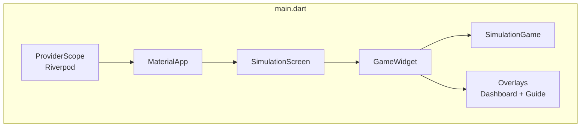
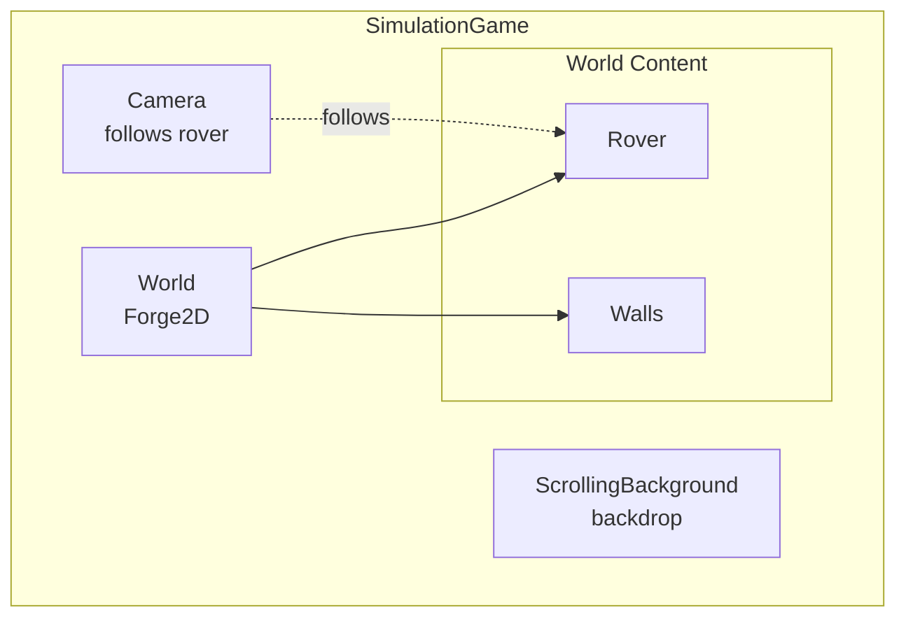
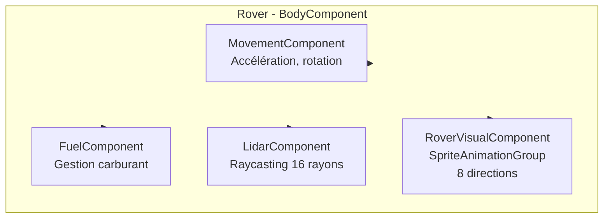
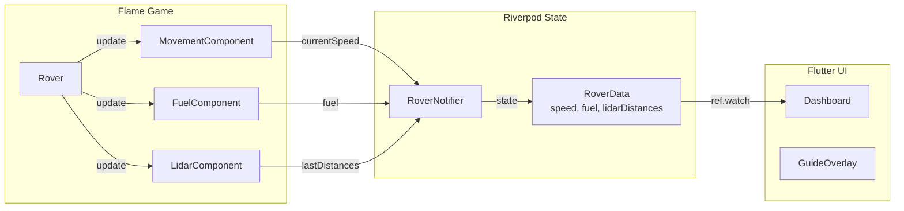
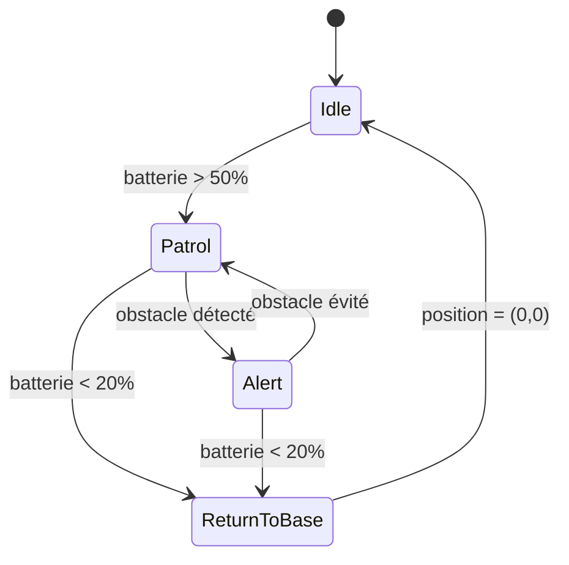

# 2.2 Mise en Pratique : Conception d'un Simulateur de Drone/Rover Autonome

Après avoir vu les bases de Flame, passons aux choses sérieuses. Nous allons construire un simulateur de Rover autonome. 

Pourquoi ce sujet ? Parce que le développement de jeu vidéo partage énormément d'ADN avec la robotique et l'informatique embarquée.

1.  **Le Game Loop vs La Boucle de Contrôle** : `update(dt)` dans Flame, c'est exactement votre boucle `while(true)` sur un microcontrôleur. C'est du temps réel.
2.  **ECS (Entity Component System) vs Modularité Hardware** : Un robot est un assemblage de modules (châssis, moteurs, capteurs). Dans Flame, une `Entity` est une coquille vide à laquelle on ajoute des `Component` (Movement, Fuel, Lidar). C'est la même philosophie de composition.
3.  **La Physique** : `flame_forge2d` (basé sur Box2D) nous permet d'appliquer de vraies forces physiques, frottements et collisions, comme dans le monde réel.

---

## 1. Le Cœur du Réacteur : La Boucle de Jeu (Game Loop)

Dans un système embarqué, vous lisez les capteurs, vous calculez la commande, et vous actionnez les moteurs.
Dans un jeu, c'est pareil :

```dart
@override
void update(double dt) {
  // 1. SENSE : Lire les inputs ou l'état des composants
  // 2. THINK : Mettre à jour l'IA ou la physique
  // 3. ACT : Rendu graphique (géré automatiquement par render)
}
```

**Règle d'or** : On ne met pas tout le code dans le `update` du jeu. On délègue aux composants. Le `GameWidget` est notre chef d'orchestre, mais ce sont les musiciens (les composants) qui jouent.

## 2. L'Architecture Orientée Composants (FCS)

L'héritage excessif est l'ennemi (`class SuperRobot extends Robot extends Vehicle extends Object`... non !).
Nous allons utiliser la **composition**.

Notre Rover sera une Entité simple. Ses capacités seront des Composants :

-   `MovementComponent` : Applique les forces pour bouger.
-   `FuelComponent` : Gère la batterie/le carburant.
-   `LidarComponent` : Gère la "vision".

C'est le **Principe de Responsabilité Unique (SRP)**. Si je veux un robot immobile mais qui scanne, j'enlève juste le `MovementComponent`. Flexibilité totale.

## 3. Simulation Sensorielle : Le Raycasting

C'est ici que ça devient intéressant pour la robotique. Comment le robot "voit-il" les murs ?
En réalité, un LIDAR envoie des lasers. Dans notre simulation, nous allons utiliser le **Raycasting**.

Le moteur physique nous permet de lancer un rayon d'un point A à un point B et de récupérer le premier obstacle touché. Utile pour :
-   Les capteurs de distance.
-   La ligne de vue (Line of Sight).
-   Les armes de tir instantané (Hitscan).

Nous dessinerons ces rayons en utilisant le `debugMode` de Flame ou en surchargeant `render` pour visualiser ce que le robot perçoit.

## 4. L'Interface de Télémétrie (La Puissance de Flutter)

C'est là que Flutter brille par rapport à Unity ou Godot pour ce type d'application.
L'UI dans les moteurs de jeux est souvent complexe. Ici, nous avons Flutter !

Nous allons créer un **Dashboard (HUD)** avec des Widgets Flutter standards (Column, Text, Stack) qui se superposent au jeu (`Overlay`).
Nous utiliserons **Riverpod** (ou Provider) pour faire remonter l'état du jeu (vitesse, batterie, distance obstacle) vers l'interface Flutter, de manière réactive.

## 5. Logique de Contrôle : State Machines

Comment gérer le comportement du drone ?
-   *Si batterie < 10% aller charger*
-   *Si obstacle à < 1m, tourner*
-   *Sinon, avancer*

Si on fait ça avec des `if/else`, on crée un "Spaghetti Code Monster".
Nous allons utiliser une **Machine à États Finis (FSM)**.

Le drone sera toujours dans un état donné : `Idle`, `Patrol`, `Alert`, `ReturnToBase`.
Chaque état définit ce que le drone fait et quand il change d'état (les transitions). C'est le pattern **State**, indispensable en IA de jeu comme en robotique.

---

## Au boulot !

Nous allons maintenant construire ce simulateur étape par étape. Chaque section vous guidera à travers la création d'un composant, en expliquant **pourquoi** nous faisons chaque choix.

Ici, vous avez deux possibilités :
- Découvrir le framework depuis la documentation officielle : https://docs.flame-engine.org/ ou ses exemples : https://examples.flame-engine.org/
- Suivre ce tutoriel pas à pas

---

## Étape 1 : Création du Projet et Configuration

### 1.1 Créer le projet Flutter

```bash
flutter create drone_simulator
cd drone_simulator
```

**Pourquoi Flutter ?** Parce que nous voulons le meilleur des deux mondes : un moteur de jeu performant (Flame) ET une interface utilisateur riche (Flutter). Unity ou Godot excellent pour les jeux, mais leur système d'UI est limité. Ici, nous aurons des widgets Flutter natifs pour notre tableau de bord.

### 1.2 Ajouter les dépendances

Modifiez votre `pubspec.yaml` :

```yaml
dependencies:
  flutter:
    sdk: flutter
  flame: ^1.34.0
  flame_forge2d: ^0.19.2+2
  flutter_riverpod: ^3.0.3
  riverpod_annotation: ^3.0.3
  riverpod: ^3.0.3

dev_dependencies:
  flutter_test:
    sdk: flutter
  flutter_lints: ^6.0.0
  riverpod_generator: ^3.0.3
  build_runner: ^2.10.4
```

**Pourquoi ces dépendances ?**
- **Flame** : Le moteur de jeu 2D pour Flutter. Il gère le game loop, les sprites, les animations.
- **flame_forge2d** : L'intégration de Box2D (moteur physique) dans Flame. Nous aurons de vraies collisions et forces physiques.
- **flutter_riverpod** : Pour la gestion d'état réactive. Le jeu mettra à jour l'état, et l'UI Flutter réagira automatiquement.

Exécutez :
```bash
flutter pub get
```

### 1.3 Préparer les assets

Créez le dossier `assets/images/` et ajoutez-y vos images :
- `mars_surface.png` : Texture de fond (surface martienne)
- `frame_rover_sprite_sheet_2.png` : Sprite sheet du rover (8 directions)

Déclarez les assets dans `pubspec.yaml` :

```yaml
flutter:
  uses-material-design: true
  assets:
    - assets/images/
```

**Pourquoi un sprite sheet ?** Plutôt que 8 images séparées, nous utilisons une seule image contenant toutes les directions. C'est plus performant (un seul chargement) et plus facile à gérer.

---

## Étape 2 : Le Point d'Entrée et la Structure de Base

### 2.1 Créer le fichier main.dart

Remplacez le contenu de `lib/main.dart` :

```dart
import 'package:flame/game.dart';
import 'package:flutter/material.dart';
import 'package:flutter_riverpod/flutter_riverpod.dart';
import 'game/simulation_game.dart';
import 'ui/dashboard.dart';
import 'ui/guide_overlay.dart';

void main() {
  runApp(const ProviderScope(child: DroneSimulatorApp()));
}

class DroneSimulatorApp extends StatelessWidget {
  const DroneSimulatorApp({super.key});

  @override
  Widget build(BuildContext context) {
    return MaterialApp(
      title: 'Drone Simulator',
      theme: ThemeData(brightness: Brightness.dark, primarySwatch: Colors.blue),
      home: const SimulationScreen(),
    );
  }
}

class SimulationScreen extends ConsumerWidget {
  const SimulationScreen({super.key});

  @override
  Widget build(BuildContext context, WidgetRef ref) {
    return Scaffold(
      body: Stack(
        children: [
          GameWidget(
            game: SimulationGame(ref),
            overlayBuilderMap: {
              'dashboard': (context, game) => const Dashboard(),
              'guide': (context, game) => const GuideOverlay(),
            },
            initialActiveOverlays: const ['dashboard', 'guide'],
          ),
        ],
      ),
    );
  }
}
```

**Décortiquons ce code :**

1. **`ProviderScope`** : Enveloppe toute l'application pour activer Riverpod. C'est le conteneur de tous nos providers.

2. **`ConsumerWidget`** : Notre écran principal est un `ConsumerWidget` (pas un `StatelessWidget`). Cela nous donne accès à `ref` pour lire les providers.

3. **`GameWidget`** : Le widget Flame qui affiche notre jeu. Notez qu'on passe `ref` au jeu pour qu'il puisse mettre à jour l'état Riverpod.

4. **`overlayBuilderMap`** : C'est la magie de Flame + Flutter ! On définit des overlays (widgets Flutter) qui se superposent au jeu. Le dashboard et le guide sont des widgets Flutter standards.

**Pourquoi passer `ref` au jeu ?** Le jeu doit pouvoir mettre à jour l'état (vitesse, carburant, etc.) que l'UI affiche. Sans `ref`, le jeu serait isolé de l'écosystème Riverpod.

### 2.2 Créer la structure de dossiers

```
lib/
├── main.dart
├── game/
│   ├── simulation_game.dart
│   ├── entities/
│   │   └── rover.dart
│   ├── components/
│   │   ├── movement_component.dart
│   │   ├── fuel_component.dart
│   │   ├── lidar_component.dart
│   │   ├── rover_visual_component.dart
│   │   └── scrolling_background.dart
│   └── behaviors/
│       └── drone_state_machine.dart
├── state/
│   └── rover_state.dart
└── ui/
    ├── dashboard.dart
    └── guide_overlay.dart
```

**Pourquoi cette structure ?**
- **game/** : Tout ce qui concerne Flame (le moteur de jeu)
- **entities/** : Les "acteurs" du jeu (le rover, les obstacles...)
- **components/** : Les capacités modulaires (mouvement, carburant, capteurs...)
- **behaviors/** : La logique d'IA (machines à états)
- **state/** : L'état partagé entre le jeu et l'UI (Riverpod)
- **ui/** : Les widgets Flutter pour l'interface

---

## Étape 3 : Le Monde Physique (SimulationGame)

### 3.1 Créer le jeu principal

Créez `lib/game/simulation_game.dart` :

```dart
import 'package:flutter/material.dart';
import 'package:flame/game.dart';
import 'package:flame_forge2d/flame_forge2d.dart';
import 'package:flame/components.dart';
import 'package:flame/input.dart';
import 'package:flame/events.dart';

import 'entities/rover.dart';
import 'components/movement_component.dart';
import 'components/scrolling_background.dart';

import 'package:flutter_riverpod/flutter_riverpod.dart';

class SimulationGame extends Forge2DGame
    with PanDetector, HasKeyboardHandlerComponents {
  final WidgetRef ref;
  late Rover rover;
  late ScrollingBackground scrollingBackground;

  SimulationGame(this.ref) : super(gravity: Vector2.zero(), zoom: 10);

  @override
  void onPanUpdate(DragUpdateInfo info) {
    // Si l'utilisateur fait glisser, on arrête de suivre le rover
    camera.stop();
    camera.viewfinder.position -= info.delta.global / camera.viewfinder.zoom;
  }

  @override
  Future<void> onLoad() async {
    super.onLoad();
    debugMode = false;

    // Créer les murs de l'arène
    final boundaryParams = createBoundaries(this);
    boundaryParams.forEach(world.add);

    // Créer le fond défilant
    scrollingBackground = ScrollingBackground();
    camera.backdrop.add(scrollingBackground);

    // Créer le rover
    rover = Rover(ref, position: Vector2.zero());
    await world.add(rover);

    // La caméra suit le rover
    camera.follow(rover);
  }

  @override
  void update(double dt) {
    super.update(dt);

    // Mettre à jour le défilement du fond selon la vélocité du rover
    if (rover.isMounted) {
      final movementComp = rover.firstChild<MovementComponent>();
      if (movementComp != null) {
        scrollingBackground.updateVelocity(movementComp.currentVelocityVector);
      }
    }
  }

  List<BodyComponent> createBoundaries(Forge2DGame game) {
    final topLeft = Vector2(-20, -20);
    final bottomRight = Vector2(20, 20);
    final topRight = Vector2(20, -20);
    final bottomLeft = Vector2(-20, 20);

    return [
      Wall(topLeft, topRight),
      Wall(topRight, bottomRight),
      Wall(bottomRight, bottomLeft),
      Wall(bottomLeft, topLeft),
    ];
  }
}

class Wall extends BodyComponent {
  final Vector2 start;
  final Vector2 end;

  Wall(this.start, this.end) : super(renderBody: false);

  @override
  Body createBody() {
    final shape = EdgeShape()..set(start, end);
    final fixtureDef = FixtureDef(shape)..friction = 0.3;
    final bodyDef = BodyDef()..position = Vector2.zero();

    return world.createBody(bodyDef)..createFixture(fixtureDef);
  }
}
```

**Points clés à comprendre :**

1. **`Forge2DGame`** : On hérite de `Forge2DGame` (pas `FlameGame`). Cela nous donne un monde physique Box2D intégré.

2. **`gravity: Vector2.zero()`** : Pas de gravité ! Notre rover est vu de dessus, pas de côté. Si on mettait une gravité, il "tomberait" vers le bas de l'écran.

3. **`zoom: 10`** : Le monde physique utilise des mètres. Un zoom de 10 signifie que 1 mètre = 10 pixels. Ajustez selon vos besoins.

4. **`PanDetector`** : Permet de détecter les gestes de glissement pour déplacer la caméra.

5. **`HasKeyboardHandlerComponents`** : Permet aux composants enfants de recevoir les événements clavier.

6. **Les murs (`Wall`)** : Ce sont des `BodyComponent` statiques. Ils utilisent `EdgeShape` (une ligne) pour créer des barrières invisibles.

**Pourquoi `renderBody: false` ?** Par défaut, Forge2D dessine les formes physiques en mode debug. On désactive cela car nous avons nos propres sprites.

---

## Étape 4 : L'Entité Rover

### 4.1 Créer le rover

Créez `lib/game/entities/rover.dart` :

```dart
import 'dart:ui';
import 'package:flame/components.dart';
import 'package:flutter/services.dart';
import 'package:flame_forge2d/flame_forge2d.dart';
import '../components/movement_component.dart';
import '../components/fuel_component.dart';
import '../components/lidar_component.dart';
import '../components/rover_visual_component.dart';

import 'package:flutter_riverpod/flutter_riverpod.dart';
import '../../state/rover_state.dart';

class Rover extends BodyComponent with KeyboardHandler {
  final WidgetRef ref;

  Rover(this.ref, {Vector2? position}) : super(priority: 1, renderBody: false) {
    initialPosition = position ?? Vector2.zero();
  }

  late Vector2 initialPosition;

  @override
  bool onKeyEvent(KeyEvent event, Set<LogicalKeyboardKey> keysPressed) {
    final movement = firstChild<MovementComponent>();
    if (movement == null) return false;

    // Mouvement avant/arrière
    final isMovingForward =
        keysPressed.contains(LogicalKeyboardKey.keyW) ||
        keysPressed.contains(LogicalKeyboardKey.keyZ);
    final isMovingBackward = keysPressed.contains(LogicalKeyboardKey.keyS);

    if (isMovingForward && !isMovingBackward) {
      movement.move(Vector2(0, 1));
    } else if (isMovingBackward && !isMovingForward) {
      movement.move(Vector2(0, -1));
    } else {
      movement.move(Vector2.zero());
    }

    // Rotation gauche/droite
    final isTurningLeft =
        keysPressed.contains(LogicalKeyboardKey.keyA) ||
        keysPressed.contains(LogicalKeyboardKey.keyQ);
    final isTurningRight = keysPressed.contains(LogicalKeyboardKey.keyD);

    if (isTurningLeft && !isTurningRight) {
      movement.turn(-1);
    } else if (isTurningRight && !isTurningLeft) {
      movement.turn(1);
    } else {
      movement.turn(0);
    }

    return true;
  }

  @override
  void update(double dt) {
    super.update(dt);

    if (isMounted) {
      final movementComp = firstChild<MovementComponent>();
      final fuelComp = firstChild<FuelComponent>();
      final lidarComp = firstChild<LidarComponent>();

      final speed = movementComp?.currentSpeed ?? 0.0;

      // Mise à jour de l'état Riverpod (différée pour éviter les erreurs)
      Future(() {
        if (!isMounted) return;
        ref
            .read(roverProvider.notifier)
            .updateData(
              speed: speed,
              fuel: fuelComp?.fuel ?? 0.0,
              lidarDistances: lidarComp?.lastDistances ?? [],
            );
      });
    }
  }

  @override
  Body createBody() {
    final shape = PolygonShape()..setAsBoxXY(2, 2);
    final fixtureDef = FixtureDef(shape)
      ..density = 1.0
      ..friction = 0.5
      ..restitution = 0.1;

    final bodyDef = BodyDef()
      ..type = BodyType.dynamic
      ..position = initialPosition
      ..linearDamping = 1.0
      ..angularDamping = 1.0;

    return world.createBody(bodyDef)..createFixture(fixtureDef);
  }

  @override
  Future<void> onLoad() async {
    await super.onLoad();

    // Ajouter les composants
    add(RoverVisualComponent());
    add(MovementComponent());
    add(FuelComponent());
    add(LidarComponent());
  }
}
```

**Analyse détaillée :**

1. **`BodyComponent`** : Le rover est un corps physique. Il a une masse, peut entrer en collision, subir des forces.

2. **`KeyboardHandler`** : Ce mixin permet au rover de recevoir les événements clavier.

3. **`createBody()`** : Définit la forme physique du rover :
   - `PolygonShape()..setAsBoxXY(2, 2)` : Un carré de 4x4 mètres
   - `density = 1.0` : La masse dépend de la densité × surface
   - `friction = 0.5` : Frottement lors des collisions
   - `restitution = 0.1` : Rebond (0 = pas de rebond, 1 = rebond parfait)
   - `linearDamping` et `angularDamping` : Résistance au mouvement (simule la friction de l'air/sol)

4. **`onLoad()`** : C'est ici qu'on ajoute les composants. Le rover est une coquille vide, ses capacités viennent des composants.

5. **`update()`** : À chaque frame, on lit l'état des composants et on met à jour Riverpod. Notez le `Future(() {...})` : c'est pour éviter de modifier l'état pendant le build de Flutter.

**Pourquoi `firstChild<T>()` ?** C'est la méthode Flame pour récupérer un composant enfant par son type. Plus propre que de garder des références manuelles.

---

## Étape 5 : Le Composant de Mouvement

### 5.1 Créer MovementComponent

Créez `lib/game/components/movement_component.dart` :

```dart
import 'package:flame/components.dart';
import 'package:flame_forge2d/flame_forge2d.dart';
import '../entities/rover.dart';

class MovementComponent extends Component with ParentIsA<Rover> {
  final double maxSpeed = 10.0;      // Vitesse max en unités/seconde
  final double acceleration = 8.0;   // Accélération
  final double deceleration = 6.0;   // Décélération
  final double turnSpeed = 3.0;      // Vitesse de rotation en rad/s

  Vector2 _targetDirection = Vector2.zero();
  double _currentVelocity = 0.0;
  double _turnDirection = 0.0;

  double get currentSpeed => _currentVelocity.abs();

  Vector2 get currentVelocityVector {
    if (_currentVelocity == 0) return Vector2.zero();
    final body = parent.body;
    final forward = body.worldVector(Vector2(0, -1));
    return forward * _currentVelocity;
  }

  void move(Vector2 direction) {
    _targetDirection = direction;
  }

  void turn(double direction) {
    _turnDirection = direction;
  }

  @override
  void update(double dt) {
    super.update(dt);

    final body = parent.body;
    final targetVelocity = _targetDirection.y * maxSpeed;

    // Interpolation douce vers la vitesse cible
    if (targetVelocity.abs() > _currentVelocity.abs() ||
        (targetVelocity > 0 && _currentVelocity < 0) ||
        (targetVelocity < 0 && _currentVelocity > 0)) {
      // Accélération ou changement de direction
      if (targetVelocity > _currentVelocity) {
        _currentVelocity += acceleration * dt;
        if (_currentVelocity > targetVelocity) _currentVelocity = targetVelocity;
      } else {
        _currentVelocity -= acceleration * dt;
        if (_currentVelocity < targetVelocity) _currentVelocity = targetVelocity;
      }
    } else {
      // Décélération
      if (_currentVelocity > targetVelocity) {
        _currentVelocity -= deceleration * dt;
        if (_currentVelocity < targetVelocity) _currentVelocity = targetVelocity;
      } else if (_currentVelocity < targetVelocity) {
        _currentVelocity += deceleration * dt;
        if (_currentVelocity > targetVelocity) _currentVelocity = targetVelocity;
      }
    }

    // Appliquer le mouvement
    if (_currentVelocity.abs() > 0.01) {
      final forward = body.worldVector(Vector2(0, -1));
      final displacement = forward * _currentVelocity * dt;
      final newPosition = body.position + displacement;
      body.setTransform(newPosition, body.angle);
    } else {
      _currentVelocity = 0;
    }

    // Appliquer la rotation
    if (_turnDirection != 0) {
      final newAngle = body.angle + _turnDirection * turnSpeed * dt;
      body.setTransform(body.position, newAngle);
    }

    // Réinitialiser les vélocités physiques
    body.linearVelocity = Vector2.zero();
    body.angularVelocity = 0;
  }
}
```

**Concepts importants :**

1. **`ParentIsA<Rover>`** : Ce mixin garantit que ce composant ne peut être ajouté qu'à un `Rover`. Il donne accès à `parent` typé.

2. **Accélération progressive** : On ne passe pas instantanément de 0 à la vitesse max. C'est plus réaliste et plus agréable à jouer.

3. **`body.worldVector(Vector2(0, -1))`** : Convertit un vecteur local (avant du rover) en vecteur monde. Essentiel pour que le rover avance dans la direction où il regarde.

4. **`body.setTransform()`** : On modifie directement la position/rotation plutôt que d'appliquer des forces. C'est un contrôle "cinématique" plutôt que "dynamique".

5. **Réinitialisation des vélocités** : On remet `linearVelocity` et `angularVelocity` à zéro pour éviter l'accumulation de forces parasites.

**Pourquoi ne pas utiliser `applyForce()` ?** On pourrait, mais le contrôle serait moins précis. Pour un simulateur où on veut un contrôle direct, `setTransform()` est plus adapté. Pour un jeu de voiture avec dérapages, on utiliserait les forces.

---

## Étape 6 : Le Composant Carburant

### 6.1 Créer FuelComponent

Créez `lib/game/components/fuel_component.dart` :

```dart
import 'package:flame/components.dart';

class FuelComponent extends Component {
  double fuel = 100.0;
  final double consumptionRate = 5.0; // Unités par seconde en mouvement

  bool get hasFuel => fuel > 0;

  void consume(double dt) {
    if (fuel > 0) {
      fuel -= consumptionRate * dt;
      if (fuel < 0) fuel = 0;
    }
  }

  void refuel(double amount) {
    fuel += amount;
    if (fuel > 100) fuel = 100;
  }
}
```

**Pourquoi un composant séparé ?** C'est le SRP (Single Responsibility Principle). Le `MovementComponent` gère le mouvement, le `FuelComponent` gère le carburant. Si demain on veut un rover électrique avec une batterie au lieu de carburant, on remplace juste ce composant.

**Note** : Dans cette version, la consommation n'est pas encore connectée au mouvement. C'est un exercice pour vous : appelez `consume(dt)` dans `MovementComponent` quand le rover bouge !

---

## Étape 7 : Le Composant LIDAR (Raycasting)

### 7.1 Créer LidarComponent

Créez `lib/game/components/lidar_component.dart` :

```dart
import 'dart:math';
import 'dart:ui';
import 'package:flame/components.dart';
import 'package:flame_forge2d/flame_forge2d.dart';
import '../entities/rover.dart';

class LidarComponent extends Component with ParentIsA<Rover> {
  final int numRays = 16;
  final double reach = 10.0;
  final List<RaycastResult?> results = [];
  final Paint _rayPaint = Paint()
    ..color = const Color(0xFFFF0000)
    ..strokeWidth = 0.1;

  List<double> get lastDistances {
    return results
        .where((r) => r != null)
        .map((r) => r!.fraction * reach)
        .toList();
  }

  @override
  void update(double dt) {
    super.update(dt);
    results.clear();
    final body = parent.body;
    final center = body.position;
    final angle = body.angle;

    for (int i = 0; i < numRays; i++) {
      final rayAngle = angle + (i / numRays) * 2 * pi;
      final direction = Vector2(cos(rayAngle), sin(rayAngle));
      final end = center + direction * reach;

      final callback = _LidarRayCastCallback(body);
      parent.game.world.raycast(callback, center, end);

      if (callback.closestResult != null) {
        results.add(callback.closestResult);
      } else {
        results.add(null);
      }
    }
  }

  @override
  void render(Canvas canvas) {
    // Visualisation désactivée par défaut
    // Décommentez pour voir les rayons LIDAR
  }
}

class RaycastResult {
  final Vector2 point;
  final Vector2 normal;
  final double fraction;

  RaycastResult({
    required this.point,
    required this.normal,
    required this.fraction,
  });
}

class _LidarRayCastCallback extends RayCastCallback {
  final Body originBody;
  RaycastResult? closestResult;

  _LidarRayCastCallback(this.originBody);

  @override
  double reportFixture(
    Fixture fixture,
    Vector2 point,
    Vector2 normal,
    double fraction,
  ) {
    // Ignorer le corps du rover lui-même
    if (fixture.body == originBody) return -1.0;

    closestResult = RaycastResult(
      point: point.clone(),
      normal: normal.clone(),
      fraction: fraction,
    );
    return fraction;
  }
}
```

**Le Raycasting expliqué :**

1. **Principe** : On lance des "rayons" invisibles depuis le rover dans toutes les directions. Quand un rayon touche un obstacle, on récupère le point d'impact.

2. **`numRays = 16`** : On lance 16 rayons répartis sur 360°. Plus de rayons = meilleure résolution, mais plus de calculs.

3. **`reach = 10.0`** : Portée maximale du LIDAR en mètres.

4. **`RayCastCallback`** : Box2D utilise un pattern callback. Pour chaque fixture touchée, `reportFixture()` est appelé.

5. **`return fraction`** : En retournant la fraction, on dit à Box2D de continuer à chercher des obstacles plus proches. Retourner `-1` ignore cette fixture.

6. **`fixture.body == originBody`** : On ignore le rover lui-même, sinon il se "verrait" !

**Applications robotiques :**
- Évitement d'obstacles
- Cartographie (SLAM)
- Navigation autonome

---

## Étape 8 : Le Composant Visuel du Rover

### 8.1 Créer RoverVisualComponent

Créez `lib/game/components/rover_visual_component.dart` :

```dart
import 'package:flame/components.dart';
import 'package:flame_forge2d/flame_forge2d.dart';
import 'dart:math';
import '../entities/rover.dart';

enum RoverDirection { n, ne, e, se, s, sw, w, nw }

class RoverVisualComponent extends SpriteAnimationGroupComponent<RoverDirection>
    with ParentIsA<Rover>, HasGameReference<Forge2DGame> {
  static const int rows = 8;
  static const int columns = 1;
  static const double stepTime = 0.1;

  RoverVisualComponent()
    : super(
        anchor: Anchor.center,
        size: Vector2(8, 8),
      );

  @override
  Future<void> onLoad() async {
    final image = await game.images.load('frame_rover_sprite_sheet_2.png');
    final frameWidth = image.width / columns;
    final frameHeight = image.height / rows;
    final frameSize = Vector2(frameWidth, frameHeight);

    final directions = [
      RoverDirection.n,
      RoverDirection.ne,
      RoverDirection.e,
      RoverDirection.se,
      RoverDirection.s,
      RoverDirection.sw,
      RoverDirection.w,
      RoverDirection.nw,
    ];

    final animations = <RoverDirection, SpriteAnimation>{};

    for (int i = 0; i < directions.length; i++) {
      final y = i * frameHeight;
      final frames = List.generate(columns, (j) {
        return Sprite(
          image,
          srcPosition: Vector2(j * frameWidth, y),
          srcSize: frameSize,
        );
      });

      animations[directions[i]] = SpriteAnimation.spriteList(
        frames,
        stepTime: stepTime,
        loop: true,
      );
    }

    this.animations = animations;
    current = RoverDirection.n;
    size = Vector2(8, 8);
  }

  @override
  void update(double dt) {
    super.update(dt);

    if (parent.body.bodyType == BodyType.dynamic) {
      // Contre-rotation pour rester droit à l'écran
      angle = -parent.body.angle;

      // Déterminer la direction selon l'angle du corps
      double heading = parent.body.angle;
      final normalizedAngle = (heading % (2 * pi));
      final positiveAngle = normalizedAngle < 0
          ? normalizedAngle + 2 * pi
          : normalizedAngle;

      final sector = ((positiveAngle + pi / 8) / (pi / 4)).floor() % 8;

      switch (sector) {
        case 0: current = RoverDirection.n; break;
        case 1: current = RoverDirection.ne; break;
        case 2: current = RoverDirection.e; break;
        case 3: current = RoverDirection.se; break;
        case 4: current = RoverDirection.s; break;
        case 5: current = RoverDirection.sw; break;
        case 6: current = RoverDirection.w; break;
        case 7: current = RoverDirection.nw; break;
      }
    }
  }
}
```

**Technique du sprite directionnel :**

1. **`SpriteAnimationGroupComponent`** : Permet d'avoir plusieurs animations et de basculer entre elles avec `current`.

2. **8 directions** : Le sprite sheet contient 8 lignes, une par direction (N, NE, E, SE, S, SW, W, NW).

3. **Contre-rotation** : Le sprite tourne avec le corps physique, mais on applique `-parent.body.angle` pour qu'il reste "droit" visuellement. Ensuite, on change l'animation selon la direction.

4. **Calcul du secteur** : On divise le cercle (2π) en 8 secteurs de π/4 chacun. L'angle du rover détermine quel secteur (et donc quelle animation) afficher.

**Pourquoi cette technique ?** C'est le style "vue isométrique" classique des jeux 2D. Le personnage semble toujours vu du même angle, mais l'animation change selon sa direction.

---

## Étape 9 : Le Fond Défilant

### 9.1 Créer ScrollingBackground

Créez `lib/game/components/scrolling_background.dart` :

```dart
import 'dart:ui';
import 'package:flame/components.dart';

class ScrollingBackground extends PositionComponent with HasGameReference {
  late Sprite _backgroundSprite;
  Vector2 _offset = Vector2.zero();
  Vector2 _velocity = Vector2.zero();

  final double scrollMultiplier = 15.0;

  @override
  Future<void> onLoad() async {
    await super.onLoad();
    _backgroundSprite = await game.loadSprite('mars_surface.png');
    priority = -10;
  }

  void updateVelocity(Vector2 velocity) {
    _velocity = velocity;
  }

  @override
  void update(double dt) {
    super.update(dt);

    _offset += _velocity * scrollMultiplier * dt;

    if (_backgroundSprite.image.width > 0) {
      final spriteWidth = _backgroundSprite.image.width.toDouble();
      final spriteHeight = _backgroundSprite.image.height.toDouble();

      _offset.x = _offset.x % spriteWidth;
      _offset.y = _offset.y % spriteHeight;
    }
  }

  @override
  void render(Canvas canvas) {
    super.render(canvas);

    final screenSize = game.size;
    final spriteWidth = _backgroundSprite.image.width.toDouble();
    final spriteHeight = _backgroundSprite.image.height.toDouble();

    if (spriteWidth <= 0 || spriteHeight <= 0) return;

    final tilesX = (screenSize.x / spriteWidth).ceil() + 2;
    final tilesY = (screenSize.y / spriteHeight).ceil() + 2;

    final startX = -spriteWidth + (_offset.x % spriteWidth);
    final startY = -spriteHeight + (_offset.y % spriteHeight);

    for (int x = 0; x < tilesX; x++) {
      for (int y = 0; y < tilesY; y++) {
        _backgroundSprite.render(
          canvas,
          position: Vector2(startX + x * spriteWidth, startY + y * spriteHeight),
          size: Vector2(spriteWidth, spriteHeight),
        );
      }
    }
  }
}
```

**Effet de parallaxe :**

1. **Tiling infini** : On dessine plusieurs copies de la texture pour couvrir l'écran, créant l'illusion d'un terrain infini.

2. **Modulo** : `_offset.x % spriteWidth` empêche l'offset de grandir indéfiniment (évite les problèmes de précision flottante).

3. **`priority = -10`** : Assure que le fond est dessiné en premier (derrière tout le reste).

4. **Inversion de vélocité** : Quand le rover avance, le fond défile en sens inverse, créant l'illusion de mouvement.

---

## Étape 10 : La Gestion d'État avec Riverpod

### 10.1 Créer le state du rover

Créez `lib/state/rover_state.dart` :

```dart
import 'package:flutter_riverpod/flutter_riverpod.dart';

class RoverData {
  final double speed;
  final double fuel;
  final double battery;
  final List<double> lidarDistances;

  RoverData({
    this.speed = 0.0,
    this.fuel = 100.0,
    this.battery = 100.0,
    this.lidarDistances = const [],
  });

  RoverData copyWith({
    double? speed,
    double? fuel,
    double? battery,
    List<double>? lidarDistances,
  }) {
    return RoverData(
      speed: speed ?? this.speed,
      fuel: fuel ?? this.fuel,
      battery: battery ?? this.battery,
      lidarDistances: lidarDistances ?? this.lidarDistances,
    );
  }
}

class RoverNotifier extends Notifier<RoverData> {
  @override
  RoverData build() {
    return RoverData();
  }

  void updateData({double? speed, double? fuel, List<double>? lidarDistances}) {
    state = state.copyWith(
      speed: speed,
      fuel: fuel,
      lidarDistances: lidarDistances,
    );
  }
}

final roverProvider = NotifierProvider<RoverNotifier, RoverData>(
  RoverNotifier.new,
);
```

**Pattern Riverpod :**

1. **`RoverData`** : Classe immutable contenant l'état. Le pattern `copyWith` permet de créer une nouvelle instance avec certaines valeurs modifiées.

2. **`RoverNotifier`** : Le "contrôleur" de l'état. Il expose des méthodes pour modifier l'état de manière contrôlée.

3. **`NotifierProvider`** : Crée un provider qui peut être lu (`ref.read`) ou observé (`ref.watch`) depuis n'importe où dans l'app.

**Pourquoi Riverpod plutôt que setState ?** Le jeu et l'UI sont séparés. Le jeu tourne dans Flame, l'UI dans Flutter. Riverpod fait le pont entre les deux de manière réactive et propre.

---

## Étape 11 : L'Interface Utilisateur (Dashboard)

### 11.1 Créer le Dashboard

Créez `lib/ui/dashboard.dart` :

```dart
import 'package:flutter/material.dart';
import 'package:flutter_riverpod/flutter_riverpod.dart';
import '../state/rover_state.dart';

class Dashboard extends ConsumerWidget {
  const Dashboard({super.key});

  @override
  Widget build(BuildContext context, WidgetRef ref) {
    final roverData = ref.watch(roverProvider);

    return Positioned(
      top: 20,
      left: 20,
      child: Container(
        padding: const EdgeInsets.all(16),
        decoration: BoxDecoration(
          color: Colors.black.withAlpha(180),
          borderRadius: BorderRadius.circular(12),
          border: Border.all(color: Colors.blueAccent),
        ),
        child: Column(
          crossAxisAlignment: CrossAxisAlignment.start,
          children: [
            const Text(
              "ROVER TELEMETRY",
              style: TextStyle(
                color: Colors.blueAccent,
                fontWeight: FontWeight.bold,
              ),
            ),
            const SizedBox(height: 10),
            _buildRow("Speed:", "${roverData.speed.toStringAsFixed(1)} m/s"),
            _buildRow("Fuel:", "${roverData.fuel.toStringAsFixed(1)} %"),
            const SizedBox(height: 10),
            Text(
              "Lidar Rays: ${roverData.lidarDistances.length}",
              style: const TextStyle(color: Colors.white70),
            ),
          ],
        ),
      ),
    );
  }

  Widget _buildRow(String label, String value) {
    return Padding(
      padding: const EdgeInsets.symmetric(vertical: 4.0),
      child: Row(
        mainAxisSize: MainAxisSize.min,
        children: [
          SizedBox(
            width: 60,
            child: Text(label, style: const TextStyle(color: Colors.grey)),
          ),
          Text(
            value,
            style: const TextStyle(
              color: Colors.white,
              fontWeight: FontWeight.bold,
              fontFamily: 'Courier',
            ),
          ),
        ],
      ),
    );
  }
}
```

**Points clés :**

1. **`ConsumerWidget`** : Permet d'utiliser `ref.watch()` pour observer l'état.

2. **`ref.watch(roverProvider)`** : Chaque fois que l'état change, le widget se reconstruit automatiquement.

3. **`Positioned`** : Utilisé dans un `Stack`, permet de placer le dashboard à une position fixe.

4. **Style "terminal"** : Police Courier, fond semi-transparent, bordure colorée. Donne un look de tableau de bord spatial.

### 11.2 Créer le Guide des Contrôles

Créez `lib/ui/guide_overlay.dart` :

```dart
import 'package:flutter/material.dart';

class GuideOverlay extends StatelessWidget {
  const GuideOverlay({super.key});

  @override
  Widget build(BuildContext context) {
    return Align(
      alignment: Alignment.topRight,
      child: Container(
        margin: const EdgeInsets.only(top: 120, right: 16),
        padding: const EdgeInsets.all(16),
        decoration: BoxDecoration(
          color: Colors.black.withAlpha(150),
          borderRadius: BorderRadius.circular(12),
          border: Border.all(color: Colors.white24),
        ),
        child: Column(
          mainAxisSize: MainAxisSize.min,
          crossAxisAlignment: CrossAxisAlignment.start,
          children: [
            const Text(
              "CONTROLS",
              style: TextStyle(
                color: Colors.white,
                fontWeight: FontWeight.bold,
                fontSize: 16,
              ),
            ),
            const SizedBox(height: 8),
            _buildControlRow("W / Z", "Move Forward"),
            _buildControlRow("S", "Move Backward"),
            _buildControlRow("A / Q", "Turn Left"),
            _buildControlRow("D", "Turn Right"),
            const SizedBox(height: 8),
            _buildControlRow("Drag", "Pan Camera"),
          ],
        ),
      ),
    );
  }

  Widget _buildControlRow(String keys, String action) {
    return Padding(
      padding: const EdgeInsets.symmetric(vertical: 4),
      child: Row(
        mainAxisSize: MainAxisSize.min,
        children: [
          Container(
            padding: const EdgeInsets.symmetric(horizontal: 8, vertical: 4),
            decoration: BoxDecoration(
              color: Colors.white10,
              borderRadius: BorderRadius.circular(4),
              border: Border.all(color: Colors.white30),
            ),
            child: Text(
              keys,
              style: const TextStyle(
                color: Colors.yellowAccent,
                fontWeight: FontWeight.bold,
                fontFamily: 'Courier',
              ),
            ),
          ),
          const SizedBox(width: 12),
          Text(action, style: const TextStyle(color: Colors.white70)),
        ],
      ),
    );
  }
}
```

---

## Étape 12 : La Machine à États (Bonus)

### 12.1 Créer DroneStateMachine

Créez `lib/game/behaviors/drone_state_machine.dart` :

```dart
enum DroneState { idle, patrol, alert, returnToBase }

class DroneStateMachine {
  DroneState _currentState = DroneState.idle;

  void update(double dt, dynamic sensors) {
    switch (_currentState) {
      case DroneState.idle:
        // Transition vers Patrol si batterie > 50%
        _currentState = DroneState.patrol;
        break;
      case DroneState.patrol:
        // Si obstacle détecté -> Alert
        // Si batterie < 20% -> ReturnToBase
        break;
      case DroneState.alert:
        // S'arrêter et attendre ou tourner
        break;
      case DroneState.returnToBase:
        // Se diriger vers (0,0)
        break;
    }
  }
}
```

**C'est un squelette !** Cette machine à états est volontairement incomplète. C'est un exercice pour vous :

1. Connectez-la au rover
2. Implémentez les transitions basées sur le carburant et les données LIDAR
3. Faites que le rover se comporte de manière autonome

**Le pattern State Machine :**
- Chaque état définit un comportement
- Les transitions sont explicites et prévisibles
- Facile à débugger (on sait toujours dans quel état on est)
- Extensible (ajouter un état = ajouter un case)

---

## Récapitulatif de l'Architecture

### Hiérarchie des Widgets Flutter



### Architecture du SimulationGame



### Composition du Rover



### Flux de données avec Riverpod



### Machine à États du Drone



---

## Pour Aller Plus Loin

### Exercices suggérés :

1. **Consommation de carburant** : Modifiez `MovementComponent` pour appeler `FuelComponent.consume()` quand le rover bouge.

2. **Arrêt sans carburant** : Si `fuel <= 0`, le rover ne peut plus bouger.

3. **Visualisation LIDAR** : Décommentez le code dans `LidarComponent.render()` pour voir les rayons.

4. **IA autonome** : Implémentez la `DroneStateMachine` pour que le rover évite les obstacles automatiquement.

5. **Station de recharge** : Ajoutez une zone où le rover peut se recharger.

6. **Obstacles dynamiques** : Ajoutez des obstacles qui bougent.

7. **Mini-map** : Créez un widget Flutter qui affiche une vue d'ensemble du terrain.

### Concepts avancés à explorer :

- **Pathfinding** (A*) pour la navigation autonome
- **Behavior Trees** comme alternative aux FSM
- **Networking** pour un mode multijoueur
- **Persistence** pour sauvegarder l'état du jeu

---

Félicitations ! Vous avez maintenant un simulateur de rover fonctionnel qui combine :
- Un moteur de jeu 2D (Flame)
- Un moteur physique (Box2D via Forge2D)
- Une gestion d'état réactive (Riverpod)
- Une interface utilisateur moderne (Flutter)

C'est un excellent point de départ pour explorer de nombreux concepts avancés en développement logiciel.
