# Intelligence Artificielle Agentique : Histoire, Fonctionnement et Techniques de Prompting


## Table des matières

1. [Histoire de l'IA et des agents IA](#1-histoire-de-lia-et-des-agents-ia)
2. [Fonctionnement des agents IA](#2-fonctionnement-des-agents-ia)
3. [Architecture et diagrammes](#3-architecture-et-diagrammes)
4. [Techniques de prompting](#4-techniques-de-prompting)
5. [Applications en robotique](#5-applications-en-robotique)
6. [Ressources et références](#6-ressources-et-références)

---

## 1. Histoire de l'IA et des agents IA

### 1.1 Les origines de l'intelligence artificielle (1943-1956)

#### Les précurseurs théoriques

L'histoire de l'intelligence artificielle commence bien avant l'invention des ordinateurs modernes, avec des réflexions philosophiques sur la nature de l'intelligence et de la pensée.

**Dates clés :**

- **1943** : Warren McCulloch et Walter Pitts publient "A Logical Calculus of the Ideas Immanent in Nervous Activity", décrivant le premier modèle mathématique d'un neurone artificiel
- **1950** : Alan Turing publie "Computing Machinery and Intelligence" et propose le célèbre **Test de Turing**
- **1951** : Marvin Minsky et Dean Edmonds construisent **SNARC**, le premier réseau de neurones artificiel

#### La conférence de Dartmouth (1956)

L'**été 1956** marque la naissance officielle de l'IA comme discipline scientifique. John McCarthy organise la **Conférence de Dartmouth** avec :

- **John McCarthy** : inventeur du terme "Intelligence Artificielle" et du langage LISP
- **Marvin Minsky** : co-fondateur du MIT AI Lab
- **Claude Shannon** : père de la théorie de l'information
- **Allen Newell et Herbert Simon** : créateurs du Logic Theorist, premier programme d'IA

> "Nous proposons qu'une étude de deux mois sur l'intelligence artificielle soit menée [...] L'étude doit procéder sur la base de la conjecture que chaque aspect de l'apprentissage ou toute autre caractéristique de l'intelligence peut en principe être décrit si précisément qu'une machine peut être faite pour le simuler."
> — Proposition de la conférence de Dartmouth, 1955

### 1.2 L'âge d'or et les premiers systèmes (1956-1974)

#### Les premiers succès

**Programmes emblématiques :**

- **1956** : **Logic Theorist** (Newell & Simon) - prouve des théorèmes mathématiques
- **1958** : **LISP** (McCarthy) - premier langage de programmation pour l'IA
- **1961** : **Unimate** - premier robot industriel (General Motors)
- **1964** : **ELIZA** (Weizenbaum) - premier chatbot simulant un psychothérapeute
- **1966** : **SHRDLU** (Winograd) - comprend le langage naturel dans un monde de blocs
- **1969** : **Shakey** (SRI) - premier robot mobile autonome

**Shakey le robot** est particulièrement important pour les étudiants en robotique : c'est le premier système à combiner perception, planification et action de manière intégrée.

#### L'optimisme initial

Cette période est caractérisée par un **optimisme débordant** :

- Herbert Simon prédit en 1965 : "Dans 20 ans, les machines seront capables de faire tout travail qu'un homme peut faire"
- Marvin Minsky déclare en 1970 : "Dans 3 à 8 ans, nous aurons une machine avec l'intelligence générale d'un être humain moyen"

### 1.3 Le premier hiver de l'IA (1974-1980)

#### Les limites révélées

Le **rapport Lighthill** (1973) au Royaume-Uni critique sévèrement les promesses non tenues de l'IA :

**Problèmes identifiés :**

- **Explosion combinatoire** : les problèmes réels sont trop complexes
- **Manque de sens commun** : les systèmes ne comprennent pas le contexte
- **Limites du traitement symbolique** : difficulté à gérer l'incertitude
- **Problème du cadre** (frame problem) : comment représenter ce qui ne change pas ?

**Conséquences :**

- Réduction drastique des financements
- Abandon de nombreux projets
- Scepticisme généralisé envers l'IA

### 1.4 Les systèmes experts (1980-1987)

#### Renaissance de l'IA

Les **systèmes experts** relancent l'intérêt pour l'IA en se concentrant sur des domaines spécifiques :

**Systèmes emblématiques :**

- **MYCIN** (1976) : diagnostic médical des infections bactériennes
- **DENDRAL** (1965-1981) : analyse de spectres de masse en chimie
- **R1/XCON** (1980) : configuration d'ordinateurs chez DEC (économies de 40M$/an)
- **PROSPECTOR** (1983) : exploration géologique

**Caractéristiques des systèmes experts :**

- Base de connaissances (règles SI-ALORS)
- Moteur d'inférence
- Interface utilisateur
- Module d'explication

**Limites :**

- Acquisition des connaissances difficile ("knowledge bottleneck")
- Maintenance coûteuse
- Fragilité face aux cas non prévus
- Pas d'apprentissage automatique

### 1.5 Le deuxième hiver de l'IA (1987-1993)

#### L'effondrement du marché

**Causes :**

- Échec des machines LISP face aux PC
- Coûts de maintenance des systèmes experts
- Promesses non tenues (encore)
- Fin du projet japonais de 5ème génération

**Période de transition :**

- Développement discret des réseaux de neurones
- Émergence des méthodes statistiques
- Travaux fondamentaux sur l'apprentissage automatique

### 1.6 L'ère de l'apprentissage automatique (1993-2011)

#### Nouveaux paradigmes

**Évolutions majeures :**

- **1997** : **Deep Blue** (IBM) bat Garry Kasparov aux échecs
- **1997** : Développement des **Support Vector Machines** (SVM)
- **2002** : **Roomba** - premier robot aspirateur grand public
- **2004** : **DARPA Grand Challenge** - véhicules autonomes
- **2006** : Geoffrey Hinton relance les réseaux de neurones profonds
- **2011** : **Watson** (IBM) gagne à Jeopardy!

**Changement de paradigme :**

- De la programmation explicite à l'**apprentissage à partir des données**
- Des règles symboliques aux **modèles statistiques**
- De l'IA générale à l'**IA spécialisée**

### 1.7 La révolution du Deep Learning (2012-2022)

#### Le tournant AlexNet

**2012** marque un tournant avec **AlexNet** qui remporte ImageNet avec une marge spectaculaire grâce aux réseaux de neurones convolutifs (CNN) et aux GPU.

**Avancées majeures :**

- **2014** : **GANs** (Generative Adversarial Networks) - Ian Goodfellow
- **2015** : **ResNet** - réseaux très profonds (152 couches)
- **2016** : **AlphaGo** (DeepMind) bat Lee Sedol au Go
- **2017** : **Transformer** - architecture révolutionnaire ("Attention is All You Need")
- **2018** : **BERT** (Google) - compréhension du langage
- **2019** : **GPT-2** (OpenAI) - génération de texte
- **2020** : **GPT-3** - 175 milliards de paramètres
- **2021** : **DALL-E** - génération d'images à partir de texte
- **2022** : **ChatGPT** - IA conversationnelle grand public

### 1.8 L'ère des agents IA (2023-présent)

#### L'émergence de l'IA agentique

**2023-2025** marque l'avènement des **agents IA** capables d'agir de manière autonome :

**Jalons importants :**

- **Mars 2023** : **GPT-4** avec capacités de raisonnement avancées
- **Avril 2023** : **Auto-GPT** - premier agent IA autonome populaire
- **Mai 2023** : **Voyager** (NVIDIA) - agent IA jouant à Minecraft
- **Novembre 2023** : **GPTs** d'OpenAI - agents personnalisables
- **2024** : Explosion des frameworks d'agents (LangChain, AutoGen, CrewAI)
- **2024** : **Claude** (Anthropic) avec capacités d'utilisation d'outils
- **2024** : **Devin** - premier agent développeur IA
- **2025** : Intégration massive des agents dans les IDE (Cursor, Augment, Windsurf)

**Définition d'un agent IA :**

> Un **agent IA** est un système d'intelligence artificielle capable de percevoir son environnement, de raisonner sur ses objectifs, de planifier des actions, et d'exécuter ces actions de manière autonome pour atteindre ses buts.

### 1.9 Chronologie synthétique

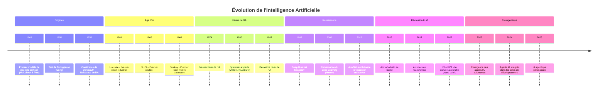

---

## 2. Fonctionnement des agents IA

### 2.1 Concepts fondamentaux

#### Qu'est-ce qu'un agent ?

En intelligence artificielle, un **agent** est une entité qui :

1. **Perçoit** son environnement via des capteurs (ou entrées)
2. **Raisonne** sur ces perceptions et ses objectifs
3. **Agit** sur l'environnement via des effecteurs (ou sorties)

**Analogie robotique :**

| Composant | Robot physique | Agent IA |
|-----------|----------------|----------|
| Capteurs | Caméras, LIDAR, IMU | APIs, fichiers, bases de données |
| Traitement | Microcontrôleur, CPU | LLM (Large Language Model) |
| Effecteurs | Moteurs, pinces | Appels d'outils, génération de code |
| Environnement | Monde physique | Système informatique, web |

#### Types d'agents

**1. Agents réactifs simples :**
- Répondent directement aux stimuli
- Pas de mémoire ni de planification
- Exemple : thermostat, chatbot basique

**2. Agents basés sur des modèles :**
- Maintiennent un modèle interne du monde
- Peuvent gérer des environnements partiellement observables
- Exemple : robot avec carte de l'environnement

**3. Agents basés sur des objectifs :**
- Ont des buts explicites à atteindre
- Planifient des séquences d'actions
- Exemple : agent de navigation GPS

**4. Agents basés sur l'utilité :**
- Optimisent une fonction d'utilité
- Gèrent les compromis entre objectifs
- Exemple : agent de trading

**5. Agents apprenants :**
- S'améliorent avec l'expérience
- Adaptent leur comportement
- Exemple : AlphaGo, agents IA modernes

### 2.2 Le cycle perception-décision-action

#### Boucle fondamentale

Tout agent IA fonctionne selon un cycle continu :

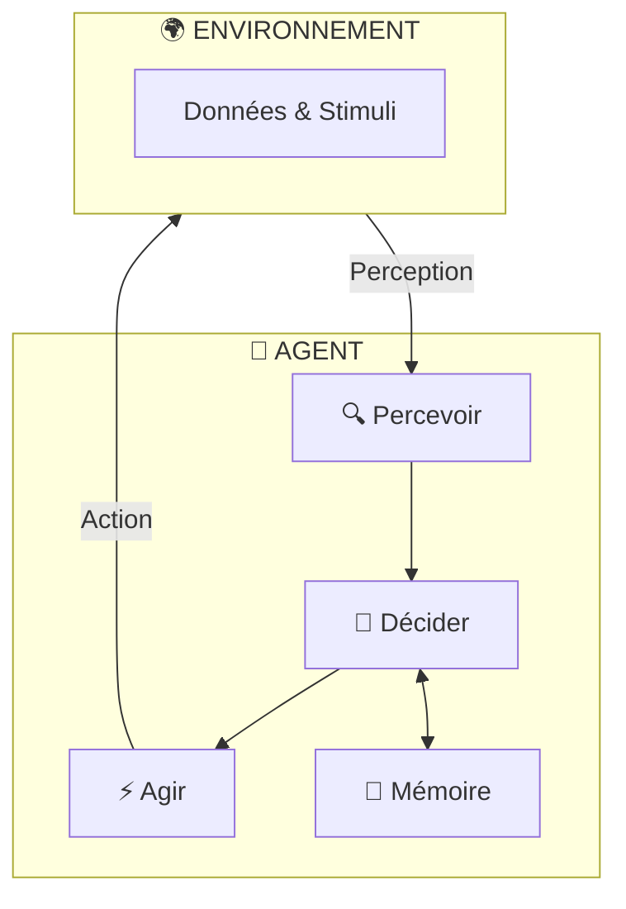

**Étapes du cycle :**

1. **Perception** : L'agent reçoit des informations de son environnement
2. **Interprétation** : Les données brutes sont transformées en représentations utilisables
3. **Raisonnement** : L'agent analyse la situation et ses objectifs
4. **Planification** : Une séquence d'actions est élaborée
5. **Exécution** : Les actions sont effectuées
6. **Observation** : Les résultats sont évalués
7. **Apprentissage** : L'agent met à jour ses connaissances

### 2.3 Architecture d'un agent IA moderne

#### Composants principaux

**1. Le modèle de langage (LLM) - Le "cerveau"**

Le LLM est le cœur de l'agent moderne :
- Comprend le langage naturel
- Raisonne sur les problèmes
- Génère des plans d'action
- Produit du texte, du code, des commandes

**Exemples de LLM :**
- GPT-4, GPT-4o (OpenAI)
- Claude 3.5 Sonnet, Claude Opus (Anthropic)
- Gemini (Google)
- Llama 3 (Meta)
- Mistral (Mistral AI)

**2. La mémoire**

Les agents modernes utilisent plusieurs types de mémoire :

| Type | Description | Exemple |
|------|-------------|---------|
| **Mémoire de travail** | Contexte de la conversation actuelle | Messages récents |
| **Mémoire à court terme** | Informations de la session | Variables, état |
| **Mémoire à long terme** | Connaissances persistantes | Base vectorielle |
| **Mémoire épisodique** | Expériences passées | Historique des actions |
| **Mémoire sémantique** | Connaissances générales | Documentation, faits |

**3. Les outils (Tools)**

Les outils étendent les capacités de l'agent :

- **Recherche web** : accès à l'information en temps réel
- **Exécution de code** : calculs, scripts, automatisation
- **Accès aux fichiers** : lecture, écriture, modification
- **APIs externes** : services tiers, bases de données
- **Contrôle système** : commandes shell, processus

**4. Le système de planification**

Permet à l'agent de :
- Décomposer les tâches complexes
- Ordonner les sous-tâches
- Gérer les dépendances
- Adapter le plan en cours d'exécution

### 2.4 Utilisation des outils (Function Calling)

#### Principe du Function Calling

Le **function calling** (ou tool use) permet au LLM d'invoquer des fonctions externes :

**Processus :**

1. L'utilisateur pose une question ou donne une tâche
2. Le LLM analyse et détermine qu'un outil est nécessaire
3. Le LLM génère un appel de fonction structuré (JSON)
4. Le système exécute la fonction
5. Le résultat est renvoyé au LLM
6. Le LLM intègre le résultat dans sa réponse

**Exemple de définition d'outil :**

```json
{
  "name": "lire_capteur_temperature",
  "description": "Lit la température actuelle d'un capteur du robot",
  "parameters": {
    "type": "object",
    "properties": {
      "capteur_id": {
        "type": "string",
        "description": "Identifiant du capteur (ex: 'temp_moteur_1')"
      },
      "unite": {
        "type": "string",
        "enum": ["celsius", "fahrenheit", "kelvin"],
        "description": "Unité de température souhaitée"
      }
    },
    "required": ["capteur_id"]
  }
}
```

**Exemple d'appel généré par le LLM :**

```json
{
  "name": "lire_capteur_temperature",
  "arguments": {
    "capteur_id": "temp_moteur_1",
    "unite": "celsius"
  }
}
```

#### Outils courants pour les agents

| Catégorie | Outils | Usage |
|-----------|--------|-------|
| **Recherche** | web_search, retrieval | Trouver des informations |
| **Code** | execute_code, run_tests | Exécuter du code |
| **Fichiers** | read_file, write_file | Manipuler des fichiers |
| **Système** | run_command, list_processes | Contrôler le système |
| **Communication** | send_email, post_message | Interagir avec des services |
| **Robotique** | move_robot, read_sensor | Contrôler des robots |

### 2.5 Gestion du contexte et de la mémoire

#### La fenêtre de contexte

Les LLM ont une **fenêtre de contexte limitée** (nombre maximum de tokens) :

| Modèle | Fenêtre de contexte |
|--------|---------------------|
| GPT-3.5 | 16K tokens |
| GPT-4 | 128K tokens |
| Claude 3.5 Sonnet | 200K tokens |
| Gemini 1.5 Pro | 2M tokens |

**Stratégies de gestion :**

1. **Résumé progressif** : condenser les anciennes conversations
2. **Fenêtre glissante** : garder les N derniers messages
3. **Récupération sélective** : chercher les informations pertinentes
4. **Hiérarchisation** : prioriser les informations importantes

#### Mémoire vectorielle (RAG)

Le **RAG** (Retrieval-Augmented Generation) permet d'étendre la mémoire :

**Processus :**

1. **Indexation** : Les documents sont découpés et convertis en vecteurs
2. **Stockage** : Les vecteurs sont stockés dans une base vectorielle
3. **Recherche** : La requête est convertie en vecteur et comparée
4. **Récupération** : Les documents les plus similaires sont récupérés
5. **Augmentation** : Le contexte est enrichi avec ces documents
6. **Génération** : Le LLM répond avec ce contexte augmenté

**Bases vectorielles populaires :**
- Pinecone
- Weaviate
- Chroma
- Milvus
- pgvector (PostgreSQL)

### 2.6 Raisonnement et planification

#### Capacités de raisonnement

Les agents IA modernes peuvent :

**1. Raisonnement déductif :**
- Appliquer des règles logiques
- Tirer des conclusions à partir de prémisses

**2. Raisonnement inductif :**
- Généraliser à partir d'exemples
- Identifier des patterns

**3. Raisonnement abductif :**
- Inférer la meilleure explication
- Formuler des hypothèses

**4. Raisonnement analogique :**
- Transférer des connaissances entre domaines
- Résoudre par analogie

#### Planification hiérarchique

Les agents décomposent les tâches complexes :

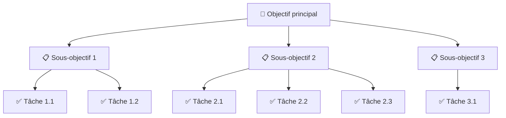

**Exemple robotique :**

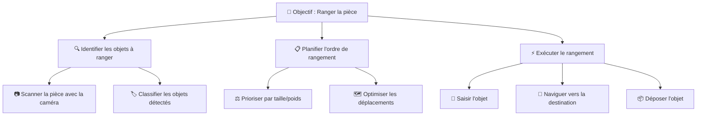

### 2.7 Intégration avec les systèmes externes

#### APIs et services

Les agents peuvent interagir avec :

- **Bases de données** : SQL, NoSQL, GraphQL
- **Services web** : REST APIs, webhooks
- **Systèmes de fichiers** : local, cloud (S3, GCS)
- **Outils de développement** : Git, CI/CD
- **Plateformes de communication** : Slack, Discord, email
- **Systèmes robotiques** : ROS, contrôleurs industriels

#### Exemple d'intégration robotique

```python
# Définition d'outils pour un agent robotique
tools = [
    {
        "name": "deplacer_robot",
        "description": "Déplace le robot vers une position cible",
        "parameters": {
            "x": "float - coordonnée X en mètres",
            "y": "float - coordonnée Y en mètres",
            "theta": "float - orientation en radians"
        }
    },
    {
        "name": "lire_lidar",
        "description": "Lit les données du capteur LIDAR",
        "parameters": {
            "resolution": "int - nombre de points (défaut: 360)"
        }
    },
    {
        "name": "activer_pince",
        "description": "Ouvre ou ferme la pince du robot",
        "parameters": {
            "action": "string - 'ouvrir' ou 'fermer'",
            "force": "float - force de préhension en Newtons"
        }
    }
]
```

---

## 3. Architecture et diagrammes

### 3.1 Architecture générale d'un agent IA

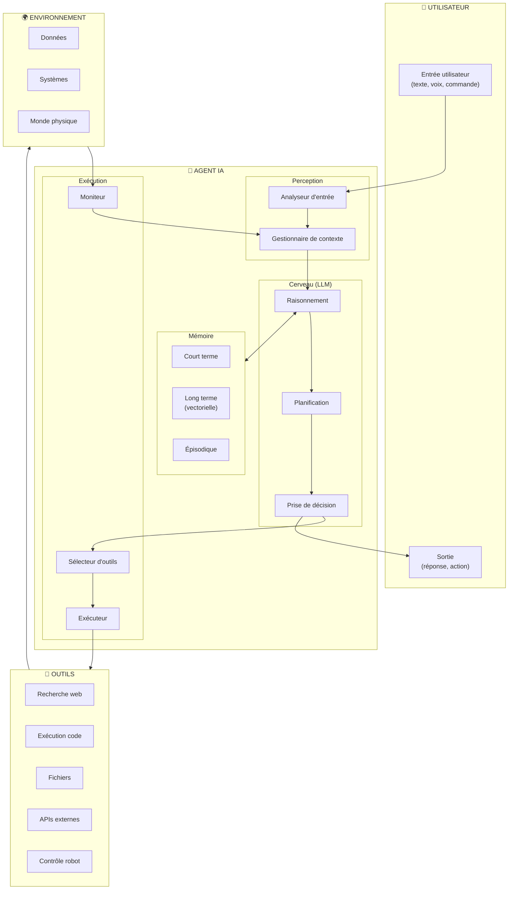

### 3.2 Boucle perception-décision-action

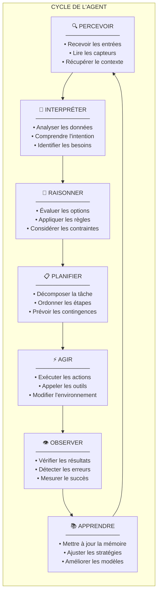

### 3.3 Interaction avec les outils

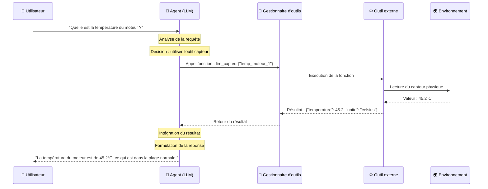

### 3.4 Flux d'information dans un système agentique

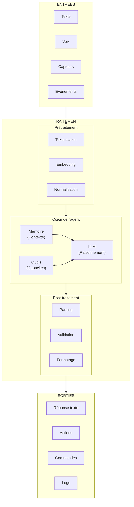

### 3.5 Comparaison IA traditionnelle vs IA agentique

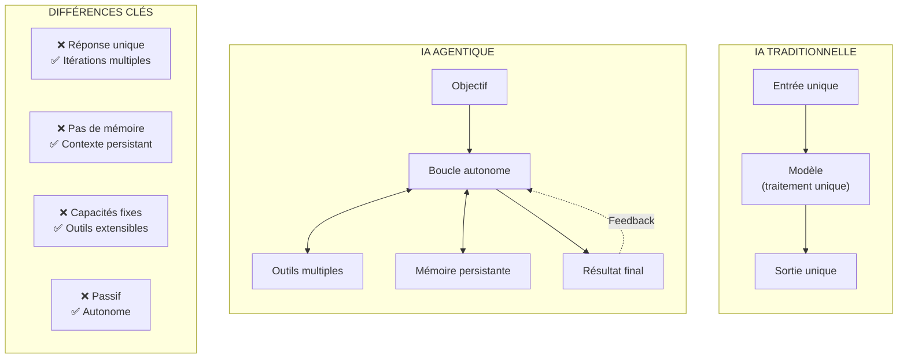

### 3.6 Architecture multi-agents

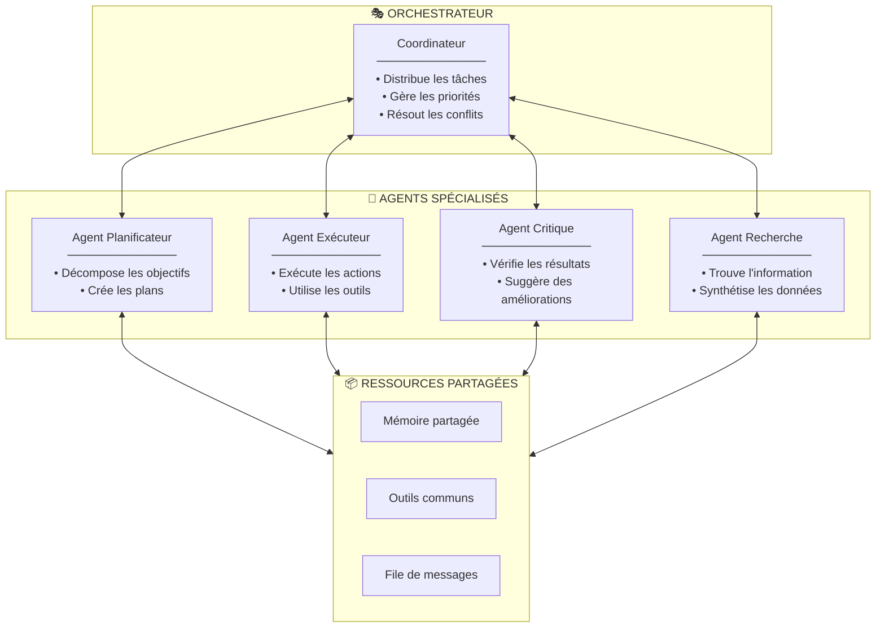

### 3.7 Diagramme spécifique robotique

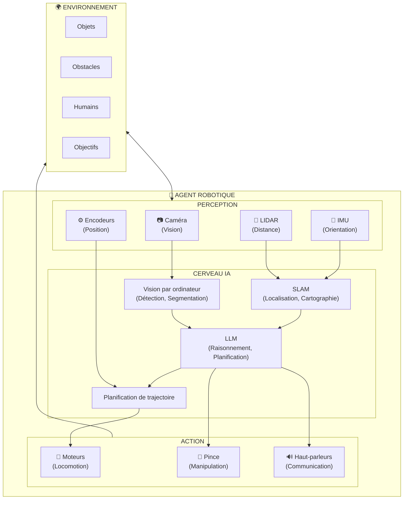

---

## 4. Techniques de prompting

### 4.1 Introduction au prompting

#### Qu'est-ce que le prompting ?

Le **prompting** est l'art de formuler des instructions pour les modèles de langage afin d'obtenir les réponses souhaitées.

**Pourquoi c'est important :**

- Les LLM sont sensibles à la formulation des requêtes
- Un bon prompt peut améliorer drastiquement la qualité des réponses
- Le prompting est une compétence essentielle pour utiliser l'IA efficacement

**Composants d'un prompt :**

1. **Contexte** : informations de fond
2. **Instruction** : ce que vous voulez que le modèle fasse
3. **Entrée** : les données à traiter
4. **Format de sortie** : comment structurer la réponse

### 4.2 Principes fondamentaux

#### Clarté et précision

**❌ Mauvais prompt :**
```
Parle-moi des robots.
```

**✅ Bon prompt :**
```
Explique les trois principaux types de robots industriels 
(articulés, SCARA, cartésiens), en décrivant pour chacun :
- Leur structure mécanique
- Leurs applications typiques
- Leurs avantages et inconvénients

Utilise un format de tableau pour la comparaison.
```

#### Spécificité

**❌ Vague :**
```
Écris du code pour un robot.
```

**✅ Spécifique :**
```
Écris une fonction Python qui :
- Prend en entrée les coordonnées (x, y) d'un point cible
- Calcule l'angle de rotation nécessaire pour un robot différentiel
- Retourne l'angle en radians
- Gère le cas où le robot est déjà à la position cible

Utilise numpy pour les calculs trigonométriques.
Ajoute des docstrings et des commentaires explicatifs.
```

#### Structure

Utilisez des délimiteurs clairs :

```
### Contexte ###
Tu es un expert en robotique mobile.

### Tâche ###
Analyse le code suivant et identifie les problèmes potentiels.

### Code à analyser ###
```python
def move_robot(x, y):
    # code ici
```

### Format de réponse ###
Pour chaque problème :
1. Ligne concernée
2. Description du problème
3. Solution proposée
```

### 4.3 Zero-shot prompting

#### Définition

Le **zero-shot prompting** consiste à demander au modèle d'effectuer une tâche sans lui fournir d'exemples.

**Principe :** On fait confiance aux connaissances préexistantes du modèle.

#### Exemples

**Classification :**
```
Classifie le texte suivant comme "positif", "négatif" ou "neutre" :

Texte : "Le nouveau capteur LIDAR offre une précision exceptionnelle, 
mais son prix reste prohibitif pour les petits projets."

Classification :
```

**Extraction d'information :**
```
Extrais les spécifications techniques du texte suivant :

Texte : "Le robot UR5e possède une portée de 850mm, une charge utile 
de 5kg, et une répétabilité de ±0.03mm. Il consomme en moyenne 200W."

Spécifications (format JSON) :
```

**Génération de code :**
```
Écris une fonction Python qui implémente un contrôleur PID 
pour le contrôle de vitesse d'un moteur DC.

La fonction doit :
- Accepter les gains Kp, Ki, Kd en paramètres
- Maintenir l'état interne (erreur intégrale, erreur précédente)
- Retourner la commande de contrôle
```

#### Quand utiliser le zero-shot

- Tâches simples et bien définies
- Quand le modèle a probablement vu des exemples similaires
- Pour des tests rapides
- Quand vous n'avez pas d'exemples disponibles

### 4.4 Few-shot prompting

#### Définition

Le **few-shot prompting** fournit quelques exemples au modèle avant de lui demander d'effectuer la tâche.

**Principe :** Les exemples guident le modèle sur le format et le style attendus.

#### Structure

```
Voici comment convertir des commandes en langage naturel en commandes robot :

Exemple 1 :
Entrée : "Avance de 2 mètres"
Sortie : move_forward(distance=2.0)

Exemple 2 :
Entrée : "Tourne à gauche de 90 degrés"
Sortie : rotate(angle=-90, unit="degrees")

Exemple 3 :
Entrée : "Attrape l'objet devant toi"
Sortie : gripper_close(force=10)

Maintenant, convertis cette commande :
Entrée : "Recule de 50 centimètres puis tourne à droite"
Sortie :
```

#### Exemples pratiques

**Formatage de données :**
```
Convertis les mesures de capteurs en format standardisé :

Entrée : "temp: 25.5C, humidity: 60%"
Sortie : {"temperature": {"value": 25.5, "unit": "celsius"}, "humidity": {"value": 60, "unit": "percent"}}

Entrée : "distance=1.5m angle=45deg"
Sortie : {"distance": {"value": 1.5, "unit": "meters"}, "angle": {"value": 45, "unit": "degrees"}}

Entrée : "vitesse: 2.3 m/s, acceleration: 0.5 m/s²"
Sortie :
```

**Génération de documentation :**
```
Génère une docstring pour les fonctions suivantes :

Fonction :
def calculate_distance(x1, y1, x2, y2):
    return math.sqrt((x2-x1)**2 + (y2-y1)**2)

Docstring :
"""
Calcule la distance euclidienne entre deux points 2D.

Args:
    x1 (float): Coordonnée x du premier point
    y1 (float): Coordonnée y du premier point
    x2 (float): Coordonnée x du second point
    y2 (float): Coordonnée y du second point

Returns:
    float: Distance euclidienne entre les deux points
"""

Fonction :
def normalize_angle(angle):
    while angle > math.pi:
        angle -= 2 * math.pi
    while angle < -math.pi:
        angle += 2 * math.pi
    return angle

Docstring :
```

#### Bonnes pratiques few-shot

1. **Choisir des exemples représentatifs** : couvrir les cas typiques
2. **Varier les exemples** : montrer différentes situations
3. **Garder la cohérence** : même format pour tous les exemples
4. **3-5 exemples suffisent** généralement
5. **Ordonner du simple au complexe** si possible

### 4.5 Chain-of-Thought (CoT) prompting

#### Définition

Le **Chain-of-Thought prompting** encourage le modèle à expliciter son raisonnement étape par étape.

**Principe :** Décomposer le problème améliore la qualité du raisonnement.

#### Prompt simple vs CoT

**❌ Sans CoT :**
```
Un robot se déplace à 0.5 m/s. Il doit parcourir 10 mètres, 
puis tourner de 90°, puis parcourir 5 mètres. 
Combien de temps cela prend-il si la rotation prend 2 secondes ?

Réponse :
```

**✅ Avec CoT :**
```
Un robot se déplace à 0.5 m/s. Il doit parcourir 10 mètres, 
puis tourner de 90°, puis parcourir 5 mètres. 
Combien de temps cela prend-il si la rotation prend 2 secondes ?

Résous ce problème étape par étape :

1. D'abord, calcule le temps pour parcourir 10 mètres
2. Ensuite, ajoute le temps de rotation
3. Puis, calcule le temps pour parcourir 5 mètres
4. Enfin, additionne tous les temps

Raisonnement :
```

#### Zero-shot CoT

Ajoutez simplement "Réfléchissons étape par étape" :

```
Un bras robotique à 3 articulations doit atteindre un point 
situé à (0.5, 0.3, 0.2) mètres. Les longueurs des segments 
sont L1=0.3m, L2=0.25m, L3=0.15m. 

Le point est-il atteignable ?

Réfléchissons étape par étape.
```

#### Few-shot CoT

```
Problème : Un robot doit naviguer d'un point A(0,0) à B(3,4) 
en évitant un obstacle circulaire centré en (1.5, 2) de rayon 0.5m.
Quelle est la distance minimale approximative ?

Raisonnement :
1. Distance directe A→B = √(3² + 4²) = √25 = 5m
2. Vérifions si le chemin direct passe par l'obstacle :
   - La ligne A→B a pour équation : y = (4/3)x
   - Distance du centre (1.5, 2) à cette ligne :
   - |4(1.5) - 3(2) + 0| / √(16+9) = |6-6| / 5 = 0
   - Le centre est sur la ligne ! Le chemin direct est bloqué.
3. Il faut contourner l'obstacle. Approximation :
   - Chemin = distance avant obstacle + demi-cercle + distance après
   - ≈ 5m + π(0.5) ≈ 5m + 1.57m ≈ 6.57m

Réponse : Environ 6.6 mètres

---

Problème : Un drone doit livrer un colis de 2kg. Sa capacité 
de charge est de 3kg et sa batterie permet 20 minutes de vol.
Le trajet aller fait 5km à 30km/h. Peut-il faire l'aller-retour ?

Raisonnement :
```

### 4.6 ReAct (Reasoning + Acting)

#### Définition

**ReAct** combine le raisonnement (Reasoning) et l'action (Acting) dans une boucle itérative.

**Structure :**
1. **Thought** (Pensée) : Le modèle réfléchit à la situation
2. **Action** : Le modèle décide d'une action à effectuer
3. **Observation** : Le résultat de l'action est observé
4. Répéter jusqu'à la résolution

#### Format ReAct

```
Question : Quel est l'état actuel du robot et peut-il effectuer 
une mission de livraison de 5km ?

Thought 1 : Je dois d'abord vérifier le niveau de batterie du robot.
Action 1 : check_battery()
Observation 1 : Batterie à 75%, autonomie estimée : 8km

Thought 2 : La batterie semble suffisante pour 5km aller, mais 
je dois vérifier si le retour est possible (10km total).
L'autonomie de 8km est insuffisante. Je dois vérifier s'il y a 
une station de recharge sur le trajet.
Action 2 : find_charging_stations(route="current_to_destination")
Observation 2 : Station de recharge trouvée à 4km sur le trajet

Thought 3 : Avec une station à 4km, le robot peut :
- Aller jusqu'à la station (4km)
- Recharger
- Continuer jusqu'à destination (1km)
- Revenir à la station (1km)
- Recharger
- Retourner au point de départ (4km)
C'est faisable avec les recharges.
Action 3 : plan_mission(destination="5km", include_charging=True)
Observation 3 : Mission planifiée avec 2 arrêts de recharge

Thought 4 : La mission est planifiée et réalisable.
Action 4 : respond("Le robot peut effectuer la mission avec 2 arrêts 
de recharge à la station située à 4km.")
```

#### Implémentation pratique

```python
# Pseudo-code d'un agent ReAct
def react_agent(question, tools, max_iterations=10):
    context = f"Question: {question}\n"
    
    for i in range(max_iterations):
        # Générer pensée et action
        response = llm.generate(context + f"\nThought {i+1}:")
        thought, action = parse_response(response)
        
        context += f"\nThought {i+1}: {thought}"
        context += f"\nAction {i+1}: {action}"
        
        # Exécuter l'action
        if action.startswith("respond("):
            return extract_response(action)
        
        observation = execute_tool(action, tools)
        context += f"\nObservation {i+1}: {observation}"
    
    return "Limite d'itérations atteinte"
```

### 4.7 System prompts vs User prompts

#### System prompt

Le **system prompt** définit le comportement global de l'agent :

```
Tu es un assistant expert en robotique industrielle. 

Tes responsabilités :
- Aider à diagnostiquer les problèmes des robots
- Suggérer des optimisations de trajectoire
- Expliquer les concepts de robotique clairement

Tes contraintes :
- Toujours prioriser la sécurité
- Demander des clarifications si la situation est ambiguë
- Citer tes sources quand tu donnes des spécifications techniques

Ton style :
- Professionnel mais accessible
- Utiliser des exemples concrets
- Structurer les réponses avec des listes quand approprié
```

#### User prompt

Le **user prompt** contient la requête spécifique :

```
Mon robot UR10 fait un bruit inhabituel lors des mouvements 
du joint 3. Le bruit apparaît surtout en charge (>5kg) et 
lors des accélérations rapides. Que dois-je vérifier ?
```

#### Combinaison efficace

```
[SYSTEM]
Tu es un ingénieur roboticien senior spécialisé dans le diagnostic.
Format de réponse :
1. Hypothèses probables (classées par probabilité)
2. Tests de diagnostic recommandés
3. Actions correctives possibles
Utilise ton expertise pour guider l'utilisateur de manière méthodique.

[USER]
Mon robot UR10 fait un bruit inhabituel lors des mouvements 
du joint 3. Le bruit apparaît surtout en charge (>5kg) et 
lors des accélérations rapides.
```

### 4.8 Bonnes pratiques

#### Structure recommandée

```markdown
# Rôle
Tu es [description du rôle et de l'expertise].

# Contexte
[Informations de fond pertinentes]

# Tâche
[Description claire de ce qui est demandé]

# Contraintes
- [Contrainte 1]
- [Contrainte 2]

# Format de sortie
[Description du format attendu]

# Exemples (si few-shot)
[Exemples]

# Entrée
[Données à traiter]
```

#### Techniques avancées

**1. Persona :**
```
Tu es le Dr. Sarah Chen, une experte mondiale en robotique 
humanoïde avec 20 ans d'expérience chez Boston Dynamics.
```

**2. Contraintes négatives :**
```
NE PAS :
- Inventer des spécifications techniques
- Suggérer des modifications non sécuritaires
- Ignorer les normes ISO de sécurité robotique
```

**3. Méta-prompting :**
```
Avant de répondre, pose-toi ces questions :
1. Ai-je bien compris la demande ?
2. Ma réponse est-elle complète ?
3. Y a-t-il des risques de sécurité à considérer ?
```

**4. Décomposition de tâche :**
```
Pour résoudre ce problème, suis ces étapes :
1. Analyse les symptômes décrits
2. Liste les causes possibles
3. Propose un arbre de diagnostic
4. Recommande les actions par ordre de priorité
```

### 4.9 Erreurs courantes à éviter

#### ❌ Prompts trop vagues

```
Mauvais : "Aide-moi avec mon robot"
Bon : "Mon robot différentiel ne suit pas correctement les 
trajectoires circulaires. Il dérive vers l'extérieur. 
Quelles peuvent être les causes ?"
```

#### ❌ Surcharge d'information

```
Mauvais : [3 pages de contexte non pertinent]
Bon : [Contexte minimal mais suffisant]
```

#### ❌ Instructions contradictoires

```
Mauvais : "Sois bref mais donne tous les détails"
Bon : "Donne une réponse concise (max 200 mots) couvrant 
les points essentiels"
```

#### ❌ Absence de format de sortie

```
Mauvais : "Analyse ce code"
Bon : "Analyse ce code et fournis :
1. Un résumé en une phrase
2. Les problèmes identifiés (liste)
3. Les corrections suggérées (code)"
```

#### ❌ Attentes irréalistes

```
Mauvais : "Écris un système de navigation autonome complet"
Bon : "Écris une fonction de planification A* pour une grille 2D"
```

### 4.10 Tableau récapitulatif des techniques

| Technique | Quand l'utiliser | Avantages | Inconvénients |
|-----------|------------------|-----------|---------------|
| **Zero-shot** | Tâches simples, tests rapides | Rapide, pas d'exemples nécessaires | Moins précis |
| **Few-shot** | Format spécifique requis | Guide le modèle efficacement | Consomme des tokens |
| **Chain-of-Thought** | Problèmes complexes, maths | Meilleur raisonnement | Réponses plus longues |
| **ReAct** | Tâches nécessitant des outils | Combine réflexion et action | Plus complexe à implémenter |
| **System prompt** | Définir le comportement global | Cohérence des réponses | Peut être ignoré parfois |

---

## 5. Applications en robotique

### 5.1 Agents IA pour le contrôle robotique

#### Cas d'usage

**1. Navigation autonome :**
- Planification de trajectoire avec LLM
- Évitement d'obstacles intelligent
- Adaptation au contexte (foule, météo)

**2. Manipulation d'objets :**
- Reconnaissance et classification
- Planification de saisie
- Adaptation à des objets inconnus

**3. Interaction homme-robot :**
- Compréhension du langage naturel
- Génération de réponses contextuelles
- Apprentissage des préférences utilisateur

**4. Maintenance prédictive :**
- Analyse des données capteurs
- Détection d'anomalies
- Recommandations de maintenance

### 5.2 Exemple d'architecture agent-robot

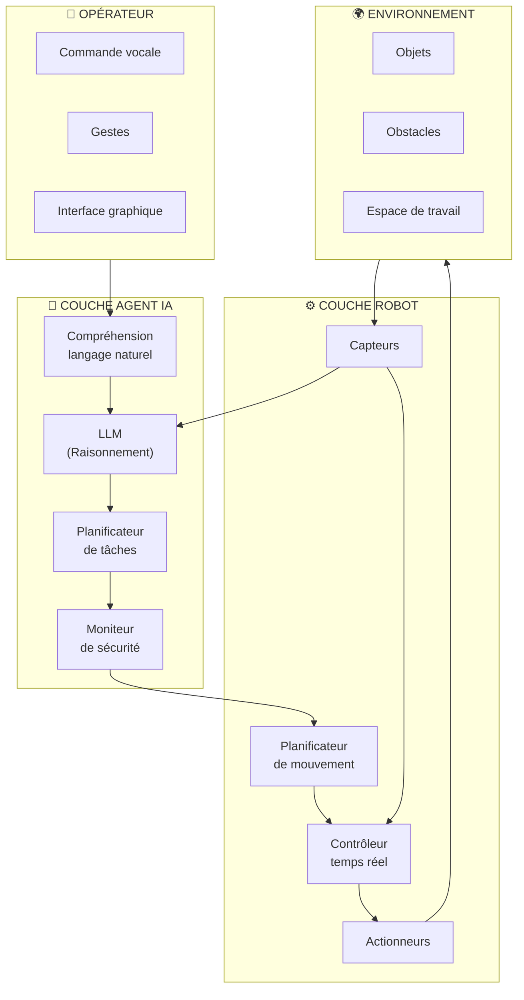

### 5.3 Prompt engineering pour la robotique

#### Exemple : Agent de diagnostic

```
# System Prompt pour un agent de diagnostic robotique

Tu es un système expert en diagnostic de robots industriels.

## Tes capacités
- Analyser les données des capteurs en temps réel
- Identifier les patterns d'anomalies
- Proposer des diagnostics différentiels
- Recommander des actions correctives

## Outils disponibles
- read_sensor(sensor_id) : Lire un capteur
- get_error_logs(time_range) : Récupérer les logs d'erreur
- check_calibration(joint_id) : Vérifier la calibration
- run_diagnostic_routine(routine_name) : Exécuter un test

## Protocole de diagnostic
1. Collecter les symptômes rapportés
2. Vérifier les données capteurs pertinentes
3. Analyser les logs d'erreur récents
4. Formuler des hypothèses
5. Proposer des tests de confirmation
6. Recommander des actions

## Contraintes de sécurité
- Ne jamais recommander d'opération sans arrêt du robot
- Toujours vérifier l'état d'urgence avant toute action
- Signaler immédiatement tout risque pour l'opérateur
```

---

## 6. Ressources et références

### 6.1 Livres fondamentaux

| Livre | Auteur(s) | Description |
|-------|-----------|-------------|
| **Artificial Intelligence: A Modern Approach** | Stuart Russell, Peter Norvig | La référence en IA |
| **Deep Learning** | Ian Goodfellow, Yoshua Bengio, Aaron Courville | Fondamentaux du deep learning |
| **Robotics, Vision and Control** | Peter Corke | Robotique et vision |
| **Probabilistic Robotics** | Sebastian Thrun et al. | Robotique probabiliste |

### 6.2 Ressources en ligne

**Cours :**
- [CS229 - Machine Learning (Stanford)](https://cs229.stanford.edu/)
- [CS231n - Computer Vision (Stanford)](http://cs231n.stanford.edu/)
- [Prompt Engineering Guide](https://www.promptingguide.ai/)

**Documentation :**
- [OpenAI API Documentation](https://platform.openai.com/docs)
- [Anthropic Claude Documentation](https://docs.anthropic.com/)
- [LangChain Documentation](https://python.langchain.com/)

**Tutoriels :**
- [Hugging Face Course](https://huggingface.co/course)
- [DeepLearning.AI Short Courses](https://www.deeplearning.ai/short-courses/)

### 6.3 Frameworks et outils

| Outil | Usage | Lien |
|-------|-------|------|
| **LangChain** | Framework d'agents | langchain.com |
| **AutoGen** | Agents multi-modaux | microsoft.github.io/autogen |
| **CrewAI** | Orchestration multi-agents | crewai.io |
| **Semantic Kernel** | SDK Microsoft pour IA | github.com/microsoft/semantic-kernel |
| **ROS 2** | Framework robotique | ros.org |

### 6.4 Communautés

- **Reddit** : r/MachineLearning, r/robotics, r/LocalLLaMA
- **Discord** : Serveurs LangChain, Hugging Face
- **GitHub** : Projets open source d'agents IA
- **arXiv** : Publications de recherche

---

## Annexe : Glossaire

| Terme | Définition |
|-------|------------|
| **Agent IA** | Système autonome capable de percevoir, raisonner et agir |
| **LLM** | Large Language Model - Modèle de langage de grande taille |
| **Prompt** | Instruction donnée à un modèle de langage |
| **Token** | Unité de texte (mot ou sous-mot) traitée par un LLM |
| **Fine-tuning** | Adaptation d'un modèle pré-entraîné à une tâche spécifique |
| **RAG** | Retrieval-Augmented Generation - Génération augmentée par récupération |
| **Embedding** | Représentation vectorielle d'un texte |
| **Function calling** | Capacité d'un LLM à invoquer des fonctions externes |
| **Context window** | Nombre maximum de tokens qu'un LLM peut traiter |
| **Chain-of-Thought** | Technique de prompting encourageant le raisonnement explicite |
| **ReAct** | Pattern combinant raisonnement et action |
| **Zero-shot** | Exécution d'une tâche sans exemples préalables |
| **Few-shot** | Exécution d'une tâche avec quelques exemples |
| **System prompt** | Instructions définissant le comportement global d'un agent |
| **Hallucination** | Génération d'informations fausses par un LLM |
