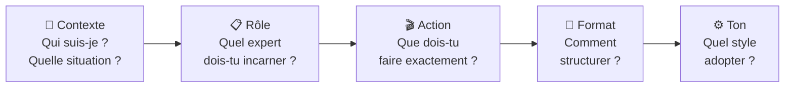
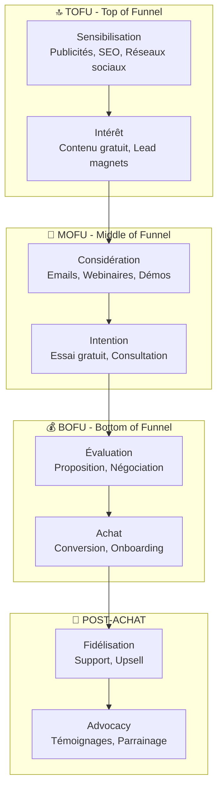
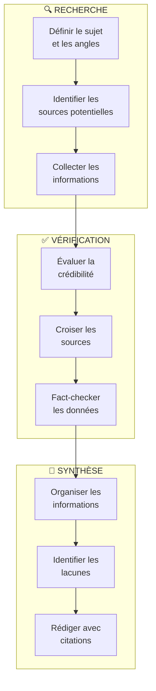
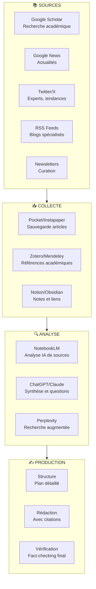
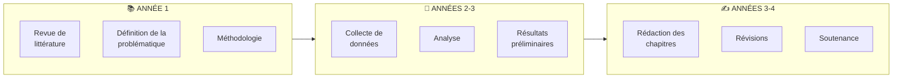
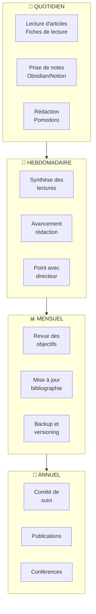
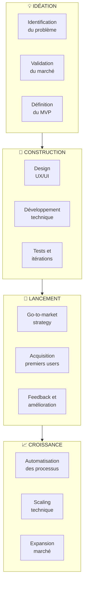
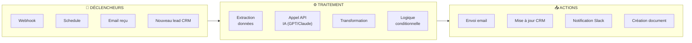
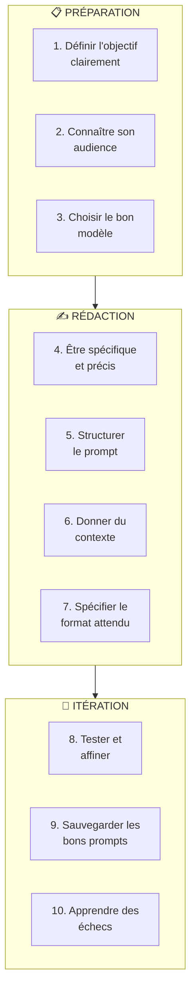

# Exemples Pratiques de Prompting par Profil Professionnel


## Table des matières

1. [Introduction au prompting professionnel](#1-introduction-au-prompting-professionnel)
2. [Commercial : Lancement de tunnels de vente](#2-commercial--lancement-de-tunnels-de-vente)
3. [Auteur : Recherche de sources fiables](#3-auteur--recherche-de-sources-fiables)
4. [Étudiant : Thèse de doctorat](#4-étudiant--thèse-de-doctorat)
5. [Entrepreneur : Lancement de produit](#5-entrepreneur--lancement-de-produit)
6. [Bonnes pratiques transversales](#6-bonnes-pratiques-transversales)
7. [Ressources et références](#7-ressources-et-références)
8. [Glossaire](#8-glossaire)

---

## 1. Introduction au prompting professionnel

### 1.1 Pourquoi adapter ses prompts à son métier ?

Le **prompting professionnel** consiste à formuler des requêtes à l'IA de manière adaptée à son contexte métier, ses
objectifs et ses contraintes spécifiques. Contrairement aux prompts génériques, les prompts professionnels intègrent :

- **Le vocabulaire métier** : termes techniques, jargon du secteur
- **Les contraintes réelles** : budget, délais, ressources disponibles
- **Les objectifs mesurables** : KPIs, métriques de succès
- **Le contexte organisationnel** : équipe, processus, outils existants

### 1.2 Les piliers d'un prompt professionnel efficace

| Pilier          | Description                       | Exemple                                              |
|-----------------|-----------------------------------|------------------------------------------------------|
| **Contexte**    | Situation actuelle, contraintes   | "Je suis commercial B2B dans le SaaS..."             |
| **Objectif**    | Résultat attendu, mesurable       | "...je veux augmenter mon taux de conversion de 15%" |
| **Format**      | Structure de la réponse souhaitée | "Fournis-moi un plan en 5 étapes avec des exemples"  |
| **Contraintes** | Limites à respecter               | "Budget max 500€/mois, équipe de 2 personnes"        |
| **Expertise**   | Niveau de détail attendu          | "Explique comme à un expert marketing"               |

### 1.3 Méthodologie CRAFT pour les prompts professionnels



**Exemple d'application :**

```
[CONTEXTE] Je suis responsable commercial dans une startup SaaS B2B
qui vend un outil de gestion de projet. Notre cible : PME de 50-200 employés.

[RÔLE] Tu es un expert en growth marketing et tunnels de vente avec
15 ans d'expérience dans le SaaS.

[ACTION] Crée une stratégie complète de tunnel de vente pour notre
lancement, de l'acquisition à la conversion.

[FORMAT] Structure ta réponse en :
1. Analyse du marché (3 points clés)
2. Tunnel de vente détaillé (étapes avec métriques)
3. Contenu à créer (liste priorisée)
4. Outils recommandés (avec alternatives)

[TON] Professionnel mais accessible, avec des exemples concrets.
```

---

## 2. Commercial : Lancement de tunnels de vente

### 2.1 Contexte et enjeux

Un **tunnel de vente** (ou funnel) est le parcours que suit un prospect depuis sa première interaction avec votre marque
jusqu'à l'achat (et au-delà). Pour un commercial B2B ou B2C, maîtriser ce tunnel est essentiel pour :

- **Optimiser le taux de conversion** à chaque étape
- **Automatiser les tâches répétitives** (qualification, relances)
- **Personnaliser l'expérience** selon le profil du prospect
- **Mesurer et améliorer** continuellement les performances



### 2.2 Stratégie de prompting pour les tunnels de vente

#### Étape 1 : Analyse du marché et définition des personas

**Prompt pour créer un persona détaillé :**

```text
Tu es un expert en marketing B2B avec 15 ans d'expérience dans le secteur [SECTEUR].

Je lance un produit/service : [DESCRIPTION DU PRODUIT]
Ma cible principale : [DESCRIPTION GÉNÉRALE]

Crée un persona détaillé de mon client idéal (ICP - Ideal Customer Profile) incluant :

1. **Données démographiques**
   - Poste, niveau hiérarchique, taille d'entreprise
   - Secteur d'activité, localisation

2. **Données psychographiques**
   - Objectifs professionnels et personnels
   - Frustrations et points de douleur quotidiens
   - Valeurs et motivations d'achat

3. **Comportement d'achat**
   - Processus de décision (qui décide, qui influence)
   - Sources d'information consultées
   - Objections courantes

4. **Canaux de communication**
   - Où passe-t-il son temps en ligne ?
   - Quels contenus consomme-t-il ?

Donne-lui un prénom et une histoire pour le rendre concret.
```

#### Étape 2 : Création du contenu de sensibilisation (TOFU)

**Prompt pour générer des idées de lead magnets :**

```text
Tu es un expert en marketing B2B avec 15 ans d'expérience dans le secteur [SECTEUR].

Je lance un produit/service : [DESCRIPTION DU PRODUIT]
Ma cible principale : [DESCRIPTION GÉNÉRALE]

Génère une liste de 10 idées de lead magnets pour attirer des prospects potentiels.

Chaque idée doit inclure :
- Titre explicite
- Description concise (1-2 phrases)
- Format (e-book, guide, webinaire, calculateur, etc.)
- Contenu principal
- Appel à l'action
```

**Prompt pour écrire un e-book :**

```text
Tu es un expert en marketing B2B avec 15 ans d'expérience dans le secteur [SECTEUR].

J'ai besoin d'écrire un e-book de 10 000 mots sur le sujet : [SUJET DE L'E-BOOK]

Structure de l'e-book :
1. **Introduction** (500 mots)
   - Accroche, objectifs, plan

2. **Chapitre 1** (1000 mots)
   - Titre : [TITRE DU CHAPITRE 1]
   - Contenu : [CONTENU DU CHAPITRE 1]

3. **Chapitre 2** (1000 mots)
   - Titre : [TITRE DU CHAPITRE 2]
   - Contenu : [CONTENU DU CHAPITRE 2]

```

#### Étape 3 : Création de la stratégie de tunnel de vente

**Prompt pour créer une stratégie de tunnel de vente :**

```text
Tu es un expert en marketing B2B avec 15 ans d'expérience dans le secteur [SECTEUR].

Je lance un produit/service : [DESCRIPTION DU PRODUIT]
Ma cible principale : [DESCRIPTION GÉNÉRALE]

Crée une stratégie de tunnel de vente complète incluant :

1. **Étape TOFU** (Top of Funnel)
   - Objectifs
   - Canaux de communication
   - Contenu à créer
   - Planification
   - Budget estimatif

2. **Étape MOFU** (Middle of Funnel)
   - Objectifs
   - Canaux de communication
   - Contenu à créer
   - Planification
   - Budget estimatif

3. **Étape BOFU** (Bottom of Funnel)
   - Objectifs
   - Canaux de communication
   - Contenu à créer
   - Planification
   - Budget estimatif

4. **Étape POST-ACHAT**
   - Objectifs
   - Canaux de communication
   - Contenu à créer
   - Planification
   - Budget estimatif

Fournis :
- Des indicateurs clés de performance (KPIs) pour chaque étape
- Des recommandations d'outils à utiliser
- Un planning mensuel détaillé
- Un budget mensuel estimatif
```

#### Étape 4 : Scripts de qualification et closing (BOFU)

**Prompt pour créer un script de découverte :**

```
Tu es un expert en vente consultative B2B.

Crée un script de call de découverte (discovery call) de 30 minutes
pour qualifier un prospect intéressé par [PRODUIT].

Structure du call :
1. **Introduction** (2 min)
   - Présentation, mise en confiance
   - Agenda du call

2. **Découverte des besoins** (15 min)
   - Questions SPIN (Situation, Problème, Implication, Need-payoff)
   - Questions ouvertes pour comprendre le contexte

3. **Qualification BANT** (5 min)
   - Budget, Authority, Need, Timeline
   - Questions pour chaque critère

4. **Présentation valeur** (5 min)
   - Pitch adapté aux besoins découverts
   - 2-3 bénéfices clés personnalisés

5. **Next steps** (3 min)
   - Proposition de démo/essai
   - Gestion des objections courantes

Pour chaque section, donne les questions exactes à poser
et les réponses types à anticiper.
```

**Prompt pour gérer les objections :**

```
Liste les 10 objections les plus courantes pour [TYPE DE PRODUIT]
et fournis pour chacune :

1. **L'objection verbatim** (comme le prospect la formule)
2. **La vraie inquiétude** (ce qu'il pense vraiment)
3. **Réponse empathique** (validation + recadrage)
4. **Preuve à apporter** (cas client, donnée, démo)
5. **Question de rebond** (pour reprendre le contrôle)

Objections à couvrir :
- Prix trop élevé
- Pas le bon moment
- Besoin de réfléchir
- Concurrent moins cher
- Fonctionnalité manquante
- Équipe pas prête
- Décideur absent
- Mauvaise expérience passée
- Solution interne existante
- ROI incertain
```

#### Étape 5 : Automatisation du tunnel

**Prompt pour concevoir l'architecture d'automatisation :**

```
Je veux automatiser mon tunnel de vente avec les outils suivants :
- CRM : [HubSpot/Salesforce/Pipedrive]
- Email : [Mailchimp/ActiveCampaign/Brevo]
- Ads : [Google Ads/LinkedIn Ads/Meta Ads]

Crée un schéma d'automatisation couvrant :

1. **Capture de leads**
   - Formulaires → CRM
   - Tags et segmentation automatique

2. **Scoring des leads**
   - Critères de scoring (actions, profil)
   - Seuils de qualification (MQL, SQL)

3. **Nurturing automatisé**
   - Déclencheurs de séquences
   - Personnalisation dynamique

4. **Alertes commerciales**
   - Quand notifier le commercial ?
   - Informations à inclure

5. **Reporting**
   - KPIs à suivre par étape
   - Dashboards recommandés

Fournis un diagramme de flux et les intégrations nécessaires.
```

### 2.3 Workflow d'automatisation complet

```mermaid
flowchart TB
    subgraph Acquisition["📢 ACQUISITION"]
        Ads["Publicités<br/>Google/LinkedIn/Meta"]
        SEO["SEO/Content<br/>Blog, YouTube"]
        Social["Social Selling<br/>LinkedIn, Twitter"]
    end

    subgraph Capture["📥 CAPTURE"]
        LP["Landing Page<br/>+ Formulaire"]
        LM["Lead Magnet<br/>Téléchargement"]
        CRM["CRM<br/>Création contact"]
    end

    subgraph Qualification["🎯 QUALIFICATION"]
        Score["Lead Scoring<br/>Automatique"]
        Segment["Segmentation<br/>Par persona"]
        MQL["MQL<br/>Marketing Qualified"]
    end

    subgraph Nurturing["📧 NURTURING"]
        Seq1["Séquence Email<br/>Éducation"]
        Retarget["Retargeting<br/>Ads personnalisées"]
        Content["Contenu ciblé<br/>Webinaires, Démos"]
    end

    subgraph Sales["💼 SALES"]
        Alert["Alerte Commercial<br/>Lead chaud"]
        Call["Discovery Call<br/>Qualification BANT"]
        Demo["Démo produit<br/>Personnalisée"]
        Proposal["Proposition<br/>Commerciale"]
    end

    subgraph Closing["✅ CLOSING"]
        Nego["Négociation<br/>Objections"]
        Sign["Signature<br/>Contrat"]
        Onboard["Onboarding<br/>Client"]
    end

    Acquisition --> LP
    LP --> LM
    LM --> CRM
    CRM --> Score
    Score --> Segment
    Segment --> MQL
    MQL --> Seq1
    Seq1 --> Retarget
    Retarget --> Content
    Content --> Alert
    Alert --> Call
    Call --> Demo
    Demo --> Proposal
    Proposal --> Nego
    Nego --> Sign
    Sign --> Onboard
```



### 2.4 Cas réel : Success story d'un tunnel de vente optimisé par l'IA

#### Étude de cas : Lemlist et l'hyper-personnalisation

**Contexte :**
[Lemlist](https://www.lemlist.com/), startup française de cold emailing, a utilisé l'IA pour optimiser ses tunnels de
vente B2B.

**Stratégie mise en place :**

1. **Personnalisation à grande échelle**
    - Utilisation de l'IA pour générer des icebreakers personnalisés
    - Analyse automatique des profils LinkedIn des prospects
    - Génération de premiers paragraphes uniques pour chaque email

2. **Séquences multicanales**
    - Email + LinkedIn + Appel téléphonique
    - Timing optimisé par l'IA selon le comportement du prospect
    - A/B testing automatisé des objets et contenus

3. **Scoring comportemental**
    - Tracking des ouvertures, clics, réponses
    - Priorisation automatique des leads les plus engagés
    - Alertes temps réel pour les commerciaux

**Résultats documentés :**

- Taux d'ouverture : 70%+ (vs 20% moyenne du secteur)
- Taux de réponse : 25%+ (vs 5% moyenne)
- Réduction du temps de prospection : -60%

**Source :** [Blog Lemlist - Case Studies](https://blog.lemlist.com/case-studies/)

#### Facteurs clés de succès

| Facteur                | Impact                | Comment le reproduire                    |
|------------------------|-----------------------|------------------------------------------|
| **Personnalisation**   | +300% taux de réponse | Utiliser l'IA pour recherche + rédaction |
| **Multicanal**         | +50% conversions      | Combiner email, LinkedIn, téléphone      |
| **Timing intelligent** | +40% ouvertures       | Envoyer au moment optimal par prospect   |
| **Itération continue** | +25% par trimestre    | A/B tester systématiquement              |

### 2.5 Tableau récapitulatif des prompts commerciaux

| Étape du tunnel    | Objectif            | Type de prompt       | Outils associés   |
|--------------------|---------------------|----------------------|-------------------|
| **Persona**        | Comprendre la cible | Analyse + création   | CRM, LinkedIn     |
| **Lead magnet**    | Attirer des leads   | Idéation + rédaction | Landing pages     |
| **Emails**         | Nurturing           | Séquences + A/B      | Email automation  |
| **Scripts**        | Qualification       | Conversation guidée  | CRM, téléphonie   |
| **Objections**     | Closing             | Réponses préparées   | Playbook sales    |
| **Automatisation** | Efficacité          | Architecture système | Zapier, Make, N8N |

---

## 3. Auteur : Recherche de sources fiables

### 3.1 Contexte et enjeux

Pour un **auteur, journaliste ou rédacteur**, la qualité des sources est fondamentale. L'IA peut considérablement
accélérer le processus de recherche tout en maintenant la rigueur requise. Les enjeux principaux sont :

- **Fiabilité** : distinguer les sources crédibles des contenus douteux
- **Exhaustivité** : couvrir tous les angles d'un sujet
- **Actualité** : trouver les informations les plus récentes
- **Traçabilité** : pouvoir citer et vérifier chaque information



### 3.2 Stratégie de prompting pour la recherche documentaire

#### Prompt 1 : Cartographie d'un sujet

```
Je prépare un article/livre sur [SUJET].

Aide-moi à cartographier ce sujet en identifiant :

1. **Les sous-thèmes essentiels** (5-7 axes principaux)
   Pour chaque axe : titre + 2-3 questions clés à explorer

2. **Les experts reconnus** (5-10 personnes)
   Pour chaque expert : nom, affiliation, contribution principale,
   où trouver leurs publications

3. **Les sources primaires incontournables**
   - Études académiques de référence
   - Rapports institutionnels
   - Bases de données spécialisées

4. **Les controverses ou débats actuels**
   - Points de désaccord entre experts
   - Questions non résolues

5. **L'historique du sujet**
   - Dates clés et évolutions
   - Changements de paradigme

Classe les informations par niveau de priorité pour mon enquête.
```

#### Prompt 2 : Évaluation de la crédibilité d'une source

```
Je dois évaluer la fiabilité de cette source pour mon article :
[URL ou RÉFÉRENCE DE LA SOURCE]

Analyse cette source selon les critères suivants :

1. **Autorité**
   - Qui est l'auteur ? Quelles sont ses qualifications ?
   - Quelle est la réputation du média/éditeur ?
   - Y a-t-il un comité de lecture ou de révision ?

2. **Exactitude**
   - Les affirmations sont-elles sourcées ?
   - Les données sont-elles vérifiables ?
   - Y a-t-il des erreurs factuelles évidentes ?

3. **Objectivité**
   - L'auteur a-t-il un biais déclaré ou potentiel ?
   - Y a-t-il un conflit d'intérêts ?
   - Le ton est-il factuel ou persuasif ?

4. **Actualité**
   - Quand a été publiée cette source ?
   - Les informations sont-elles encore d'actualité ?
   - Y a-t-il des mises à jour plus récentes ?

5. **Couverture**
   - Le sujet est-il traité en profondeur ?
   - Manque-t-il des perspectives importantes ?

Donne un score de fiabilité sur 10 avec justification.
```

#### Prompt 3 : Cross-référencement et fact-checking

```
J'ai trouvé cette affirmation dans mes recherches :
"[AFFIRMATION À VÉRIFIER]"

Source originale : [SOURCE]

Aide-moi à vérifier cette information :

1. **Recherche de corroboration**
   - Quelles autres sources mentionnent cette information ?
   - Les sources sont-elles indépendantes les unes des autres ?
   - Y a-t-il une source primaire identifiable ?

2. **Analyse des données**
   - Si des chiffres sont cités, d'où viennent-ils ?
   - La méthodologie est-elle décrite et solide ?
   - Les données sont-elles interprétées correctement ?

3. **Contre-arguments**
   - Existe-t-il des sources qui contredisent cette affirmation ?
   - Quels sont leurs arguments ?
   - Comment expliquer les divergences ?

4. **Verdict**
   - Confirmé / Partiellement vrai / Non vérifié / Faux
   - Niveau de confiance (élevé/moyen/faible)
   - Nuances à apporter

Fournis les références des sources consultées.
```

#### Prompt 4 : Synthèse bibliographique

```
J'ai collecté ces sources sur [SUJET] :
[LISTE DES SOURCES AVEC RÉFÉRENCES]

Crée une synthèse bibliographique structurée :

1. **Vue d'ensemble**
   - Consensus général dans la littérature
   - Principales conclusions partagées

2. **Analyse par thème**
   Pour chaque thème identifié :
   - Ce que disent les sources
   - Points de convergence
   - Points de divergence

3. **Lacunes identifiées**
   - Questions non traitées
   - Perspectives manquantes
   - Recherches à approfondir

4. **Recommandations**
   - Sources à privilégier pour mon article
   - Angles originaux à explorer
   - Experts à contacter

Format : Synthèse de 500 mots avec citations entre parenthèses.
```

#### Prompt 5 : Génération de questions d'interview

```
Je prépare une interview avec [NOM DE L'EXPERT], spécialiste de [DOMAINE].

Contexte de l'interview :
- Format : [Podcast/Article/Vidéo]
- Durée : [X minutes]
- Angle : [ANGLE SPÉCIFIQUE]
- Public cible : [DESCRIPTION DU PUBLIC]

Génère une liste de questions structurée :

1. **Questions d'introduction** (2-3)
   - Parcours, expertise, actualité

2. **Questions de fond** (5-7)
   - Sur le sujet principal
   - Progressant du général au spécifique

3. **Questions de controverse** (2-3)
   - Points de débat dans le domaine
   - Position personnelle de l'expert

4. **Questions prospectives** (2-3)
   - Évolutions attendues
   - Conseils pour le public

5. **Question de conclusion** (1)
   - Mémorable, citation potentielle

Pour chaque question, indique :
- L'objectif (information, émotion, citation)
- Une question de relance potentielle
```

### 3.3 Workflow de veille informationnelle



### 3.4 Cas réel : Journalisme assisté par IA

#### Étude de cas : The Associated Press et l'automatisation

**Contexte :**
L'agence de presse **Associated Press (AP)** utilise l'IA depuis 2014 pour automatiser certaines tâches journalistiques,
notamment la rédaction de rapports financiers.

**Utilisation de l'IA :**

1. **Automated Insights (Wordsmith)**
    - Génération automatique de rapports sur les résultats trimestriels d'entreprises
    - 3 700 articles générés par trimestre (vs 300 manuellement avant)
    - Libération des journalistes pour des enquêtes plus approfondies

2. **Vérification des sources**
    - Outils de détection de deepfakes
    - Analyse de la provenance des images
    - Cross-référencement automatique des déclarations

3. **Recherche documentaire**
    - Analyse de documents volumineux (Panama Papers, etc.)
    - Identification de patterns et connexions
    - Extraction d'informations clés

**Résultats :**

- Multiplication par 12 du volume d'articles sur les résultats financiers
- Réduction des erreurs factuelles de 30%
- Temps de recherche réduit de 50% pour les enquêtes complexes

**Source :** [AP - Artificial Intelligence](https://www.ap.org/discover/artificial-intelligence)

#### Bonnes pratiques du journalisme assisté par IA

| Pratique                      | Description                               | Outil recommandé             |
|-------------------------------|-------------------------------------------|------------------------------|
| **Vérification systématique** | Ne jamais publier sans vérifier           | Perplexity, Google Scholar   |
| **Transparence**              | Indiquer l'utilisation de l'IA            | Mention en fin d'article     |
| **Sources primaires**         | Toujours remonter à la source             | Bases de données officielles |
| **Expertise humaine**         | L'IA assiste, ne remplace pas             | Relecture par expert         |
| **Éthique**                   | Respecter la vie privée, éviter les biais | Charte éditoriale            |

### 3.5 Tableau récapitulatif des prompts pour auteurs

| Étape            | Objectif                | Type de prompt         | Outils complémentaires |
|------------------|-------------------------|------------------------|------------------------|
| **Cartographie** | Vue d'ensemble du sujet | Exploration structurée | Mind mapping           |
| **Évaluation**   | Fiabilité des sources   | Analyse critique       | Fact-checking sites    |
| **Vérification** | Cross-référencement     | Corroboration          | Google Scholar         |
| **Synthèse**     | Organisation des infos  | Résumé structuré       | Zotero, NotebookLM     |
| **Interview**    | Préparation entretiens  | Questions ciblées      | Enregistrement         |

---

## 4. Étudiant : Thèse de doctorat

### 4.1 Contexte et enjeux

La rédaction d'une **thèse de doctorat** est un projet de longue haleine (3-5 ans) qui requiert :

- **Maîtrise de la littérature** : des centaines d'articles à lire et synthétiser
- **Méthodologie rigoureuse** : protocoles de recherche, analyse de données
- **Rédaction académique** : style, structure, citations
- **Gestion du temps** : planification sur plusieurs années

L'IA peut assister le doctorant à chaque étape, tout en respectant l'intégrité académique.



### 4.2 Stratégie de prompting pour la recherche doctorale

#### Prompt 1 : Analyse d'un article scientifique

```
Analyse cet article scientifique de manière approfondie :

Titre : [TITRE]
Auteurs : [AUTEURS]
Journal : [JOURNAL]
Année : [ANNÉE]

[COLLER LE RÉSUMÉ OU LE TEXTE COMPLET]

Fournis une analyse structurée :

1. **Résumé exécutif** (100 mots)
   - Question de recherche principale
   - Méthodologie en une phrase
   - Résultat clé

2. **Cadre théorique**
   - Théories mobilisées
   - Positionnement par rapport à la littérature
   - Hypothèses formulées

3. **Méthodologie**
   - Type de recherche (quali/quanti/mixte)
   - Échantillon et collecte de données
   - Méthodes d'analyse
   - Limites méthodologiques

4. **Résultats principaux**
   - Findings clés (3-5 points)
   - Données chiffrées importantes
   - Résultats inattendus

5. **Discussion et implications**
   - Contributions théoriques
   - Implications pratiques
   - Pistes de recherche future

6. **Pertinence pour ma thèse**
   - Comment cet article s'inscrit dans mon travail
   - Ce que je peux en retenir
   - Points à approfondir

Ma thèse porte sur : [SUJET DE THÈSE]
```

#### Prompt 2 : Revue de littérature systématique

```
Je réalise une revue de littérature systématique sur [SUJET].

Aide-moi à structurer ma démarche :

1. **Définition du périmètre**
   - Question de recherche PICO (Population, Intervention,
     Comparaison, Outcome)
   - Critères d'inclusion/exclusion
   - Période couverte

2. **Stratégie de recherche**
   - Mots-clés principaux et synonymes
   - Opérateurs booléens recommandés
   - Bases de données à interroger (par discipline)

3. **Processus de sélection**
   - Étapes de filtrage (titre → abstract → full text)
   - Grille d'évaluation de la qualité
   - Diagramme PRISMA à compléter

4. **Extraction des données**
   - Variables à extraire de chaque article
   - Template de fiche de lecture
   - Outil de gestion recommandé

5. **Synthèse**
   - Méthode de synthèse (narrative, méta-analyse...)
   - Structure du chapitre de revue
   - Visualisations recommandées

Mon domaine : [DISCIPLINE]
Ma question de recherche : [QUESTION]
```

#### Prompt 3 : Formulation de la problématique

```
Je travaille sur ma thèse de doctorat en [DISCIPLINE].

Mon sujet général : [SUJET]
Ce que j'ai lu jusqu'ici : [RÉSUMÉ DES LECTURES]
Ce qui m'intéresse particulièrement : [INTÉRÊTS]

Aide-moi à formuler ma problématique :

1. **Analyse du gap**
   - Qu'est-ce qui manque dans la littérature actuelle ?
   - Quelles questions restent sans réponse ?
   - Quelles contradictions existent ?

2. **Formulation de la problématique**
   - 3 versions de ma question de recherche principale
   - Du plus large au plus spécifique
   - Avec justification de chaque formulation

3. **Sous-questions de recherche**
   - 3-5 sous-questions découlant de la problématique
   - Lien avec les chapitres potentiels

4. **Hypothèses** (si applicable)
   - Hypothèses à tester
   - Variables dépendantes et indépendantes

5. **Contribution attendue**
   - Apport théorique
   - Apport méthodologique
   - Apport pratique

Critères : La problématique doit être originale, faisable
en 3 ans, et pertinente pour le domaine.
```

#### Prompt 4 : Structuration d'un chapitre

```
Je rédige le chapitre [NUMÉRO] de ma thèse : [TITRE DU CHAPITRE]

Contexte :
- Sujet de thèse : [SUJET]
- Problématique : [PROBLÉMATIQUE]
- Ce chapitre doit : [OBJECTIF DU CHAPITRE]

Propose une structure détaillée :

1. **Plan du chapitre**
   - Sections principales (3-5)
   - Sous-sections pour chaque section
   - Estimation du nombre de pages par section

2. **Introduction du chapitre**
   - Accroche
   - Objectifs du chapitre
   - Annonce du plan

3. **Transitions**
   - Lien avec le chapitre précédent
   - Lien avec le chapitre suivant

4. **Points clés à développer**
   - Arguments principaux
   - Preuves/données à mobiliser
   - Auteurs à citer

5. **Conclusion du chapitre**
   - Synthèse des apports
   - Transition vers la suite

Style : Académique, [DISCIPLINE], niveau doctorat.
```

#### Prompt 5 : Amélioration de la rédaction académique

```
Améliore ce passage de ma thèse en respectant les conventions
académiques de [DISCIPLINE] :

[COLLER LE TEXTE À AMÉLIORER]

Critères d'amélioration :

1. **Clarté**
   - Phrases plus concises
   - Suppression des redondances
   - Définition des termes techniques

2. **Rigueur**
   - Formulations prudentes (hedging)
   - Distinction fait/interprétation
   - Précision du vocabulaire

3. **Cohérence**
   - Transitions entre paragraphes
   - Fil conducteur clair
   - Progression logique

4. **Style académique**
   - Voix passive/active appropriée
   - Registre soutenu
   - Citations intégrées naturellement

5. **Structure**
   - Topic sentences claires
   - Paragraphes équilibrés
   - Conclusion de section

Fournis :
- Le texte amélioré
- Les modifications expliquées
- Suggestions alternatives pour les passages clés
```

### 4.3 Workflow de gestion de thèse



### 4.4 Cas réel : Doctorants et IA générative

#### Étude de cas : Utilisation éthique de l'IA en recherche

**Contexte :**
Une étude de l'Université de Stanford (2023) a analysé l'utilisation de l'IA par les doctorants dans leurs travaux de
recherche.

**Usages acceptés :**

| Usage                     | Acceptabilité   | Condition                 |
|---------------------------|-----------------|---------------------------|
| Recherche bibliographique | ✅ Accepté       | Vérification des sources  |
| Synthèse de littérature   | ✅ Accepté       | Reformulation personnelle |
| Amélioration du style     | ✅ Accepté       | Contenu original conservé |
| Traduction                | ✅ Accepté       | Relecture humaine         |
| Analyse de données        | ⚠️ Conditionnel | Méthodologie transparente |
| Génération de texte       | ❌ Problématique | Risque de plagiat         |

**Bonnes pratiques recommandées :**

1. **Transparence**
    - Déclarer l'utilisation de l'IA dans la méthodologie
    - Préciser les outils utilisés et leur rôle

2. **Vérification**
    - Toujours vérifier les informations générées
    - Ne pas faire confiance aux citations générées par l'IA

3. **Originalité**
    - L'IA assiste, ne remplace pas la réflexion
    - Le travail intellectuel reste celui du doctorant

4. **Conformité**
    - Respecter les guidelines de l'université
    - Consulter le directeur de thèse

**Source :** [Stanford HAI - AI in Academic Research](https://hai.stanford.edu/)

### 4.5 Tableau récapitulatif des prompts pour doctorants

| Étape             | Objectif                 | Type de prompt      | Outils complémentaires |
|-------------------|--------------------------|---------------------|------------------------|
| **Lecture**       | Analyser un article      | Fiche structurée    | Zotero, Mendeley       |
| **Revue**         | Littérature systématique | Méthodologie PRISMA | Covidence, Rayyan      |
| **Problématique** | Formuler la question     | Analyse de gap      | Mind mapping           |
| **Structure**     | Organiser un chapitre    | Plan détaillé       | Scrivener, Word        |
| **Rédaction**     | Améliorer le style       | Révision académique | Grammarly, Antidote    |

---

## 5. Entrepreneur : Lancement de produit

### 5.1 Vue d'ensemble

L'entrepreneur moderne peut utiliser l'IA à chaque étape du lancement d'un produit, qu'il s'agisse d'un **SaaS web**,
d'une **application mobile** ou d'un **système d'automatisation**. Cette section couvre trois cas d'usage
complémentaires.



### 5.2 Cas 1 : Création d'un SaaS Web avec Antigravity

#### Contexte

**Antigravity** est une plateforme no-code/low-code permettant de créer des applications SaaS complètes. L'IA peut
assister l'entrepreneur à chaque étape, de l'idéation au lancement.

#### Prompt 1 : Validation de l'idée de SaaS

```
Je veux créer un SaaS pour [PROBLÈME À RÉSOUDRE].

Ma cible : [DESCRIPTION DE LA CIBLE]
Mon expérience dans ce domaine : [CONTEXTE]

Aide-moi à valider cette idée :

1. **Analyse du problème**
   - Ce problème est-il suffisamment douloureux ?
   - Combien de personnes sont concernées ?
   - Comment le résolvent-elles actuellement ?

2. **Analyse concurrentielle**
   - Quels sont les concurrents directs ?
   - Quels sont les concurrents indirects ?
   - Quelle serait ma différenciation ?

3. **Potentiel de marché**
   - TAM (Total Addressable Market)
   - SAM (Serviceable Addressable Market)
   - SOM (Serviceable Obtainable Market)

4. **Modèle économique**
   - Quel pricing model recommandes-tu ?
   - Quel serait un prix acceptable ?
   - Quelles métriques suivre (LTV, CAC, MRR) ?

5. **Risques et obstacles**
   - Barrières à l'entrée
   - Risques techniques
   - Risques commerciaux

6. **Verdict**
   - Go / No-go / Pivot recommandé
   - Prochaines étapes de validation
```

#### Prompt 2 : Définition du MVP

```
Mon SaaS : [NOM DU PRODUIT]
Problème résolu : [PROBLÈME]
Cible : [PERSONA]

Aide-moi à définir le MVP (Minimum Viable Product) :

1. **Core features** (must-have)
   - Les 3-5 fonctionnalités essentielles
   - Pour chaque feature : user story + critères d'acceptation
   - Priorisation MoSCoW

2. **Nice-to-have** (v2)
   - Fonctionnalités à reporter
   - Justification du report

3. **User flows**
   - Parcours utilisateur principal
   - Étapes clés de l'onboarding
   - Moments de valeur (aha moments)

4. **Stack technique recommandée**
   - Frontend, Backend, Base de données
   - Services tiers (auth, paiement, email)
   - Estimation de coût mensuel

5. **Timeline**
   - Planning de développement réaliste
   - Jalons clés
   - Date de lancement cible

Contraintes : Budget [X€], équipe [X personnes], deadline [DATE]
```

#### Prompt 3 : Stratégie de pricing

```
Mon SaaS : [DESCRIPTION]
Cible : [B2B/B2C, taille entreprise]
Concurrents : [LISTE AVEC LEURS PRIX]

Conçois une stratégie de pricing optimale :

1. **Modèle de pricing**
   - Freemium vs Free trial vs Paid only
   - Par utilisateur vs Par usage vs Flat rate
   - Mensuel vs Annuel (discount recommandé)

2. **Tiers de prix**
   - 3-4 plans avec noms
   - Features par plan
   - Prix recommandés avec justification

3. **Psychologie du prix**
   - Ancrage (plan recommandé)
   - Effet de leurre
   - Présentation optimale

4. **Métriques à suivre**
   - ARPU (Average Revenue Per User)
   - Conversion free → paid
   - Upgrade/downgrade rates

5. **Évolution**
   - Quand augmenter les prix ?
   - Comment gérer le grandfather pricing ?

Objectif : [X€ MRR] en [X mois]
```

### 5.3 Cas 2 : Application mobile à forte valeur ajoutée

#### Contexte

Le développement d'une application mobile performante nécessite une attention particulière à l'**UX/UI**, aux *
*performances** et à l'**App Store Optimization (ASO)**.

#### Prompt 1 : Conception UX/UI

```
Je développe une app mobile : [NOM DE L'APP]
Fonction principale : [DESCRIPTION]
Cible : [PERSONA]
Plateforme : [iOS/Android/Les deux]

Aide-moi à concevoir l'UX/UI :

1. **Principes de design**
   - Style visuel recommandé (Material, iOS, Custom)
   - Palette de couleurs (avec codes hex)
   - Typographie (polices, tailles)

2. **Architecture de l'information**
   - Navigation principale (tab bar, drawer, etc.)
   - Hiérarchie des écrans
   - Nombre de taps pour les actions clés

3. **Écrans principaux**
   - Liste des écrans essentiels
   - Wireframe textuel pour chaque écran
   - Composants UI à utiliser

4. **Micro-interactions**
   - Animations recommandées
   - Feedback utilisateur
   - États de chargement

5. **Accessibilité**
   - Contraste des couleurs
   - Taille des zones tactiles
   - Support VoiceOver/TalkBack

Références : [APPS SIMILAIRES QUE J'AIME]
```

#### Prompt 2 : Architecture technique React Native/Flutter

```
Mon app : [DESCRIPTION]
Features principales : [LISTE]
Plateforme : [iOS/Android/Les deux]
Framework choisi : [React Native/Flutter]

Conçois l'architecture technique :

1. **Structure du projet**
   - Organisation des dossiers
   - Conventions de nommage
   - Modules principaux

2. **State management**
   - Solution recommandée (Redux, MobX, Riverpod, Bloc...)
   - Structure du state
   - Gestion du cache

3. **Navigation**
   - Librairie recommandée
   - Stack de navigation
   - Deep linking

4. **API et données**
   - Architecture API (REST, GraphQL)
   - Gestion offline-first
   - Synchronisation

5. **Authentification**
   - Méthodes (email, social, biométrie)
   - Stockage sécurisé des tokens
   - Refresh token strategy

6. **Performance**
   - Optimisations recommandées
   - Lazy loading
   - Métriques à surveiller

7. **CI/CD**
   - Pipeline de build
   - Tests automatisés
   - Distribution (TestFlight, Firebase)
```

#### Prompt 3 : App Store Optimization (ASO)

```
Mon app : [NOM]
Catégorie : [CATÉGORIE APP STORE]
Concurrents principaux : [LISTE]

Optimise ma présence sur les stores :

1. **Nom de l'app**
   - 3 propositions optimisées SEO
   - Inclusion de mots-clés stratégiques
   - Mémorabilité

2. **Sous-titre** (iOS) / Short description (Android)
   - 30 caractères max
   - Proposition de valeur claire

3. **Description longue**
   - Structure optimisée
   - Mots-clés intégrés naturellement
   - Call-to-action

4. **Mots-clés** (iOS)
   - 100 caractères optimisés
   - Stratégie de mots-clés

5. **Screenshots**
   - 5-10 screenshots recommandés
   - Messages clés pour chaque
   - Ordre optimal

6. **Vidéo preview**
   - Durée recommandée
   - Scénario suggéré
   - Moments clés à montrer

7. **Stratégie de reviews**
   - Quand demander un avis ?
   - Comment répondre aux avis négatifs ?
```

### 5.4 Cas 3 : Système d'automatisation complet (IA + N8N)

#### Contexte

**N8N** est une plateforme d'automatisation open-source qui permet de créer des workflows complexes connectant
différents services. Combiné à l'IA, il devient un outil puissant pour automatiser des processus métier.



#### Prompt 1 : Conception d'un workflow d'automatisation

```
Je veux automatiser ce processus dans mon entreprise :
[DESCRIPTION DU PROCESSUS ACTUEL]

Actuellement :
- Temps passé : [X heures/semaine]
- Personnes impliquées : [X]
- Outils utilisés : [LISTE]

Conçois un workflow N8N pour automatiser ce processus :

1. **Analyse du processus**
   - Étapes actuelles (as-is)
   - Points de friction
   - Opportunités d'automatisation

2. **Architecture du workflow**
   - Trigger (déclencheur)
   - Nodes principaux (étapes)
   - Conditions et branches
   - Actions finales

3. **Intégrations nécessaires**
   - APIs à connecter
   - Credentials requis
   - Limites de rate limiting

4. **Intégration IA**
   - Où l'IA apporte de la valeur ?
   - Quel modèle utiliser (GPT-4, Claude, etc.) ?
   - Prompts à intégrer dans le workflow

5. **Gestion des erreurs**
   - Cas d'erreur possibles
   - Fallback et retry logic
   - Alertes

6. **Estimation**
   - Temps de mise en place
   - Coût mensuel (APIs, hébergement)
   - ROI attendu
```

#### Prompt 2 : Workflow de qualification de leads automatisé

```
Je veux créer un workflow N8N qui qualifie automatiquement
les leads entrants avec l'IA.

Sources de leads :
- Formulaire site web
- LinkedIn
- Email

CRM utilisé : [HubSpot/Salesforce/Pipedrive]

Conçois le workflow complet :

1. **Capture du lead**
   - Webhook pour formulaire
   - Intégration LinkedIn (via Phantombuster ou autre)
   - Parsing email

2. **Enrichissement**
   - Recherche entreprise (Clearbit, Apollo)
   - Profil LinkedIn
   - Données publiques

3. **Qualification IA**
   - Prompt pour analyser le lead
   - Scoring automatique (1-100)
   - Catégorisation (hot/warm/cold)

4. **Routing**
   - Si score > 80 : alerte immédiate commercial
   - Si score 50-80 : séquence nurturing
   - Si score < 50 : newsletter

5. **Actions CRM**
   - Création/mise à jour contact
   - Tags automatiques
   - Assignation commercial

Fournis le JSON du workflow N8N si possible.
```

#### Prompt 3 : Automatisation du support client

```
Je veux automatiser le support client de mon SaaS avec N8N + IA.

Volume actuel : [X tickets/jour]
Canaux : [Email, Chat, Formulaire]
Types de demandes courantes : [LISTE]

Conçois le système :

1. **Réception et classification**
   - Parsing du message
   - Classification IA (catégorie, urgence, sentiment)
   - Extraction des informations clés

2. **Réponses automatiques**
   - FAQ automatisée (réponses pré-définies)
   - Génération de réponse IA pour cas simples
   - Escalade pour cas complexes

3. **Intégration knowledge base**
   - Recherche dans la documentation
   - Suggestion d'articles pertinents
   - Mise à jour automatique des FAQ

4. **Workflow de traitement**
   - Assignation automatique
   - SLA et rappels
   - Suivi de résolution

5. **Analytics**
   - Métriques à collecter
   - Dashboard recommandé
   - Alertes sur anomalies

Objectif : Réduire le temps de réponse de [X] à [Y] heures
et automatiser [X%] des tickets.
```

### 5.5 Cas réel : Success stories d'entrepreneurs utilisant l'IA

#### Étude de cas 1 : Jasper AI - De 0 à 1.5 milliard de valorisation

**Contexte :**
[Jasper](https://www.jasper.ai/) (anciennement Jarvis) est un outil de copywriting IA lancé en 2021.

**Stratégie :**

1. **MVP rapide** : Wrapper autour de GPT-3 avec interface simplifiée
2. **Focus niche** : Copywriters et marketeurs uniquement
3. **Templates** : Prompts pré-configurés pour cas d'usage spécifiques
4. **Communauté** : Groupe Facebook de 50 000+ membres

**Résultats :**

- 1.5 milliard $ de valorisation en 2022
- 100 000+ clients payants
- 125 millions $ de revenus annuels

**Source :** [TechCrunch - Jasper AI](https://techcrunch.com/tag/jasper-ai/)

#### Étude de cas 2 : Levity - Automatisation no-code avec IA

**Contexte :**
[Levity](https://levity.ai/) permet de créer des workflows d'automatisation intégrant l'IA sans code.

**Stratégie :**

1. **Intégration N8N/Zapier** : Se positionner comme brique IA
2. **Use cases concrets** : Classification emails, modération contenu
3. **Freemium** : 1000 opérations gratuites/mois

**Résultats :**

- Levée de 5.5 millions € en 2022
- Clients : Shopify, Delivery Hero
- Croissance 300% YoY

**Source :** [EU-Startups - Levity](https://www.eu-startups.com/tag/levity/)

### 5.6 Tableau récapitulatif des prompts entrepreneur

| Cas d'usage    | Étape      | Type de prompt      | Outils associés         |
|----------------|------------|---------------------|-------------------------|
| **SaaS**       | Validation | Analyse marché      | Antigravity, Bubble     |
| **SaaS**       | MVP        | Définition features | Figma, Notion           |
| **SaaS**       | Pricing    | Stratégie tarifaire | Stripe, Paddle          |
| **Mobile**     | UX/UI      | Design system       | Figma, Sketch           |
| **Mobile**     | Dev        | Architecture        | React Native, Flutter   |
| **Mobile**     | ASO        | Optimisation stores | AppFollow, Sensor Tower |
| **Automation** | Workflow   | Architecture N8N    | N8N, Make, Zapier       |
| **Automation** | Leads      | Qualification IA    | CRM, Clearbit           |
| **Automation** | Support    | Chatbot IA          | Intercom, Zendesk       |

---

## 6. Bonnes pratiques transversales

### 6.1 Les 10 commandements du prompting efficace



#### Détail des bonnes pratiques

| #  | Pratique             | Mauvais exemple              | Bon exemple                                                 |
|----|----------------------|------------------------------|-------------------------------------------------------------|
| 1  | **Objectif clair**   | "Aide-moi avec mon business" | "Crée un plan marketing pour lancer mon SaaS B2B en 3 mois" |
| 2  | **Audience définie** | "Écris un email"             | "Écris un email pour un DRH de PME française"               |
| 3  | **Modèle adapté**    | Utiliser GPT-4 pour tout     | GPT-4 pour raisonnement, Claude pour rédaction longue       |
| 4  | **Spécificité**      | "Fais-moi un site"           | "Crée la structure HTML/CSS d'une landing page SaaS"        |
| 5  | **Structure**        | Texte en bloc                | Sections numérotées avec titres                             |
| 6  | **Contexte**         | "Écris un article"           | "Je suis expert SEO, écris pour des débutants"              |
| 7  | **Format**           | Pas de consigne              | "Réponds en tableau avec 3 colonnes"                        |
| 8  | **Itération**        | Accepter la 1ère réponse     | Affiner en 2-3 échanges                                     |
| 9  | **Sauvegarde**       | Réécrire à chaque fois       | Bibliothèque de prompts                                     |
| 10 | **Apprentissage**    | Ignorer les échecs           | Analyser pourquoi ça n'a pas marché                         |

### 6.2 Erreurs courantes à éviter

| Erreur                     | Conséquence                 | Solution                              |
|----------------------------|-----------------------------|---------------------------------------|
| **Prompt trop vague**      | Réponse générique inutile   | Ajouter contexte et contraintes       |
| **Prompt trop long**       | Confusion, oubli d'éléments | Découper en plusieurs prompts         |
| **Pas de format spécifié** | Format inadapté             | Toujours préciser le format           |
| **Attentes irréalistes**   | Déception, perte de temps   | Comprendre les limites de l'IA        |
| **Pas de vérification**    | Erreurs factuelles          | Toujours fact-checker                 |
| **Copier-coller aveugle**  | Contenu inadapté            | Adapter et personnaliser              |
| **Ignorer le contexte**    | Réponse hors sujet          | Rappeler le contexte à chaque échange |
| **Pas d'itération**        | Résultat médiocre           | Affiner progressivement               |

### 6.3 Template universel de prompt

```
## CONTEXTE
[Qui suis-je ? Quelle est ma situation ? Quelles sont mes contraintes ?]

## RÔLE
Tu es [EXPERT AVEC X ANNÉES D'EXPÉRIENCE DANS DOMAINE].

## OBJECTIF
[Que dois-tu accomplir exactement ?]

## INSTRUCTIONS
1. [Première étape ou consigne]
2. [Deuxième étape ou consigne]
3. [Troisième étape ou consigne]

## FORMAT DE RÉPONSE
[Comment structurer la réponse ? Longueur ? Style ?]

## CONTRAINTES
- [Contrainte 1]
- [Contrainte 2]
- [Contrainte 3]

## EXEMPLES (optionnel)
[Exemple de ce que tu attends]

## À ÉVITER
- [Ce que tu ne veux pas]
- [Erreurs courantes à éviter]
```

### 6.4 Checklist avant d'envoyer un prompt

- [ ] L'objectif est-il clairement défini ?
- [ ] Le contexte est-il suffisant ?
- [ ] Le rôle de l'IA est-il spécifié ?
- [ ] Le format de réponse est-il précisé ?
- [ ] Les contraintes sont-elles listées ?
- [ ] Le prompt est-il structuré (sections, numéros) ?
- [ ] La longueur est-elle appropriée ?
- [ ] Ai-je relu pour les ambiguïtés ?

---

## 7. Ressources et références

### 7.1 Outils de prompting

| Catégorie      | Outil          | Description                 | Lien                                                   |
|----------------|----------------|-----------------------------|--------------------------------------------------------|
| **LLMs**       | ChatGPT        | OpenAI, polyvalent          | [chat.openai.com](https://chat.openai.com)             |
| **LLMs**       | Claude         | Anthropic, rédaction longue | [claude.ai](https://claude.ai)                         |
| **LLMs**       | Gemini         | Google, multimodal          | [gemini.google.com](https://gemini.google.com)         |
| **Recherche**  | Perplexity     | Recherche augmentée IA      | [perplexity.ai](https://perplexity.ai)                 |
| **Documents**  | NotebookLM     | Analyse de documents        | [notebooklm.google.com](https://notebooklm.google.com) |
| **Images**     | Midjourney     | Génération d'images         | [midjourney.com](https://midjourney.com)               |
| **Images**     | DALL-E 3       | Génération d'images         | Intégré à ChatGPT                                      |
| **Code**       | GitHub Copilot | Assistance au code          | [github.com/copilot](https://github.com/copilot)       |
| **Code**       | Cursor         | IDE avec IA                 | [cursor.sh](https://cursor.sh)                         |
| **Automation** | N8N            | Workflows automatisés       | [n8n.io](https://n8n.io)                               |
| **Automation** | Make           | Automatisation no-code      | [make.com](https://make.com)                           |
| **No-code**    | Antigravity    | Création SaaS               | [antigravity.so](https://antigravity.so)               |

### 7.2 Communautés et apprentissage

| Ressource                                                     | Type          | Description                |
|---------------------------------------------------------------|---------------|----------------------------|
| [Learn Prompting](https://learnprompting.org/)                | Cours gratuit | Guide complet du prompting |
| [Prompt Engineering Guide](https://www.promptingguide.ai/)    | Documentation | Techniques avancées        |
| [r/ChatGPT](https://reddit.com/r/ChatGPT)                     | Communauté    | Discussions et partages    |
| [r/PromptEngineering](https://reddit.com/r/PromptEngineering) | Communauté    | Spécialisé prompting       |
| [AI Valley](https://www.theaivalley.com/)                     | Newsletter    | Actualités IA              |
| [Ben's Bites](https://bensbites.beehiiv.com/)                 | Newsletter    | Actualités IA quotidiennes |

### 7.3 Lectures recommandées

| Titre                           | Auteur     | Thème                  |
|---------------------------------|------------|------------------------|
| *The Art of Prompt Engineering* | Various    | Techniques de base     |
| *Building LLM Apps*             | Chip Huyen | Applications pratiques |
| *AI-Powered Business*           | Various    | IA en entreprise       |

### 7.4 Certifications et formations

| Formation                         | Organisme         | Niveau        |
|-----------------------------------|-------------------|---------------|
| Prompt Engineering for Developers | DeepLearning.AI   | Intermédiaire |
| ChatGPT Prompt Engineering        | Coursera          | Débutant      |
| AI for Business                   | LinkedIn Learning | Débutant      |

---

## 8. Glossaire

| Terme                | Définition                                                                        |
|----------------------|-----------------------------------------------------------------------------------|
| **ASO**              | App Store Optimization - Optimisation de la visibilité d'une app sur les stores   |
| **BANT**             | Budget, Authority, Need, Timeline - Critères de qualification commerciale         |
| **BOFU**             | Bottom of Funnel - Bas du tunnel de vente, phase de décision                      |
| **CAC**              | Customer Acquisition Cost - Coût d'acquisition d'un client                        |
| **Chain-of-Thought** | Technique de prompting demandant à l'IA de raisonner étape par étape              |
| **CRM**              | Customer Relationship Management - Outil de gestion de la relation client         |
| **Few-shot**         | Technique de prompting avec quelques exemples fournis                             |
| **Funnel**           | Tunnel de vente - Parcours du prospect vers l'achat                               |
| **Hallucination**    | Génération d'informations fausses par l'IA                                        |
| **ICP**              | Ideal Customer Profile - Profil du client idéal                                   |
| **Lead magnet**      | Contenu gratuit offert en échange d'informations de contact                       |
| **LLM**              | Large Language Model - Grand modèle de langage                                    |
| **LTV**              | Lifetime Value - Valeur vie client                                                |
| **MOFU**             | Middle of Funnel - Milieu du tunnel de vente, phase de considération              |
| **MQL**              | Marketing Qualified Lead - Lead qualifié par le marketing                         |
| **MRR**              | Monthly Recurring Revenue - Revenu mensuel récurrent                              |
| **MVP**              | Minimum Viable Product - Produit minimum viable                                   |
| **Nurturing**        | Processus d'accompagnement d'un prospect vers l'achat                             |
| **Persona**          | Représentation fictive du client idéal                                            |
| **PICO**             | Population, Intervention, Comparison, Outcome - Framework de recherche            |
| **PRISMA**           | Preferred Reporting Items for Systematic Reviews - Standard de revue systématique |
| **Prompt**           | Instruction donnée à une IA pour obtenir une réponse                              |
| **RAG**              | Retrieval-Augmented Generation - Génération augmentée par la recherche            |
| **ReAct**            | Reasoning and Acting - Technique combinant raisonnement et action                 |
| **SaaS**             | Software as a Service - Logiciel en tant que service                              |
| **SAM**              | Serviceable Addressable Market - Marché adressable                                |
| **Scoring**          | Attribution d'un score à un lead selon des critères                               |
| **SOM**              | Serviceable Obtainable Market - Marché obtenable                                  |
| **SPIN**             | Situation, Problem, Implication, Need-payoff - Méthode de vente                   |
| **SQL**              | Sales Qualified Lead - Lead qualifié par les ventes                               |
| **TAM**              | Total Addressable Market - Marché total adressable                                |
| **TOFU**             | Top of Funnel - Haut du tunnel de vente, phase de sensibilisation                 |
| **Zero-shot**        | Technique de prompting sans exemple fourni                                        |

---

## Conclusion

Le prompting professionnel est une compétence qui s'acquiert par la pratique. Les exemples présentés dans ce cours
constituent une base solide pour chaque profil :

- **Commercial** : Automatiser et optimiser le tunnel de vente
- **Auteur** : Rechercher et vérifier des sources fiables
- **Étudiant** : Structurer et rédiger une thèse de doctorat
- **Entrepreneur** : Lancer et scaler un produit digital

Les clés du succès :

1. **Adapter** les prompts à votre contexte spécifique
2. **Itérer** pour améliorer progressivement les résultats
3. **Vérifier** systématiquement les informations générées
4. **Documenter** vos meilleurs prompts pour les réutiliser

L'IA est un outil puissant, mais elle reste un assistant. La valeur ajoutée vient de votre expertise métier, de votre
jugement critique et de votre capacité à poser les bonnes questions.

---

*Document créé dans le cadre du Master 1 ITI - Développement*
*Dernière mise à jour : Décembre 2024*
