# Écosystème Google AI Avancé : Gemini, NotebookLM et Antigravity

## Table des matières

1. [Introduction](#1-introduction)
2. [Google Gemini : La famille de modèles](#2-google-gemini--la-famille-de-modèles)
   - 2.1 [Historique et évolution](#21-historique-et-évolution)
   - 2.2 [Gemini 3 Pro : Le modèle phare](#22-gemini-3-pro--le-modèle-phare)
   - 2.3 [Comparaison des modèles Gemini](#23-comparaison-des-modèles-gemini)
   - 2.4 [Capacités multimodales](#24-capacités-multimodales)
   - 2.5 [Function Calling et outils](#25-function-calling-et-outils)
   - 2.6 [Exemples de code avec l'API Gemini](#26-exemples-de-code-avec-lapi-gemini)
3. [Google NotebookLM](#3-google-notebooklm)
   - 3.1 [Concept et philosophie](#31-concept-et-philosophie)
   - 3.2 [Architecture RAG](#32-architecture-rag)
   - 3.3 [Fonctionnalités principales](#33-fonctionnalités-principales)
   - 3.4 [Cas d'usage pour la robotique](#34-cas-dusage-pour-la-robotique)
4. [Google Antigravity](#4-google-antigravity)
   - 4.1 [Présentation de la plateforme](#41-présentation-de-la-plateforme)
   - 4.2 [Architecture Agent-First](#42-architecture-agent-first)
   - 4.3 [Composants et workflow](#43-composants-et-workflow)
   - 4.4 [Intégration avec la robotique](#44-intégration-avec-la-robotique)
5. [Bonnes pratiques](#5-bonnes-pratiques)
6. [Ressources et références](#6-ressources-et-références)
7. [Glossaire](#7-glossaire)

---

## 1. Introduction

Ce document présente trois piliers majeurs de l'écosystème d'intelligence artificielle de Google en 2025 :

- **Google Gemini** : La famille de modèles de langage multimodaux de Google
- **NotebookLM** : L'assistant de recherche ancré sur vos documents
- **Google Antigravity** : La plateforme de développement agentique de nouvelle génération

Ces outils représentent l'évolution de l'IA vers des systèmes plus intelligents, plus autonomes et plus intégrés. Pour les étudiants en robotique, comprendre ces technologies est essentiel car elles constituent les fondations des systèmes robotiques intelligents de demain.

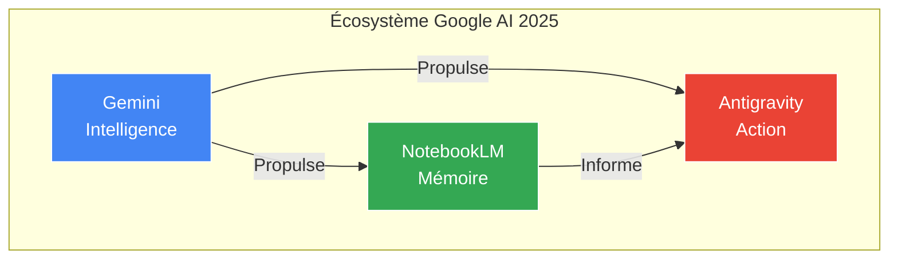

> **Note pour les roboticiens** : Ces technologies permettent de créer des robots capables de comprendre des instructions en langage naturel, de raisonner sur des tâches complexes et d'interagir de manière autonome avec leur environnement.

---

## 2. Google Gemini : La famille de modèles

### 2.1 Historique et évolution

L'histoire de Gemini commence avec la fusion des équipes Google Brain et DeepMind en 2023, créant Google DeepMind. Cette consolidation a permis de développer une nouvelle génération de modèles multimodaux.

**Chronologie des versions Gemini :**

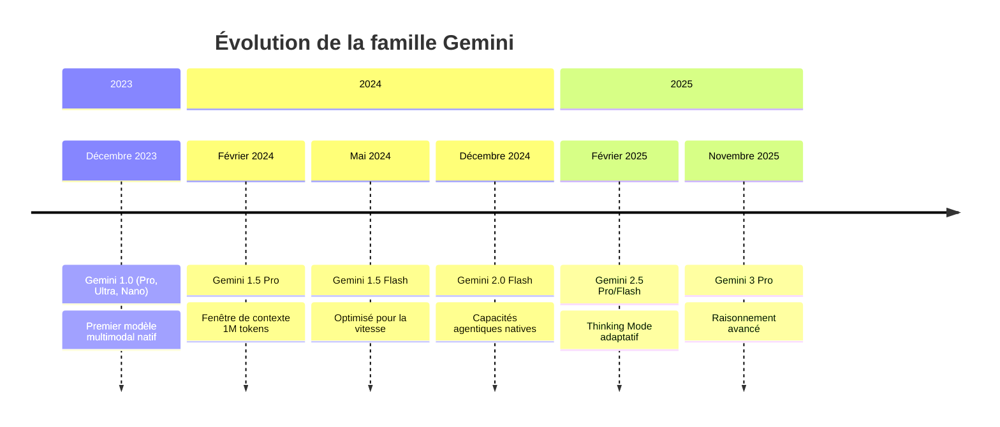

**Dates clés :**

| Date | Événement | Signification |
|------|-----------|---------------|
| Décembre 2023 | Lancement Gemini 1.0 | Premier modèle multimodal natif de Google |
| Février 2024 | Gemini 1.5 Pro | Fenêtre de contexte révolutionnaire (1M tokens) |
| Décembre 2024 | Gemini 2.0 Flash | Introduction des capacités agentiques |
| Novembre 2025 | Gemini 3 Pro | Thinking Mode et raisonnement avancé |

### 2.2 Gemini 3 Pro : Le modèle phare

**Gemini 3 Pro** est le modèle de langage multimodal le plus avancé de Google (lancé en Preview en novembre 2025). Il représente un saut qualitatif majeur dans les capacités de raisonnement.

#### Caractéristiques principales

| Caractéristique | Description | Impact |
|-----------------|-------------|--------|
| **Thinking Mode** | Génère une chaîne de pensée interne avant de répondre | Réduit les hallucinations de 60% |
| **Multimodalité native** | Traite texte, images, vidéo, audio simultanément | Compréhension holistique |
| **Contexte 1M+ tokens** | Ingère des livres entiers ou bases de code | Analyse de projets complets |
| **Tool Use natif** | Sait quand utiliser des outils externes | Autonomie accrue |

#### Le Thinking Mode expliqué

Le **Thinking Mode** est une innovation majeure de Gemini 3. Contrairement aux modèles précédents qui prédisaient directement le prochain token, Gemini 3 peut entrer dans un mode de "réflexion" :

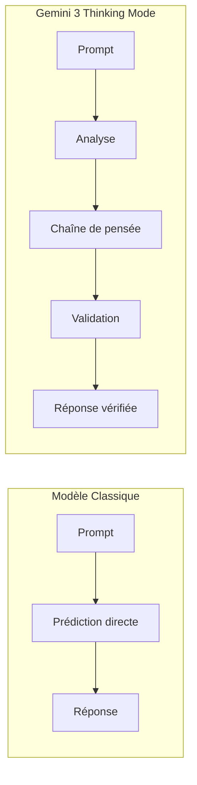

**Niveaux de Thinking :**

- **Low** : Réflexion minimale, réponses rapides
- **Medium** : Équilibre entre vitesse et profondeur
- **High** : Raisonnement approfondi pour les tâches complexes

> **Conseil** : Pour les applications robotiques critiques, utilisez le niveau "High" pour minimiser les erreurs de raisonnement.

#### Architecture conceptuelle

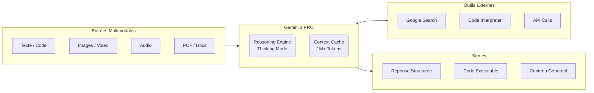

### 2.3 Comparaison des modèles Gemini

#### Tableau comparatif des modèles actuels (Décembre 2025)

| Modèle | Cas d'usage | Tokens entrée | Tokens sortie | Thinking | Function Calling |
|--------|-------------|---------------|---------------|----------|------------------|
| **Gemini 3 Pro** | Raisonnement avancé, agentic | 1,048,576 | 65,536 | ✅ | ✅ |
| **Gemini 2.5 Pro** | Tâches complexes, code | 1,048,576 | 65,536 | ✅ | ✅ |
| **Gemini 2.5 Flash** | Prix-performance optimal | 1,048,576 | 65,536 | ✅ | ✅ |
| **Gemini 2.5 Flash-Lite** | Ultra-rapide, coût minimal | 1,048,576 | 65,536 | ✅ | ✅ |
| **Gemini 2.0 Flash** | Workloads généraux | 1,048,576 | 8,192 | ⚠️ Exp | ✅ |

#### Arbre de décision pour le choix du modèle

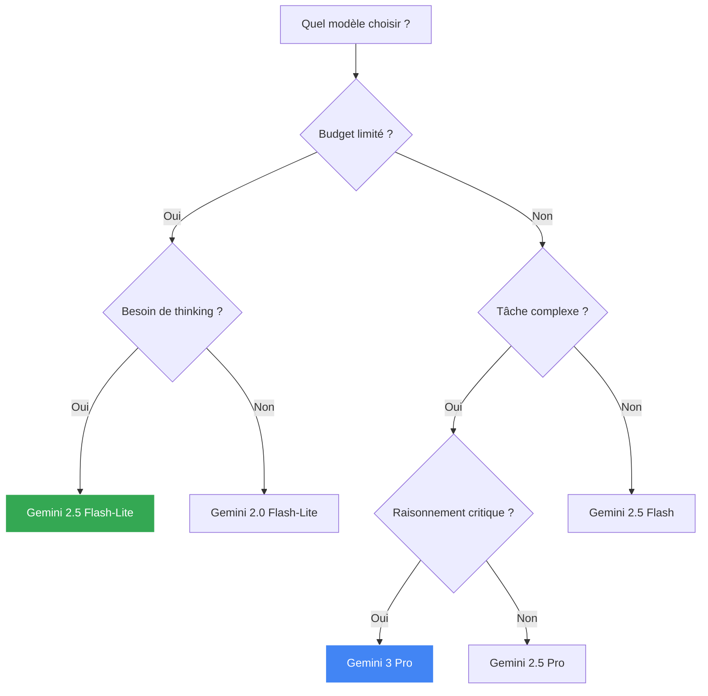

### 2.4 Capacités multimodales

Gemini est nativement multimodal, ce qui signifie qu'il a été entraîné dès le départ sur plusieurs types de données simultanément.

#### Types d'entrées supportées

| Type | Formats | Limite | Cas d'usage robotique |
|------|---------|--------|----------------------|
| **Texte** | Plain text, Markdown | 1M tokens | Instructions, documentation |
| **Images** | JPEG, PNG, WebP, GIF | Multiple images | Vision par ordinateur |
| **Vidéo** | MP4, MOV, WebM | Heures de contenu | Analyse de scènes |
| **Audio** | MP3, WAV, FLAC | Heures de contenu | Commandes vocales |
| **Documents** | PDF, DOCX | Centaines de pages | Manuels techniques |
| **Code** | Tous langages | Bases de code entières | Analyse de firmware |

#### Diagramme du flux multimodal

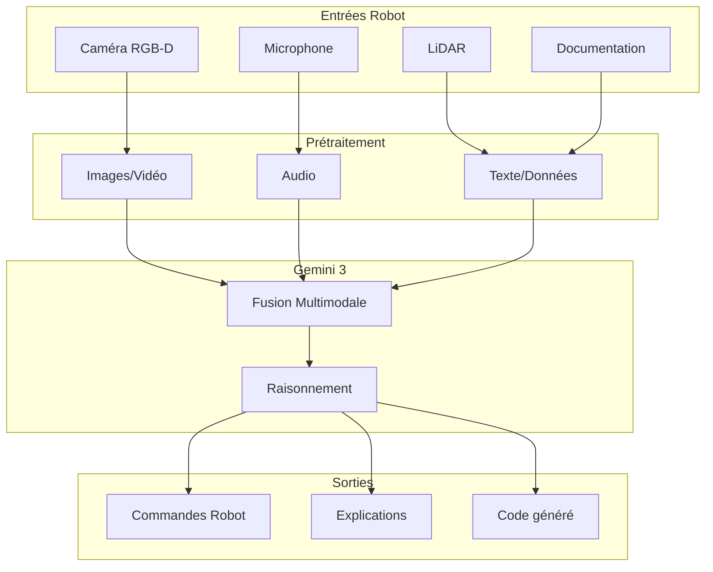

### 2.5 Function Calling et outils

Le **Function Calling** permet à Gemini d'interagir avec des systèmes externes de manière structurée. C'est une capacité essentielle pour les applications robotiques.

#### Principe du Function Calling

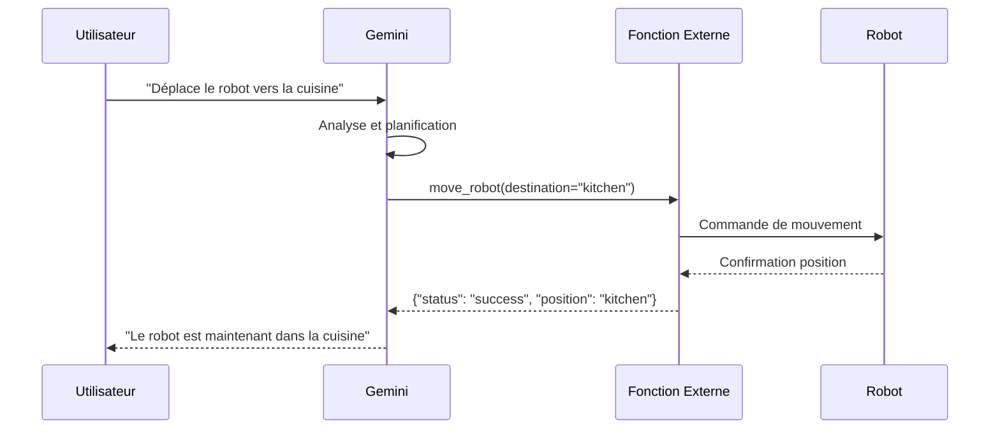

#### Outils natifs disponibles

| Outil | Description | Cas d'usage |
|-------|-------------|-------------|
| **Google Search** | Recherche web en temps réel | Informations actualisées |
| **Code Execution** | Exécution Python sandboxée | Calculs, visualisations |
| **Google Maps** | Données géographiques | Navigation robotique |
| **URL Context** | Lecture de pages web | Documentation en ligne |
| **File Search** | Recherche dans fichiers uploadés | Base de connaissances |

### 2.6 Exemples de code avec l'API Gemini

#### Installation et configuration

```bash
# Installation du SDK Python
pip install google-genai

# Ou avec npm pour JavaScript
npm install @google/genai
```

#### Exemple 1 : Génération de texte simple

```python
from google import genai

# Configuration du client
client = genai.Client(api_key="VOTRE_CLE_API")

# Génération simple
response = client.models.generate_content(
    model="gemini-2.5-flash",
    contents="Explique le concept de SLAM en robotique en 3 phrases."
)

print(response.text)
```

#### Exemple 2 : Analyse d'image pour la robotique

```python
from google import genai
from google.genai import types
import base64

client = genai.Client(api_key="VOTRE_CLE_API")

# Charger une image de la caméra du robot
with open("camera_frame.jpg", "rb") as f:
    image_data = base64.b64encode(f.read()).decode()

# Analyse de la scène
response = client.models.generate_content(
    model="gemini-2.5-flash",
    contents=[
        types.Part.from_text("Décris les objets dans cette image et leur position relative. Identifie les obstacles potentiels pour un robot mobile."),
        types.Part.from_bytes(
            data=base64.b64decode(image_data),
            mime_type="image/jpeg"
        )
    ]
)

print(response.text)
```

#### Exemple 3 : Function Calling pour contrôle robotique

```python
from google import genai
from google.genai import types

# Définition des fonctions du robot
robot_functions = [
    {
        "name": "move_robot",
        "description": "Déplace le robot vers une position cible",
        "parameters": {
            "type": "object",
            "properties": {
                "x": {"type": "number", "description": "Coordonnée X en mètres"},
                "y": {"type": "number", "description": "Coordonnée Y en mètres"},
                "speed": {"type": "number", "description": "Vitesse en m/s (0.1-1.0)"}
            },
            "required": ["x", "y"]
        }
    },
    {
        "name": "grab_object",
        "description": "Saisit un objet avec le préhenseur",
        "parameters": {
            "type": "object",
            "properties": {
                "object_id": {"type": "string", "description": "Identifiant de l'objet"},
                "grip_force": {"type": "number", "description": "Force de préhension en N"}
            },
            "required": ["object_id"]
        }
    }
]

client = genai.Client(api_key="VOTRE_CLE_API")
tools = types.Tool(function_declarations=robot_functions)
config = types.GenerateContentConfig(tools=[tools])

# Demande en langage naturel
response = client.models.generate_content(
    model="gemini-2.5-flash",
    contents="Va chercher la tasse rouge sur la table et apporte-la moi",
    config=config
)

# Traitement des appels de fonction
for part in response.candidates[0].content.parts:
    if hasattr(part, 'function_call'):
        fc = part.function_call
        print(f"Fonction: {fc.name}")
        print(f"Arguments: {fc.args}")
```

#### Exemple 4 : Thinking Mode pour planification complexe

```python
from google import genai
from google.genai import types

client = genai.Client(api_key="VOTRE_CLE_API")

# Configuration avec Thinking Mode
config = types.GenerateContentConfig(
    thinking_config=types.ThinkingConfig(
        thinking_budget=1024  # Tokens alloués à la réflexion
    )
)

# Tâche de planification complexe
response = client.models.generate_content(
    model="gemini-3-pro-preview",
    contents="""
    Tu es un planificateur de tâches robotiques.

    Contexte: Un robot mobile avec un bras manipulateur doit ranger une pièce.
    Objets détectés: 3 livres sur le sol, 2 tasses sur le bureau, 1 chaise renversée.
    Contraintes: Batterie à 40%, capacité de charge 2kg max.

    Génère un plan d'action optimal en tenant compte des contraintes énergétiques.
    """,
    config=config
)

print(response.text)
```

---

## 3. Google NotebookLM

### 3.1 Concept et philosophie

**NotebookLM** est un assistant de recherche "grounded" (ancré). Contrairement à un chatbot générique qui utilise tout son entraînement, NotebookLM se restreint **exclusivement** aux documents que vous lui fournissez.

#### Différence avec un chatbot classique

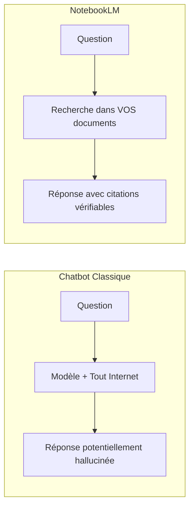

#### Avantages clés

| Aspect | Chatbot classique | NotebookLM |
|--------|-------------------|------------|
| **Source** | Entraînement général | Vos documents uniquement |
| **Vérifiabilité** | Difficile | Citations cliquables |
| **Hallucinations** | Fréquentes | Très rares |
| **Confidentialité** | Données partagées | Documents privés |
| **Actualité** | Limité au cutoff | Toujours à jour |

### 3.2 Architecture RAG

La technologie clé derrière NotebookLM est le **RAG** (Retrieval-Augmented Generation).

#### Principe du RAG

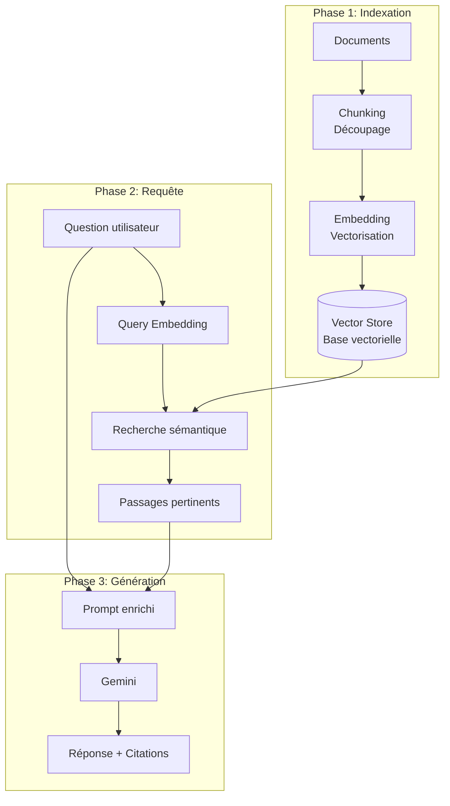

#### Étapes détaillées

1. **Chunking** : Les documents sont découpés en segments de 500-1000 tokens
2. **Embedding** : Chaque segment est converti en vecteur (768-1536 dimensions)
3. **Indexation** : Les vecteurs sont stockés dans une base vectorielle
4. **Retrieval** : La question est vectorisée et comparée aux segments
5. **Augmentation** : Les segments pertinents enrichissent le prompt
6. **Generation** : Gemini génère une réponse basée sur le contexte

### 3.3 Fonctionnalités principales

#### Sources supportées

| Type de source | Limite | Notes |
|----------------|--------|-------|
| Google Docs | 50 par notebook | Synchronisation automatique |
| PDF | 50 par notebook | OCR inclus |
| Sites web | 50 URLs | Extraction du contenu |
| YouTube | 50 vidéos | Transcription automatique |
| Texte brut | 50 fichiers | Copier-coller |
| Google Slides | 50 présentations | Texte et notes |

#### Audio Overviews : La fonctionnalité star

NotebookLM peut transformer vos documents en un **podcast audio** réaliste avec deux hôtes IA qui discutent du contenu.

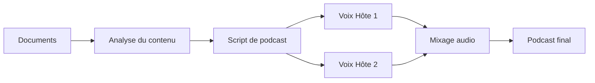

**Caractéristiques :**
- Durée : 5-15 minutes selon le contenu
- Ton conversationnel et engageant
- Analogies et exemples générés automatiquement
- Personnalisable (focus, ton, public cible)

### 3.4 Cas d'usage pour la robotique

#### Scénario 1 : Documentation technique

```
Sources uploadées:
- Manuel du robot (PDF)
- Datasheets des capteurs (PDF)
- Notes de cours ROS 2 (Google Docs)

Questions possibles:
- "Comment calibrer le LiDAR selon le manuel ?"
- "Quelles sont les limites de couple des moteurs ?"
- "Résume les différences entre ROS 1 et ROS 2"
```

#### Scénario 2 : Revue de littérature

```
Sources uploadées:
- 20 articles de recherche sur le SLAM (PDF)
- Thèses de doctorat (PDF)

Questions possibles:
- "Compare les approches SLAM visuelles vs LiDAR"
- "Quels sont les défis non résolus mentionnés ?"
- "Génère un Audio Overview de l'état de l'art"
```

#### Diagramme de séquence : Flux NotebookLM

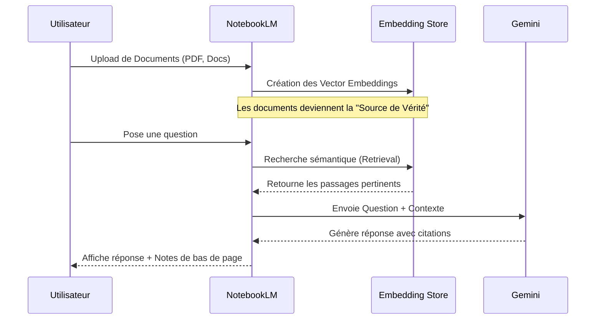

---

## 4. Google Antigravity

### 4.1 Présentation de la plateforme

**Google Antigravity** est la plateforme de développement "Agent-First" de nouvelle génération, lancée en novembre 2025 par Google DeepMind. Elle représente l'évolution de l'IDE vers l'ère des agents autonomes.

> "Antigravity n'est pas juste un IDE avec de l'IA. C'est un environnement où les agents autonomes prennent en charge des tâches complexes de bout en bout."
> — Blog Google Developers, Novembre 2025

#### Positionnement dans l'écosystème

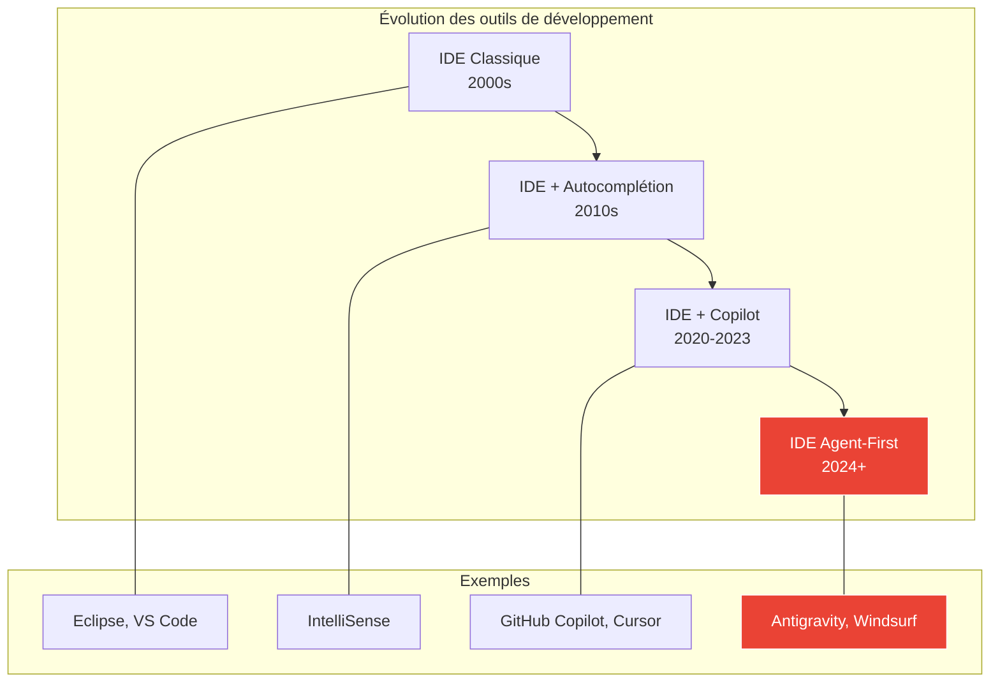

### 4.2 Architecture Agent-First

#### Différence avec les assistants de code traditionnels

| Aspect | Copilot/Cursor | Antigravity |
|--------|----------------|-------------|
| **Paradigme** | Autocomplétion assistée | Agent autonome |
| **Scope** | Ligne/fonction | Projet entier |
| **Planification** | Aucune | Multi-étapes |
| **Vérification** | Manuelle | Automatique |
| **Contexte** | Fichier courant | Codebase + Web + Docs |

#### Les trois piliers d'Antigravity

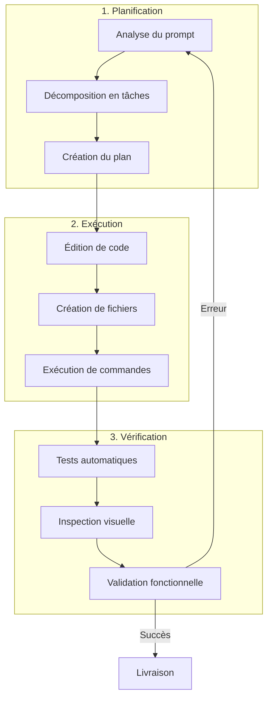

### 4.3 Composants et workflow

#### Composants clés

| Composant | Rôle | Technologie |
|-----------|------|-------------|
| **Agent Manager** | Orchestration des tâches | Gemini 3 Pro |
| **IDE instrumenté** | Lecture/écriture de code | Fork VS Code |
| **Browser Agent** | Tests visuels automatisés | Puppeteer/Playwright |
| **Terminal Agent** | Exécution de commandes | Shell sandboxé |
| **Artefacts** | Suivi et documentation | Markdown dynamique |

#### Workflow agentique complet

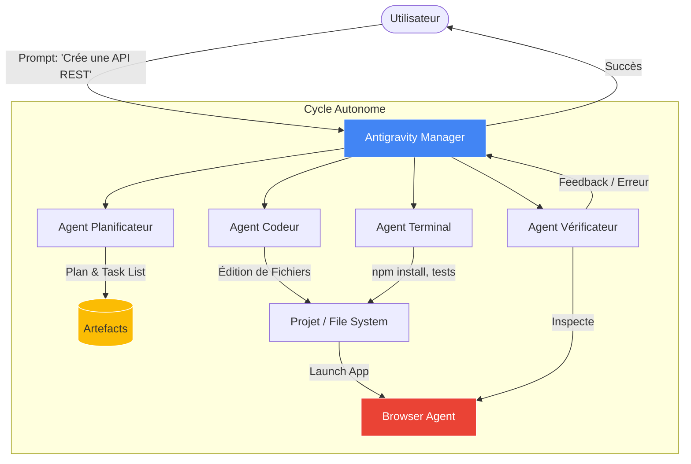

#### Exemple de session Antigravity

```
👤 Utilisateur: "Crée une API REST pour contrôler un bras robotique avec
   des endpoints pour move, grip et status"

🤖 Antigravity:
   📋 Plan créé:
   1. Analyser les requirements
   2. Créer la structure du projet
   3. Implémenter les endpoints
   4. Ajouter la validation
   5. Écrire les tests
   6. Documenter l'API

   ⚙️ Exécution en cours...
   ✅ Fichier créé: src/app.py
   ✅ Fichier créé: src/robot_controller.py
   ✅ Fichier créé: tests/test_api.py
   ✅ Tests passés: 12/12

   📦 Livrable: API REST fonctionnelle avec documentation Swagger
```

### 4.4 Intégration avec la robotique

#### Architecture Robot + Antigravity

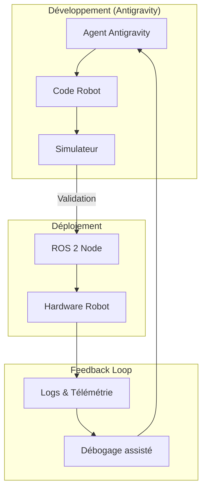

#### Cas d'usage : Développement d'un nœud ROS 2

```python
# Prompt Antigravity:
# "Crée un nœud ROS 2 qui publie les données d'un capteur IMU
#  à 100Hz avec gestion des erreurs"

# Code généré par Antigravity:
import rclpy
from rclpy.node import Node
from sensor_msgs.msg import Imu
from rclpy.qos import QoSProfile, ReliabilityPolicy
import numpy as np

class IMUPublisher(Node):
    def __init__(self):
        super().__init__('imu_publisher')

        # Configuration QoS pour données temps réel
        qos = QoSProfile(
            depth=10,
            reliability=ReliabilityPolicy.BEST_EFFORT
        )

        self.publisher = self.create_publisher(Imu, 'imu/data', qos)
        self.timer = self.create_timer(0.01, self.publish_imu)  # 100Hz

        self.get_logger().info('IMU Publisher initialisé')

    def publish_imu(self):
        try:
            msg = Imu()
            msg.header.stamp = self.get_clock().now().to_msg()
            msg.header.frame_id = 'imu_link'

            # Lecture capteur (simulée ici)
            msg.linear_acceleration.x = np.random.normal(0, 0.1)
            msg.linear_acceleration.y = np.random.normal(0, 0.1)
            msg.linear_acceleration.z = np.random.normal(9.81, 0.1)

            self.publisher.publish(msg)

        except Exception as e:
            self.get_logger().error(f'Erreur lecture IMU: {e}')

def main():
    rclpy.init()
    node = IMUPublisher()
    rclpy.spin(node)
    rclpy.shutdown()

if __name__ == '__main__':
    main()
```

---

## 5. Bonnes pratiques

### 5.1 Utilisation de Gemini

#### Prompting efficace

| Pratique | Exemple | Pourquoi |
|----------|---------|----------|
| **Être spécifique** | "Génère du code Python 3.10 pour ROS 2 Humble" | Évite les ambiguïtés |
| **Donner du contexte** | "Tu es un expert en robotique mobile..." | Oriente les réponses |
| **Structurer la demande** | "1. Analyse 2. Implémente 3. Teste" | Facilite le suivi |
| **Demander des explications** | "Explique chaque étape" | Améliore la compréhension |

#### Gestion des tokens

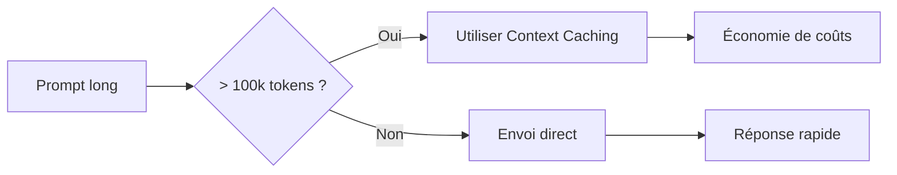

### 5.2 Utilisation de NotebookLM

#### Organisation des sources

- **Grouper par thème** : Un notebook par projet/sujet
- **Nommer clairement** : Préfixer les documents (01_intro, 02_methode...)
- **Mettre à jour** : Supprimer les sources obsolètes
- **Limiter le scope** : 10-20 sources pertinentes > 50 sources vagues

#### Questions efficaces

```
❌ "Parle-moi du SLAM"
✅ "Selon les articles uploadés, quelles sont les 3 principales
   limitations du SLAM visuel en environnement extérieur ?"
```

### 5.3 Utilisation d'Antigravity

#### Prompts de qualité

```
❌ "Fais une app"

✅ "Crée une application Flask qui:
   - Expose une API REST pour contrôler un robot
   - Endpoints: /move (POST), /status (GET), /stop (POST)
   - Validation des entrées avec Pydantic
   - Tests unitaires avec pytest
   - Documentation Swagger automatique"
```

#### Revue du travail de l'agent

- **Vérifier le plan** avant l'exécution
- **Lire les artefacts** générés
- **Tester manuellement** les fonctionnalités critiques
- **Itérer** avec des feedbacks précis

---

## 6. Ressources et références

### 6.1 Documentation officielle

| Ressource | URL | Description |
|-----------|-----|-------------|
| **Gemini API Docs** | ai.google.dev/gemini-api | Documentation complète |
| **Google AI Studio** | aistudio.google.com | Interface web pour tester |
| **NotebookLM** | notebooklm.google.com | Accès à l'outil |
| **Antigravity** | antigravity.dev | Plateforme de développement |

### 6.2 Tutoriels et guides

**Gemini :**
- [Quickstart Python](https://ai.google.dev/gemini-api/docs/quickstart)
- [Function Calling Guide](https://ai.google.dev/gemini-api/docs/function-calling)
- [Multimodal Prompting](https://ai.google.dev/gemini-api/docs/vision)

**Robotique + IA :**
- [Gemini Robotics Overview](https://ai.google.dev/gemini-api/docs/robotics)
- [ROS 2 + LLM Integration](https://docs.ros.org/)

### 6.3 Communautés

- **Discord** : Google AI Developers
- **Reddit** : r/GoogleGeminiAI, r/robotics
- **GitHub** : google-gemini, google-deepmind
- **Stack Overflow** : Tags [google-gemini], [notebooklm]

### 6.4 Articles de recherche

| Titre | Auteurs | Année | Sujet |
|-------|---------|-------|-------|
| Gemini: A Family of Highly Capable Multimodal Models | Google DeepMind | 2023 | Architecture Gemini |
| PaLM-E: An Embodied Multimodal Language Model | Google | 2023 | LLM pour robotique |
| RT-2: Vision-Language-Action Models | Google DeepMind | 2023 | Contrôle robotique |

---

## 7. Glossaire

| Terme | Définition |
|-------|------------|
| **Agent IA** | Système autonome capable de percevoir, raisonner et agir |
| **Antigravity** | Plateforme de développement agent-first de Google |
| **Context Window** | Nombre maximum de tokens qu'un modèle peut traiter |
| **Embedding** | Représentation vectorielle d'un texte ou média |
| **Function Calling** | Capacité d'un LLM à invoquer des fonctions externes |
| **Gemini** | Famille de modèles multimodaux de Google |
| **Grounding** | Ancrage des réponses sur des sources vérifiables |
| **Hallucination** | Génération d'informations fausses par un LLM |
| **LLM** | Large Language Model - Modèle de langage de grande taille |
| **Multimodal** | Capable de traiter plusieurs types de données (texte, image, audio) |
| **NotebookLM** | Assistant de recherche ancré sur documents de Google |
| **RAG** | Retrieval-Augmented Generation - Génération augmentée par récupération |
| **Thinking Mode** | Mode de raisonnement explicite de Gemini 3 |
| **Token** | Unité de texte (mot ou sous-mot) traitée par un LLM |
| **Tool Use** | Capacité d'un modèle à utiliser des outils externes |
| **Vector Store** | Base de données optimisée pour les vecteurs d'embedding |

---

## Synthèse

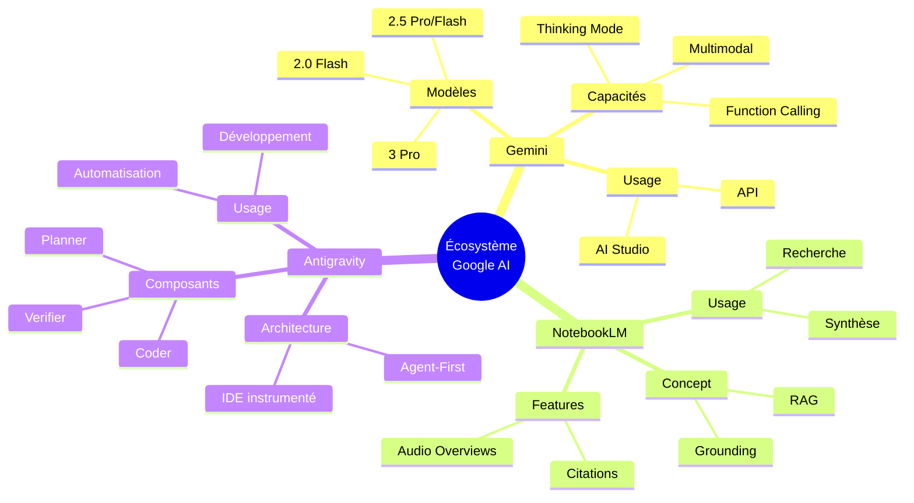

**En résumé :**

- **Gemini** est le "Cerveau" — L'intelligence brute multimodale
- **NotebookLM** est le "Bibliothécaire" — La mémoire et la synthèse ancrée
- **Antigravity** est l'"Ouvrier" — L'action et le développement autonome

Ces trois outils, utilisés ensemble, permettent de créer des systèmes robotiques intelligents capables de comprendre, raisonner et agir de manière autonome.
