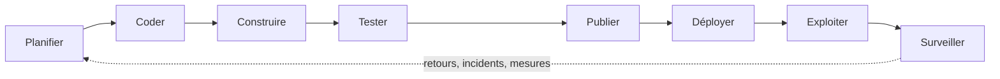

# Chapitre 8 · CI/CD et DevOps : automatiser la confiance

*Séance 1 « Comprendre et s'équiper » · Master ITI, Nantes Université, 2026-2027. Chapitre à lire avant ou après la séance. État des outils vérifié le 6 octobre 2026.*

## Ce que vous allez retenir

- Une **chaîne d'intégration continue (CI)** lance automatiquement, sur une machine distante, les contrôles du projet (analyse, tests) à chaque modification, et répond par une pastille verte ou rouge. Vous n'avez plus à « penser à tester ».
- **Livraison continue** signifie « le logiciel est toujours prêt à être publié » ; **déploiement continu** signifie « il est publié automatiquement ». La différence est une décision d'organisation, pas de technique.
- **DevOps** est un mouvement qui rapproche ceux qui construisent le logiciel et ceux qui le font tourner. Il se pilote avec des indicateurs : les indicateurs **DORA** (fréquence de déploiement, délai de livraison, taux d'échec, temps de rétablissement).
- L'IA accélère l'écriture du code, mais elle ne règle pas la stabilité : selon DORA 2025, elle **amplifie** les forces et les faiblesses d'une organisation. Une CI solide est ce qui transforme la vitesse en vitesse utile.
- Un **workflow GitHub Actions** est un simple fichier texte (YAML) rangé dans le dépôt. Le chapitre en fournit un complet pour un projet Flutter : analyse, tests, porte de couverture, build web, publication sur GitHub Pages. Il a été validé syntaxiquement et ses commandes ont été exécutées.
- Les **portes qualité** (lint, couverture, tests de mutation) et les **protections de branche** font passer la règle du « on s'est mis d'accord » au « la machine l'impose ».
- Un **secret** (clé, mot de passe) n'entre jamais dans le dépôt ; et tout ce qui est dans un build web publié est public.
- Pour les applications mobiles, la documentation officielle de Flutter liste Codemagic, Bitrise et Appcircle comme options « tout-en-un », et décrit fastlane comme un outil à intégrer à un système de CI existant. fastlane n'y est **pas** présenté comme la recommandation officielle.
- Dans la CI, l'agent de code est un **contributeur comme un autre** : ses modifications passent par les mêmes contrôles, et c'est la CI, pas l'agent, qui a le dernier mot.

---

## 1. Pourquoi automatiser : le problème que la CI résout

Imaginez une équipe de cinq personnes qui rédige un rapport de 200 pages. Chacune travaille sur son chapitre dans son coin pendant trois semaines, puis on assemble. Résultat prévisible : références croisées cassées, styles incompatibles, deux chapitres qui se contredisent. Plus on attend avant d'assembler, plus l'assemblage est douloureux et plus il est difficile de savoir qui a causé quoi.

Le logiciel a exactement ce problème. Plusieurs personnes (et désormais plusieurs agents) modifient en parallèle le même ensemble de fichiers, le **dépôt** (l'endroit, géré par l'outil git, où est stocké le code avec tout son historique). La réponse historique, venue de l'**Extreme Programming** (une méthode agile des années 1990, voir le chapitre sur l'histoire du métier), est d'assembler **tout le temps**, par petits morceaux, et de vérifier à chaque assemblage que « ça marche encore ».

Le mot « vérifier » est la clé. Vérifier à la main est lent, ennuyeux, et surtout oubliable un vendredi à 18 h. Une machine, elle, ne se lasse pas : elle exécute la même liste de contrôles, de la même façon, à chaque modification. Tout ce chapitre tient dans cette phrase : **on transforme une discipline humaine fragile en un mécanisme automatique fiable**.

> **À retenir.** La CI/CD ne rend personne plus intelligent : elle supprime la dépendance à la mémoire et à la bonne volonté. C'est exactement pourquoi elle devient plus importante quand un agent d'IA produit du code à grande vitesse.

---

## 2. Intégration continue, livraison continue, déploiement continu

### 2.1 Trois mots, trois niveaux d'automatisation

Un petit lexique avant d'aller plus loin (le glossaire complet est en fin de chapitre) :

- **Intégration** : fusionner ses modifications avec celles des autres.
- **Livraison** : mettre à disposition une version du logiciel, prête à être installée ou mise en ligne.
- **Déploiement** : installer effectivement cette version là où les utilisateurs s'en servent (la **production**).

**Intégration continue (CI, *Continuous Integration*).** Martin Fowler, auteur de référence sur le sujet, la définit ainsi : « Continuous Integration is a software development practice where each member of a team merges their changes into a codebase together with their colleagues changes at least daily. » Il insiste sur le fait que chaque intégration doit être vérifiée par une construction qui se teste elle-même (section « Make the Build Self-Testing » de l'article). L'article a été publié en 2000, réécrit en 2006 et révisé en janvier 2024 (source : Fowler, voir Sources).

Concrètement, pour vous : vous proposez une modification, une machine distante lance l'analyse du code et les tests, et vous recevez un verdict : vert (tout passe) ou rouge (quelque chose casse).

**Livraison continue (*Continuous Delivery*, CD).** Fowler la définit comme « a software development discipline where you build software in such a way that the software can be released to production at any time. » C'est une capacité : le logiciel est **toujours dans un état publiable**. La notion a été popularisée par le livre *Continuous Delivery* de Jez Humble et David Farley (2010), dont l'idée centrale est que chaque modification doit pouvoir partir en production grâce à un **pipeline** automatisé (notes du conférencier de la séance 1).

**Déploiement continu (*Continuous Deployment*).** C'est l'étape d'après : chaque modification qui passe tous les contrôles est publiée **automatiquement**, sans clic humain. Fowler résume la relation : « In order to do Continuous Deployment you must be doing Continuous Delivery. » Autrement dit, on peut faire de la livraison continue sans déploiement continu (par exemple parce que le métier souhaite choisir la date de mise en ligne), mais pas l'inverse.

| | Intégration continue | Livraison continue | Déploiement continu |
|---|---|---|---|
| Question posée | Est-ce que ça marche avec le reste ? | Est-ce publiable maintenant ? | Est-ce déjà en ligne ? |
| Déclencheur | chaque modification | chaque modification validée | chaque modification validée |
| Qui décide de publier ? | sans objet | un humain, quand il veut | la machine, automatiquement |
| Analogie | relire et assembler le rapport après chaque ajout | rapport toujours prêt à imprimer | rapport imprimé et envoyé dès qu'il est validé |

*Source du tableau : synthèse pédagogique des définitions de Fowler ci-dessus.*

### 2.2 Le pipeline

Un **pipeline** est la chaîne d'étapes que parcourt une modification, comme une chaîne de montage avec des postes de contrôle. Un pipeline typique pour un projet Flutter :

1. **Récupérer** le code (*checkout*).
2. **Installer** les outils (Flutter) et les dépendances (les bibliothèques tierces dont dépend le projet).
3. **Analyser** le code (*lint*, voir section 6).
4. **Tester** (tests automatisés, avec mesure de couverture).
5. **Construire** (*build*) : produire le livrable, ici un site web.
6. **Publier** : le mettre en ligne.

Si une étape échoue, les suivantes ne s'exécutent pas : c'est le principe du **« fail fast »**, échouer tôt, quand la correction coûte le moins cher.

Vocabulaire à connaître, tel que présenté en séance : **pipeline** (la chaîne d'étapes), **runner** (la machine qui les exécute), **workflow** (le fichier qui décrit quoi faire et quand), **artefact** (un fichier produit par le pipeline : rapport, paquet, site), **build web** (le logiciel emballé en application web), **environnement** (l'endroit où le logiciel tourne : test, production).

---

## 3. DevOps et la boucle DevOps

### 3.1 Un mur entre deux métiers

Pendant longtemps, deux équipes s'opposaient par construction. Les **développeurs** (*Dev*) sont jugés sur la vitesse à laquelle ils livrent des nouveautés. Les **exploitants** (*Ops*, pour *operations* : administrateurs systèmes, équipes d'infrastructure) sont jugés sur la stabilité du service en production. L'un veut changer souvent, l'autre veut que rien ne change : conflit d'intérêts garanti, avec un « mur » de passage de relais entre les deux.

Le terme **DevOps** est apparu vers 2009. Selon l'article rétrospectif de devops.com, il ne vient pas d'une seule personne : Patrick Debois, après avoir suivi en vidéo la présentation « 10+ Deploys per Day: Dev and Ops Cooperation at Flickr » (John Allspaw et Paul Hammond, conférence Velocity), a lancé sa propre conférence, « Devopsdays », à Gand (Belgique). La date exacte (automne 2009) et l'étymologie du nom (contraction de *development* et *operations*) ne figurent pas dans cette source (*récit répandu, non vérifié sur document d'époque*).

### 3.2 Ce que DevOps est (et n'est pas)

DevOps n'est ni un métier, ni un logiciel que l'on achète. C'est un ensemble de **pratiques et une culture** : une seule équipe est responsable du logiciel de bout en bout (formule courante : « you build it, you run it » ; *origine non vérifiée ici*), les mises en production sont fréquentes, petites et automatisées, et on apprend de la production pour améliorer le produit. La CI/CD en est l'outillage central, mais le cœur est culturel.

### 3.3 La boucle

On représente classiquement DevOps comme une **boucle infinie** (un « 8 couché ») :



Retenez l'idée plus que les huit mots exacts (les schémas varient selon les auteurs : *présentation conventionnelle, pas une norme*). La moitié gauche est la **CI/CD** (construire, tester, publier). La moitié droite est l'**exploitation** : faire tourner, surveiller (*monitoring* : mesurer en continu l'état du service), alerter. Le fait important : **la boucle est fermée**. Ce qui se passe en production nourrit la planification suivante.

> **À retenir.** DevOps = raccourcir et fiabiliser le trajet entre « une idée est codée » et « un utilisateur s'en sert », puis boucler en apprenant de la production.

---

## 4. DORA : mesurer la performance de livraison

### 4.1 D'où viennent ces indicateurs

**DORA** (*DevOps Research and Assessment*) est un programme de recherche, aujourd'hui rattaché à Google Cloud, qui étudie par enquête annuelle ce qui distingue les équipes performantes. Les résultats des premières années ont été synthétisés dans le livre *Accelerate* (Nicole Forsgren, Jez Humble, Gene Kim, **2018**) : l'excellence technique est corrélée à la performance des organisations (notes du conférencier).

### 4.2 Les quatre indicateurs (et un cinquième)

En séance, nous présentons les « quatre clés ». Voici les quatre, avec une analogie de livraison de colis :

| Indicateur | Ce qu'il mesure | Analogie |
|---|---|---|
| **Fréquence de déploiement** (*deployment frequency*) | Combien de fois on publie sur une période | Nombre de tournées de livraison par semaine |
| **Délai de livraison des changements** (*change lead time*) | Temps entre « modification enregistrée dans le dépôt » et « en production » | Temps entre la commande et la livraison chez le client |
| **Taux d'échec des changements** (*change failure rate*) | Part des déploiements qui provoquent un échec en production (définition précise à relire sur dora.dev) | Part des colis livrés endommagés ou perdus |
| **Temps de rétablissement** (*failed deployment recovery time*, autrefois MTTR) | Temps pour réparer après un déploiement raté | Temps pour renvoyer un colis de remplacement |

Le site officiel de DORA classe les deux premiers avec le temps de rétablissement dans le **débit** (*throughput*) et le taux d'échec dans l'**instabilité** (*instability*). Point de vigilance : la page actuelle de DORA décrit un modèle à **cinq** indicateurs, car s'y ajoute le **taux de reprise** (*deployment rework rate* : part des déploiements non planifiés consécutifs à un incident en production), et signale le renommage de « MTTR » en « Failed Deployment Recovery Time » (source : dora.dev, consulté le 6 octobre 2026). Notre cours garde les quatre indicateurs classiques, qui restent la base de tout le vocabulaire, mais vous pouvez citer le cinquième.

L'astuce de ces indicateurs est qu'ils se **contrebalancent** : publier très souvent (vitesse) ne vaut rien si la moitié des publications cassent le service (stabilité). Il faut regarder les deux faces ensemble. Vous noterez aussi que ces indicateurs mesurent un **système**, pas des individus : s'en servir pour noter des personnes est un contresens classique.

### 4.3 Ce que l'IA change

Les équipes qui utilisent l'IA produisent plus de code, plus vite. Mais la CI et la revue n'ont pas toute leur capacité multipliée : l'IA déplace le goulot d'étranglement de l'écriture vers la vérification. Voici ce que disent les sources, en séparant les natures de preuve :

- **Fait (source primaire).** Le rapport DORA 2025 affirme que « AI's primary role is as an amplifier, magnifying an organization's existing strengths and weaknesses » et que les meilleurs retours viennent « from a strategic focus on the underlying organizational system » (dora.dev, page du rapport 2025).
- **Mesure corrélationnelle, rapportée par notre dossier de sources (chiffres non revérifiés à la source primaire pour ce chapitre).** DORA 2024 (environ 3 000 répondants) associe une hausse de 25 % de l'adoption de l'IA à une baisse de 7,2 % de la stabilité de livraison et de 1,5 % du débit. DORA 2025 (environ 5 000 professionnels, 90 % d'adoption) rapporte un débit en hausse, mais une instabilité toujours associée à l'IA (dossiers `cours/sources/craft.md` et `spec-driven.md`).
- **Consensus de praticiens.** Les sources convergent (DORA, Willison, Thoughtworks, Farley) : l'IA donne un gain si les pratiques sont bonnes, un fossé plus profond plus vite sinon. Ce n'est **pas** une preuve causale établie qu'une CI solide améliore les résultats avec agents ; c'est un avis largement partagé (notes du conférencier, partie 3).
- **Opinion.** « Sans CI de qualité, ne lâchez pas les agents » : cette recommandation de bon sens est la nôtre, elle découle du consensus ci-dessus, pas d'une étude.

Corrélation n'est pas causalité : une association entre IA et instabilité peut venir d'autres facteurs (par exemple des changements plus gros, ce que suggère l'une de nos sources, sans preuve).

> **À retenir.** Si vous devez suivre un seul indicateur quand une équipe adopte l'IA, regardez le **taux d'échec** et le temps de rétablissement, pas seulement la fréquence de déploiement. Aller plus vite ne vaut que si la qualité suit.

---

## 5. GitHub Actions pas à pas

### 5.1 Les briques

**GitHub Actions** est le service d'automatisation intégré à GitHub. Vocabulaire officiel (documentation GitHub) :

- **Workflow** : « a configurable automated process that will run one or more jobs », défini dans un fichier YAML stocké dans `.github/workflows/` du dépôt.
- **Événement** (*event*) : ce qui déclenche le workflow (une poussée de code, l'ouverture d'une pull request, un horaire, un clic).
- **Job** : un groupe d'étapes exécutées sur la même machine. Les jobs s'exécutent en parallèle par défaut, ou à la suite si on le demande.
- **Étape** (*step*) : une commande ou une action.
- **Action** : un bloc réutilisable écrit par d'autres (par exemple « installer Flutter »).
- **Runner** : le serveur qui exécute les jobs ; GitHub en fournit sous Linux, Windows et macOS.

**YAML** est un format de texte où la structure se lit à l'indentation : deux espaces de plus signifient « ceci est contenu dans la ligne du dessus ». C'est strict : une indentation fausse casse le fichier. Les lignes qui commencent par `#` sont des commentaires.

### 5.2 Le workflow complet, ligne à ligne

Ce fichier se place dans `.github/workflows/ci.yml`. Il fait quatre choses : analyser, tester (avec porte de couverture), construire le site web, le publier sur **GitHub Pages** (l'hébergement gratuit de sites statiques de GitHub).

**Contrôle qualité de ce fichier.** Syntaxe YAML chargée sans erreur avec Python (`yaml.safe_load`), `actionlint` non disponible sur la machine de rédaction. Les commandes `flutter pub get --enforce-lockfile`, `flutter analyze`, `flutter test --coverage`, `flutter build web --release --base-href` et le script de couverture ont été exécutées sur un projet Flutter 3.47.6 (Dart 3.13.5) créé pour l'occasion : analyse sans erreur, test passé, couverture de 92,3 %, build réussi, balise `<base href>` correctement réécrite. Le déploiement réel sur GitHub Pages n'a **pas** pu être testé hors de GitHub : relisez les paramètres du dépôt (section 5.4).

```yaml
# Nom affiché dans l'onglet « Actions » de GitHub
name: CI et publication web

# Quand ce workflow se déclenche
on:
  push:
    branches: [main]      # à chaque fusion dans la branche principale
  pull_request:           # à chaque proposition de modification
  workflow_dispatch:      # et à la demande, depuis l'interface

# Droits minimaux du jeton automatique : lecture seule par défaut
permissions:
  contents: read

# Si un nouveau commit arrive, on annule l'exécution précédente de la même branche
concurrency:
  group: ci-${{ github.ref }}
  cancel-in-progress: true

jobs:
  verifier:
    name: Analyse et tests
    runs-on: ubuntu-latest
    timeout-minutes: 15
    steps:
      - name: Récupérer le code
        uses: actions/checkout@v7

      - name: Installer Flutter
        uses: subosito/flutter-action@v2
        with:
          channel: stable
          flutter-version: 3.47.6   # version figée : même résultat à chaque exécution
          cache: true               # réutilise le SDK téléchargé lors d'une exécution précédente
          pub-cache: true           # idem pour les dépendances

      - name: Télécharger les dépendances (selon pubspec.lock)
        run: flutter pub get --enforce-lockfile

      - name: Analyse statique
        run: flutter analyze

      - name: Tests avec couverture
        run: flutter test --coverage

      - name: Porte qualité sur la couverture (minimum 60 %)
        run: |
          awk -F: '/^LF:/{f+=$2} /^LH:/{h+=$2}
            END {
              if (f == 0) { print "Aucune ligne mesurée"; exit 1 }
              p = 100 * h / f
              printf "Couverture : %.1f %%\n", p
              if (p < 60) { print "Sous le seuil de 60 %"; exit 1 }
            }' coverage/lcov.info

      - name: Conserver le rapport de couverture
        uses: actions/upload-artifact@v7
        with:
          name: couverture
          path: coverage/lcov.info

  construire:
    name: Build web
    needs: verifier               # ne démarre que si « verifier » est vert
    runs-on: ubuntu-latest
    timeout-minutes: 15
    steps:
      - uses: actions/checkout@v7
      - uses: subosito/flutter-action@v2
        with:
          channel: stable
          flutter-version: 3.47.6
          cache: true
          pub-cache: true
      - run: flutter pub get --enforce-lockfile
      # Sur GitHub Pages, le site vit sous /nom-du-depot/ : on le dit à Flutter
      - name: Construire l'application web
        run: flutter build web --release --base-href "/${{ github.event.repository.name }}/"
      - name: Préparer l'artefact pour GitHub Pages
        uses: actions/upload-pages-artifact@v5
        with:
          path: build/web

  deployer:
    name: Publier sur GitHub Pages
    needs: construire
    # Uniquement après une fusion dans main, jamais pour une simple proposition
    if: github.event_name != 'pull_request' && github.ref == 'refs/heads/main'
    runs-on: ubuntu-latest
    permissions:
      contents: read
      pages: write                # autorisé à publier sur Pages
      id-token: write             # prouve l'origine de la publication
    environment:
      name: github-pages
      url: ${{ steps.deployment.outputs.page_url }}
    steps:
      - name: Déployer
        id: deployment
        uses: actions/deploy-pages@v5
```

**Lecture guidée.**

- `on:` décrit les **événements**. Ici, une proposition de modification (`pull_request`) déclenche l'analyse et les tests ; la fusion dans `main` déclenche en plus la publication.
- `permissions: contents: read` applique le **principe du moindre privilège** : le jeton automatique du workflow ne peut que lire. Les droits d'écriture sont ajoutés au seul job qui en a besoin (`deployer`). GitHub recommande ce réglage (guide de durcissement des actions).
- `concurrency` évite de gaspiller des minutes de calcul : si vous poussez deux fois de suite, seule la dernière exécution compte.
- `needs:` crée l'enchaînement. Si les tests échouent, le build ne démarre pas, et la publication encore moins.
- `flutter pub get --enforce-lockfile` impose d'utiliser exactement les versions de dépendances enregistrées dans le fichier `pubspec.lock` (option confirmée dans l'aide de la commande en Flutter 3.47). Sans cela, deux exécutions pourraient télécharger deux versions différentes d'une bibliothèque et donner deux résultats.
- `--base-href` est nécessaire car un site GitHub Pages de projet est servi à l'adresse `https://<compte>.github.io/<dépôt>/`, et non à la racine. Sans cette option, le navigateur cherche les fichiers au mauvais endroit et la page reste blanche (comportement constaté dans la balise `<base href>` générée par Flutter ; la page officielle de déploiement web de Flutter ne détaille pas le cas GitHub Pages).
- `environment: github-pages` est l'environnement par défaut de Pages ; il applique les règles de protection de déploiement (documentation GitHub Pages).

### 5.3 Des versions d'actions à contrôler

Les actions sont versionnées par **tags majeurs** (`@v7`). Au 6 octobre 2026, les dernières versions publiées (API GitHub, `releases/latest`) sont : `actions/checkout` v7.0.1, `subosito/flutter-action` v2.23.0, `actions/upload-artifact` v7.0.1, `actions/upload-pages-artifact` v5.0.0, `actions/deploy-pages` v5.0.1. D'autres actions de la même famille évoluent aussi (`actions/cache` v6.1.0, `actions/configure-pages` v6.0.0, que ce workflow n'utilise pas). Attention : certains exemples de la documentation GitHub Pages affichent encore des versions antérieures (v4, v5), ce qui montre la vitesse à laquelle ces numéros bougent. **Vérifiez toujours la page de l'action avant de recopier un numéro.**

Une consigne de sécurité de GitHub : épingler une action sur le **hash complet d'un commit** est « currently the only way to use an action as an immutable release ». Un tag comme `@v7` peut être déplacé par le mainteneur (ou par un attaquant qui prend son compte), un hash non. Pour un cours, les tags majeurs suffisent ; pour une entreprise, épinglez sur hash et laissez Dependabot proposer les mises à jour (section 9).

### 5.4 Activer GitHub Pages

Pour que le job `deployer` fonctionne, il faut une fois dans le dépôt : *Settings → Pages → Build and deployment → Source : GitHub Actions* (documentation GitHub Pages : la source doit être « GitHub Actions » et non une branche). Rappel de sécurité : un site GitHub Pages est en principe **public** (la visibilité privée relève d'offres d'entreprise ; *point non revérifié dans la documentation pour ce chapitre*). Données fictives uniquement, conformément à la règle d'or.

### 5.5 Le cache : pourquoi et attention

Chaque exécution démarre sur une machine vierge : il faudrait retélécharger Flutter (plusieurs centaines de Mo) et toutes les dépendances. Le **cache** conserve ces éléments d'une exécution à l'autre, ce qui réduit le temps d'attente. Ici, `cache: true` et `pub-cache: true` de `subosito/flutter-action` s'en chargent (inputs documentés dans le dépôt de l'action). Règle de prudence : un cache est une optimisation, jamais une source de vérité. Si un résultat semble étrange, la première hypothèse est un cache périmé.

### 5.6 Les secrets

Un **secret** est une valeur confidentielle dont le workflow a besoin : clé d'API, identifiant de publication, mot de passe. Règles :

1. **Jamais dans le dépôt**, ni dans le workflow en clair, ni dans le code.
2. On l'enregistre dans *Settings → Secrets and variables → Actions* (niveau dépôt, environnement ou organisation) et on y accède par `${{ secrets.NOM }}` (documentation GitHub).
3. GitHub ne transmet pas les secrets aux workflows déclenchés depuis un **fork** (copie du dépôt par un tiers), « with the exception of `GITHUB_TOKEN` ».
4. Un workflow peut utiliser les secrets du dépôt : toute personne qui peut modifier les workflows peut donc, en pratique, s'en servir ; ce n'est pas un coffre-fort contre l'équipe elle-même (*raisonnement de rédaction, non cité dans la documentation GitHub*).

Notre workflow n'a besoin d'aucun secret : le jeton `GITHUB_TOKEN` est créé automatiquement par GitHub pour chaque exécution, et la publication sur Pages passe par `id-token`. C'est un choix de conception : **moins on a de secrets, moins on en perd**.

Un piège propre au web : **tout ce qui est dans un build web est public** (code, ressources, constantes). Aucun secret ne doit donc se trouver *dans l'application*, même si on le « cache » dans une constante (programme détaillé, séance 4).

> **À retenir.** Un workflow est une recette versionnée avec le code : lisible, relisible, reproductible. Moindre privilège, version figée, secrets absents du dépôt, vérification avant publication.

---

## 6. Les portes qualité

Une **porte qualité** (*quality gate*) est un contrôle automatique dont l'échec bloque la suite. Le principe : on remplace « on espère que quelqu'un a regardé » par « c'est impossible de passer sans ».

### 6.1 Lint : l'analyse statique

Le **lint** (ou analyse statique) est un correcteur automatique pour le code : il lit le code sans l'exécuter et signale les erreurs probables, les oublis et les écarts de style. Avec Flutter, la commande est `flutter analyze`. Elle renvoie un code d'échec si elle trouve un problème, ce qui rend l'étape rouge. C'est la porte la plus rapide (quelques secondes) et la moins chère : à mettre toujours en premier.

### 6.2 Tests et couverture

Les **tests automatisés** (`flutter test`) vérifient que le comportement attendu est conservé. La **couverture de code** mesure la part des lignes du programme exécutées pendant les tests. Avec `flutter test --coverage`, Flutter écrit un fichier `coverage/lcov.info` ; notre script en extrait un pourcentage (lignes trouvées `LF`, lignes couvertes `LH`).

Exemple concret : si 80 lignes sur 100 sont exécutées par au moins un test, la couverture est de 80 %.

Mise en garde essentielle, à retenir pour tout échange avec une équipe : **la couverture mesure ce qui est exécuté, pas ce qui est vérifié**. Un test qui parcourt une fonction sans rien affirmer sur son résultat augmente la couverture sans protéger de rien. Un seuil (ici 60 %, choisi pour l'exemple, sans valeur universelle) est un filet de sécurité minimal, pas un label de qualité. Cette limite est exactement celle que les tests de mutation viennent combler.

### 6.3 Tests de mutation (aperçu)

L'idée est un jeu de piège : on **introduit volontairement un petit bug** dans le code (remplacer `>` par `>=`, un `+` par un `-`) et on relance les tests. Si les tests passent encore, c'est qu'ils ne protègent pas cette ligne : le « mutant a survécu ». Si un test devient rouge, le mutant est « tué ». Le **score de mutation** est la part de mutants tués.

Le paquet `mutation_test` existe pour Dart (publié sur pub.dev ; il s'ajoute avec `dart pub add --dev mutation_test` et se lance avec `dart run mutation_test`, et sa documentation avertit que l'exécution peut durer plusieurs heures selon la taille du code). Nous n'avons **pas** évalué sa maturité ni son usage sur un projet Flutter (*non vérifié*). Pour cette raison, et parce que c'est lent, les tests de mutation ne figurent ni dans notre workflow ni dans le programme : ils se placent plutôt dans une exécution nocturne ou à la demande. C'est un aperçu, pas une exigence.

### 6.4 Autres portes à connaître

- **Audit des dépendances** : vérifier que les bibliothèques tierces n'ont pas de faille connue. La commande `dart pub outdated` (listée dans l'aide de Dart 3.13.5) signale les versions plus récentes, mais n'est pas un audit de sécurité. Nous avons constaté qu'**aucune sous-commande `dart pub audit`** n'existe dans le SDK utilisé pour ce chapitre ; l'outil exact pour l'audit des paquets pub reste « à vérifier » (programme détaillé de la séance 4).
- **Détection de secrets** : un outil comme gitleaks cherche les clés oubliées dans le dépôt (prévu en séance 4 ; non installé sur la machine de rédaction, donc non testé ici).
- **Build réussi** : publier ce qui ne se construit pas n'a aucun sens ; l'étape de build est elle-même une porte.

> **À retenir.** Ordre économique des portes : lint (secondes), tests (minutes), build, puis contrôles lourds (mutation, audits) en moins fréquent. Chaque porte doit rester rapide et fiable, sinon l'équipe apprend à l'ignorer.

---

## 7. Branches, pull requests et protections de branche

### 7.1 Le circuit d'une modification

- Une **branche** est une ligne de travail parallèle : on y essaie un changement sans toucher à la version principale. La branche principale s'appelle souvent `main`.
- Une **pull request** (PR) est une proposition de fusion d'une branche dans `main`, avec un espace de discussion et de relecture. C'est là que s'affichent les pastilles vertes ou rouges de la CI.
- Une **revue** (*review*) est la relecture de la PR par un autre membre de l'équipe.

Le circuit : créer une branche → modifier → ouvrir une PR → la CI s'exécute → un humain relit → fusion dans `main` → la CI de `main` s'exécute (et publie, dans notre workflow).

### 7.2 Protections de branche

Sans protection, n'importe qui peut pousser directement sur `main`, sans CI ni relecture. GitHub propose des **règles de protection de branche** (*branch protection rules*, ou **rulesets**, la version plus récente), dont, d'après la documentation :

- exiger un nombre d'**approbations** avant de fusionner ;
- exiger que des **contrôles de statut** (*status checks*) passent : c'est ce qui branche notre CI à la fusion ; la PR ne peut pas être fusionnée tant que `Analyse et tests` est rouge ;
- exiger que la branche soit **à jour** avec `main` avant fusion ;
- exiger un **historique linéaire** (pas de commits de fusion) ;
- interdire les **poussées forcées** (réécriture d'historique) ;
- exiger la résolution des conversations, des commits signés, une file de fusion (*merge queue*).

Point pratique : la documentation GitHub précise que certaines de ces restrictions de branche sont disponibles « in public repositories owned by a GitHub Free organization and in all repositories owned by an organization using GitHub Team or GitHub Enterprise Cloud ». Selon votre type de compte et la visibilité du dépôt, certaines options peuvent donc être absentes ; vérifiez dans *Settings → Branches* (ou *Rules*) de votre dépôt.

Pour qu'un contrôle de statut soit exigible, le job doit avoir tourné au moins une fois sur le dépôt, car GitHub propose dans la liste les noms de contrôles déjà rencontrés (*comportement courant, non revérifié dans la documentation pour ce chapitre*).

### 7.3 Pourquoi c'est crucial avec un agent

Un agent de code peut ouvrir dix PR avant le déjeuner. La **revue humaine devient le goulot d'étranglement** (programme détaillé, séance 4). La protection de branche garantit que, même si l'agent se trompe ou si un humain relit trop vite, **deux barrières mécaniques** subsistent : la CI doit être verte et une personne doit avoir approuvé. Souvenez-vous aussi de la règle de la formation : chacun doit pouvoir expliquer toute PR qu'il a ouverte **ou approuvée**.

---

## 8. Versions et releases

### 8.1 Numéroter les versions

Une **version** est un état identifié du logiciel. La convention la plus répandue est le **versionnage sémantique** (*Semantic Versioning*, `MAJEUR.MINEUR.CORRECTIF`, par exemple `1.4.2`) : on augmente le chiffre de **correctif** pour une réparation sans changement visible, le **mineur** pour une nouveauté compatible, le **majeur** pour un changement qui peut casser l'existant (spécification publiée sur semver.org ; *règle rappelée de mémoire, à relire sur la source avant toute citation précise*).

Dans ce cours, le calendrier prévoit des **tags** git : une **release** `v0.1` en séance 4 si `main` est verte, un `v1.0-rc` (*release candidate*, candidat à la version finale) le 14 décembre à 18 h, puis `v1.0` en séance 5 (programme détaillé). Un **tag** est une étiquette posée sur un commit précis pour le retrouver à jamais.

### 8.2 Une release GitHub

Sur GitHub, une **release** associe un tag, des notes de version (ce qui a changé) et éventuellement des fichiers à télécharger. Les notes se rédigent à partir de l'historique des PR. Bonne pratique, qui découle de la livraison continue : une release ne doit être que le **pointage** d'un état déjà validé par la CI, pas un moment où l'on reconstruit « à la main » quelque chose de différent.

### 8.3 Déploiement progressif et retour arrière

Deux techniques de DevOps réduisent le risque d'une publication : le **déploiement progressif** (*canary*, on expose d'abord 5 % des utilisateurs) et le **retour arrière** (*rollback*, on remet la version précédente en un clic). Elles dépassent le cadre du cours et ne sont ici que citées. Elles servent directement l'indicateur « temps de rétablissement » de DORA : plus le retour arrière est simple, plus on rétablit vite.

---

## 9. Sécurité de la chaîne de livraison

Une chaîne CI/CD est une **cible**, car elle détient des droits de publication. On parle de **sécurité de la chaîne d'approvisionnement logicielle** (*supply chain security*). Les six réflexes à connaître :

1. **Aucun secret dans le dépôt** (règle d'or de la séance 1) ; si une clé a fuité, on la **révoque** (on la rend inutilisable) immédiatement : la supprimer du dépôt ne suffit pas, l'historique la conserve.
2. **Moindre privilège** : `permissions` minimales (voir le workflow).
3. **Actions tierces** : chaque action est du code d'un inconnu exécuté sur votre pipeline. Privilégiez les actions officielles ou très utilisées, lisez-les, épinglez-les sur hash en contexte sensible.
4. **Déclencheurs dangereux** : la documentation GitHub met en garde contre `pull_request_target` quand on y récupère du code non fiable, car ce déclencheur « may have repository write access and access to referenced secrets ». Notre workflow utilise `pull_request`, plus sûr.
5. **Dépendances** : **Dependabot** (outil de GitHub) peut proposer des mises à jour automatiques sous forme de PR, y compris pour l'écosystème `pub` de Dart et Flutter (documentation Dependabot : `package-ecosystem: "pub"`). Les PR de Dependabot passent par la même CI.
6. **Publication publique** : dans Flutter web, tout est lisible. La documentation de déploiement web de Flutter ajoute un avertissement pour les cartes de source : les fichiers de cartes de source (`.map`), s'ils sont déployés publiquement, sont téléchargés automatiquement par les outils de développement du navigateur et exposent des noms de symboles non minifiés, la hiérarchie des classes et des chemins de fichiers locaux ; la documentation recommande de les exclure de l'hébergement public (paraphrase de la section « Exclude source maps from public hosting » de docs.flutter.dev/deployment/web).

Exemple de configuration Dependabot minimale, fichier `.github/dependabot.yml` (syntaxe issue de la documentation, **non exécutée sur un dépôt réel** pour ce chapitre) :

```yaml
version: 2
updates:
  - package-ecosystem: "pub"
    directory: "/"
    schedule:
      interval: "weekly"
  - package-ecosystem: "github-actions"
    directory: "/"
    schedule:
      interval: "weekly"
```

> **À retenir.** Le maillon faible n'est pas toujours votre code : c'est souvent un secret oublié, une dépendance compromise ou une action trop permissive.

---

## 10. Déploiement mobile : fastlane, Codemagic, Bitrise, Appcircle

Publier une **application mobile** est plus lourd que publier un site : il faut **signer** l'application (certificats et clés qui prouvent qui l'a produite) et l'envoyer aux boutiques (Google Play, App Store), parfois via des canaux de test préalables. Construire une application iOS exige en outre une machine Apple (macOS) : les runners macOS sont donc nécessaires.

La documentation officielle de Flutter sur la livraison continue (`docs.flutter.dev/deployment/cd`, page mise à jour le 31 juillet 2026, Flutter 3.47) présente :

- **Options « tout-en-un » avec fonctionnalités Flutter intégrées** : **Codemagic**, **Bitrise** et **Appcircle** (services cloud de CI/CD, payants à partir d'un certain usage ; nous n'avons pas vérifié leurs tarifs).
- **fastlane**, décrit comme « an open-source tool suite to automate releases and deployments for your app », à intégrer à un système de CI existant (GitHub Actions, Cirrus, Travis, GitLab, CircleCI sont cités).

**Mise au point importante.** Une affirmation courante, que l'on retrouve parfois y compris sous la plume d'assistants d'IA, dit que « fastlane est l'approche recommandée par Flutter ». Notre recherche a **réfuté** cette formulation : la page ne désigne aucune option comme recommandation unique. Ce que la page recommande explicitement : « test the build and deployment process locally before migrating to a cloud-based system », et utiliser un fichier `Gemfile` plutôt qu'un `gem install fastlane` indéterministe à chaque exécution, pour des dépendances reproductibles.

Les commandes de build citées par la documentation : `flutter build appbundle` (Android) et `flutter build ipa` (iOS) en local ; en CI, pour iOS, `flutter build ios --release --no-codesign --config-only` puis `fastlane` depuis le dossier `android` ou `ios`.

| Critère | Service tout-en-un (Codemagic, Bitrise, Appcircle) | fastlane + votre CI (par exemple GitHub Actions) |
|---|---|---|
| Mise en route | rapide, Flutter pris en charge | plus de configuration à écrire |
| Contrôle | celui du service | total |
| Signature iOS | gérée par l'interface du service (selon la documentation de chaque service, non revérifiée ici) | à configurer (fastlane propose des outils pour cela) |
| Portabilité | liée au service | scripts réutilisables d'une CI à l'autre |

*Lecture de ce tableau : synthèse de rédaction, à valider selon votre contexte ; ce n'est pas un classement officiel.*

Dans notre projet de formation, **aucun déploiement mobile n'est demandé** : le livrable est un build web publié sur GitHub Pages, sans compte de service cloud. Ce passage vous donne le vocabulaire pour le jour où une équipe parlera de « lanes », de « certificats » ou de « TestFlight ».

---

## 11. La place de l'agent dans la CI

### 11.1 Trois rôles possibles

1. **L'agent écrit du code ; la CI le vérifie.** C'est le rôle de base : l'agent ouvre une PR, la CI répond vert ou rouge, l'agent (ou vous) corrige. La CI est l'**arbitre indépendant**.
2. **L'agent lit le résultat de la CI.** Quand un test échoue, le journal d'erreur est donné à l'agent pour qu'il propose une correction : boucle courte d'auto-correction.
3. **L'agent s'exécute lui-même dans la CI** (revue automatique de PR, triage de tickets, correction de pipelines rouges). C'est possible (Claude Code et d'autres outils fournissent des modes non interactifs et des intégrations GitHub), mais ce chapitre ne détaille pas ces fonctions : leurs noms et options évoluent vite, consultez la documentation officielle de l'outil. *Non vérifié ici.*

### 11.2 Le piège de l'auto-notation

Le programme de la séance 4 pose le risque du **self-grading** (« Don't grade your own exam ») : si le même agent écrit le code **et** les tests, des tests verts ne prouvent pas que le code est correct, parce que l'agent peut écrire des tests qui valident ses propres erreurs. D'où le **test d'acceptation indépendant** : écrit avant, par une autre main, avec des valeurs recopiées de l'énoncé. La CI ne remplace pas cette indépendance : elle l'**exécute** à chaque modification.

### 11.3 Ce qu'on met en place

- **La CI comme contrat** : une PR de l'agent ne se fusionne que verte (protection de branche).
- **Ne pas laisser l'agent modifier les portes** : un agent pressé de « faire passer » le rouge peut être tenté d'affaiblir un test ou un seuil. Relisez avec une attention particulière toute PR qui touche à `.github/workflows/` ou aux tests.
- **Permissions limitées** : si un agent s'exécute en CI, il reçoit le moins de droits possible ; un agent qui lit du contenu venu de l'extérieur (ticket, commentaire de PR) peut être victime de **prompt injection** (instructions malveillantes cachées dans un texte), risque abordé en séance 4.
- **Mesurer** : suivez les indicateurs DORA avant et après l'adoption de l'agent. Le dossier de sources recommande d'établir une base de référence *avant* d'accélérer (`cours/sources/craft.md`, recommandation de praticien).

> **À retenir.** L'agent propose, la CI dispose, l'humain décide. Une CI qui ne peut pas dire non est une décoration.

---

## 12. Mise en pratique dans le cours

- **Séance 1** (cette séance) : vocabulaire et lecture d'un workflow simple (récupérer, installer Flutter, analyser, tester).
- **Séance 4** : CI complète en équipe : génération de code, analyse, tests avec couverture, audit des dépendances, détection de secrets, build web, publication sur GitHub Pages. Chaque équipe publie sa version web ; l'enseignant ne démontre aucun déploiement (programme détaillé).
- À toute étape, appliquez la **règle d'or** : aucune donnée personnelle ni confidentielle dans un prompt ni dans un dépôt public.

**Auto-vérification (cinq questions).**
1. Quelle est la différence entre livraison continue et déploiement continu ?
2. Pourquoi le job `deployer` est-il conditionné à `main` ?
3. Que mesure la couverture, et que ne mesure-t-elle pas ?
4. Pourquoi ne jamais mettre une clé dans une application Flutter web ?
5. Qui doit pouvoir expliquer une PR rédigée par un agent ?

---

## Glossaire du chapitre

- **Action (GitHub Actions)** : brique réutilisable d'un workflow, par exemple « installer Flutter ».
- **Artefact** : fichier produit par un pipeline (site, rapport, paquet).
- **Branche** : ligne de travail parallèle dans git.
- **Build** : opération qui transforme le code source en livrable exécutable.
- **Cache** : copie conservée d'éléments téléchargés pour accélérer les exécutions suivantes.
- **CI (intégration continue)** : exécution automatique des contrôles à chaque modification.
- **Livraison continue (CD)** : le logiciel est toujours prêt à être publié.
- **Déploiement continu** : chaque modification validée est publiée automatiquement.
- **Couverture** : part des lignes exécutées par les tests.
- **Dependabot** : service GitHub qui propose des mises à jour de dépendances.
- **Dépendance** : bibliothèque tierce utilisée par un projet.
- **DevOps** : culture et pratiques qui rapprochent développement et exploitation.
- **DORA** : programme de recherche sur la performance de livraison, source des indicateurs du même nom.
- **Environnement** : lieu d'exécution du logiciel (test, production).
- **Étape (step)** et **Job** : instruction et groupe d'instructions d'un workflow.
- **Fork** : copie d'un dépôt par un tiers.
- **GitHub Pages** : hébergement de sites statiques par GitHub.
- **Lint** : analyse automatique du code sans l'exécuter.
- **Mutation (test de)** : technique qui introduit de petits bugs pour vérifier que les tests les détectent.
- **Pipeline** : chaîne d'étapes parcourue par une modification.
- **Porte qualité** : contrôle automatique dont l'échec bloque la suite.
- **Production** : environnement réel utilisé par les utilisateurs.
- **Protection de branche** : règle qui impose conditions (CI verte, approbation) avant fusion.
- **Pull request (PR)** : proposition de fusion d'une branche, avec relecture.
- **Release / tag** : version publiée / étiquette posée sur un commit.
- **Rollback** : retour à la version précédente.
- **Runner** : machine qui exécute un job.
- **Secret** : valeur confidentielle (clé, mot de passe).
- **Versionnage sémantique** : convention `MAJEUR.MINEUR.CORRECTIF`.
- **Workflow** : fichier YAML décrivant ce qu'il faut exécuter et quand.
- **YAML** : format texte structuré par l'indentation.

---

## Pour aller plus loin

- Jez Humble et David Farley, *Continuous Delivery* (2010) : le texte fondateur du pipeline de livraison.
- Nicole Forsgren, Jez Humble, Gene Kim, *Accelerate* (2018) : la recherche derrière les indicateurs DORA.
- Le rapport DORA 2025 sur l'IA et le guide des métriques DORA (dora.dev).
- Documentation GitHub Actions et son guide de durcissement de la sécurité.
- Documentation Flutter, pages « Continuous delivery with Flutter » et « Build and release a web app ».
- Pour les curieux : le paquet `mutation_test` (pub.dev) sur un petit projet, à titre d'expérience.

---

## Points non vérifiés (à signaler honnêtement)

- Déploiement réel sur GitHub Pages : workflow non exécuté sur GitHub ; `actionlint` indisponible ; syntaxe YAML seulement validée avec Python.
- Chiffres DORA 2024 et 2025 sur l'IA : repris des dossiers `sources/` du cours, non revérifiés à la source primaire.
- Origine du terme DevOps : récit répandu relayé par des sites secondaires ; la date de DevopsDays Gand et l'étymologie du nom ne sont pas confirmées par la source citée.
- Origine de la formule « you build it, you run it », définition précise du taux d'échec DORA, visibilité des sites GitHub Pages, rôle des secrets pour les personnes ayant accès en écriture : non revérifiés.
- Règles du versionnage sémantique : de mémoire, à confirmer sur semver.org.
- Outil d'audit des dépendances pub, maturité de `mutation_test`, tarifs et signature iOS des services tout-en-un, intégrations d'agents dans la CI : non évalués.

---

## Sources

- Martin Fowler, « Continuous Integration » : https://martinfowler.com/articles/continuousIntegration.html (consulté le 6 octobre 2026)
- Martin Fowler, « Continuous Delivery » : https://martinfowler.com/bliki/ContinuousDelivery.html
- DORA, « Software delivery performance metrics » : https://dora.dev/guides/dora-metrics/
- DORA, rapport 2025 : https://dora.dev/research/2025/dora-report/
- Flutter, « Continuous delivery with Flutter » : https://docs.flutter.dev/deployment/cd
- Flutter, « Build and release a web app » : https://docs.flutter.dev/deployment/web
- GitHub Docs, « Understanding GitHub Actions » : https://docs.github.com/en/actions/about-github-actions/understanding-github-actions
- GitHub Docs, « Using custom workflows with GitHub Pages » : https://docs.github.com/en/pages/getting-started-with-github-pages/using-custom-workflows-with-github-pages
- GitHub Docs, « Secure use reference / Security hardening for GitHub Actions » : https://docs.github.com/en/actions/security-for-github-actions/security-guides/security-hardening-for-github-actions
- GitHub Docs, « Using secrets in GitHub Actions » : https://docs.github.com/en/actions/security-for-github-actions/security-guides/using-secrets-in-github-actions
- GitHub Docs, « About protected branches » : https://docs.github.com/en/repositories/configuring-branches-and-merges-in-your-repository/managing-protected-branches/about-protected-branches
- GitHub Docs, « Dependabot options reference » : https://docs.github.com/en/code-security/dependabot/working-with-dependabot/dependabot-options-reference
- Dépôts des actions : https://github.com/actions/checkout, https://github.com/subosito/flutter-action, https://github.com/actions/upload-artifact, https://github.com/actions/upload-pages-artifact, https://github.com/actions/deploy-pages (versions lues via l'API GitHub le 6 octobre 2026)
- Paquet `mutation_test` : https://pub.dev/packages/mutation_test
- Origine de DevOps : https://devops.com/the-origins-of-devops-whats-in-a-name/ (source secondaire)
- Locales : `cours/presentations/day-1/notes.html` (partie CI/CD, jalons DORA), `cours/programme-detaille.md` (séances 1 et 4), `cours/sources/craft.md`, `cours/sources/spec-driven.md`, `cours/sources/agentic-engineering.md`
