# Chapitre 9 · Les design patterns : un vocabulaire pour parler de conception

*Séance 1 « Comprendre et s'équiper » · Master ITI, Nantes Université, 2026-2027. Chapitre à lire avant ou après la séance. Les définitions des patrons du livre « Gang of Four » sont des définitions classiques rédigées pour ce cours ; seuls les points signalés comme tels ont été revérifiés à la source le 7 octobre 2026 (voir « Points non vérifiés »).*

## Ce que vous allez retenir

- Un **design pattern** (patron de conception) est une **solution connue à un problème de conception qui revient**, décrite avec un nom, une intention et ses limites. Ce n'est ni une bibliothèque ni du code à copier : c'est une idée de structure, que l'on adapte au langage et au contexte.
- Le livre de référence est *Design Patterns: Elements of Reusable Object-Oriented Software* (Gamma, Helm, Johnson et Vlissides, Addison-Wesley, **1994**), dit « **GoF** » (*Gang of Four*, la bande des quatre). Il décrit **23 patrons** en trois familles : **création** (5), **structure** (7), **comportement** (11).
- Le principal bénéfice est un **vocabulaire commun** : dire « ici, c'est un Adapter » remplace un paragraphe d'explications, pour un collègue comme pour un agent de code.
- Il faut aussi les **critiquer** : le Singleton est controversé, un patron utilisé sans problème à résoudre n'est que de la complexité, et certains patrons deviennent inutiles quand le langage fournit directement la solution (Peter Norvig, 1996).
- Au-dessus des patrons de classes, il y a les patrons d'**architecture** que vous rencontrez dans le projet Flutter : **Repository**, **injection de dépendances**, **BLoC**, **ports et adaptateurs**.
- Avec un agent de code, nommer un patron dans un prompt ou dans `AGENTS.md`, puis demander quel problème il résout, est un moyen simple de **cadrer la conception** et de **relire plus vite**.

---

## 1. D'où vient l'idée

L'idée de « patron » ne vient pas de l'informatique. L'architecte **Christopher Alexander** et ses coauteurs ont publié en **1977** *A Pattern Language*, un catalogue de problèmes récurrents de construction (de la forme d'un quartier à la place d'une fenêtre) avec, pour chacun, une solution type. Une dizaine d'années plus tard (Kent Beck et Ward Cunningham, 1987, de mémoire), des informaticiens ont repris la démarche pour les programmes orientés objet.

En **1994**, quatre auteurs, **Erich Gamma, Richard Helm, Ralph Johnson et John Vlissides**, publient le livre qui rend le mot célèbre : 23 patrons, chacun présenté avec son intention, sa structure, un exemple de code (en C++ et en Smalltalk) et ses conséquences. Ce sont ces 23 patrons qu'on appelle les patrons du **GoF**.

Un patron est décrit par quatre éléments :

| Élément | Question à laquelle il répond |
|---|---|
| **Nom** | Comment l'appelle-t-on, pour en parler en une ou deux syllabes ? |
| **Problème** | Dans quelle situation se trouve-t-on ? |
| **Solution** | Quelle structure d'objets et de responsabilités propose-t-on ? |
| **Conséquences** | Qu'y gagne-t-on, qu'y perd-on ? |

Le dernier élément est le plus oublié : **chaque patron a un coût** (plus de classes, plus d'indirection).

### Les trois familles

| Famille | Nombre | Question | Patrons du livre |
|---|---|---|---|
| **Création** | 5 | Comment fabriquer des objets ? | Abstract Factory, Builder, Factory Method, Prototype, Singleton |
| **Structure** | 7 | Comment assembler des objets ? | Adapter, Bridge, Composite, Decorator, Facade, Flyweight, Proxy |
| **Comportement** | 11 | Comment des objets collaborent-ils ? | Chain of Responsibility, Command, Interpreter, Iterator, Mediator, Memento, Observer, State, Strategy, Template Method, Visitor |

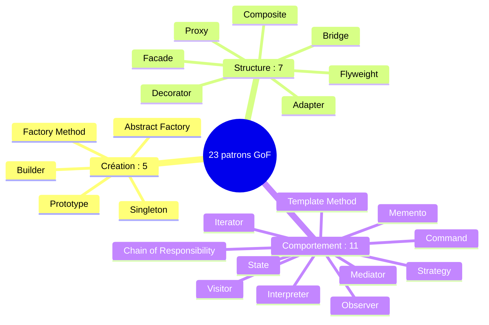

Ce chapitre développe les patrons que vous avez le plus de chances de croiser dans le code du projet, avec des exemples en **Dart**, dans le même petit univers de jeu de rôle que le chapitre 4 (jets de dés, quêtes, personnages).

> **À retenir.** On n'apprend pas les patrons pour les appliquer partout. On les apprend pour **reconnaître** une structure quand on la lit, et pour **savoir la demander** quand on la cherche.

---

## 2. Patrons de création : fabriquer des objets

### 2.1 Singleton : une seule instance

**Problème.** Il ne doit exister qu'un seul exemplaire d'un objet (un journal, une configuration, une connexion), accessible depuis plusieurs endroits.
**Solution.** La classe contrôle elle-même sa création et expose son unique instance.

```dart
class Journal {
  Journal._();                                   // constructeur privé
  static final Journal instance = Journal._();   // l'unique instance

  final List<String> lignes = [];
}

// partout dans l'application :
Journal.instance.lignes.add('Quête terminée');
```

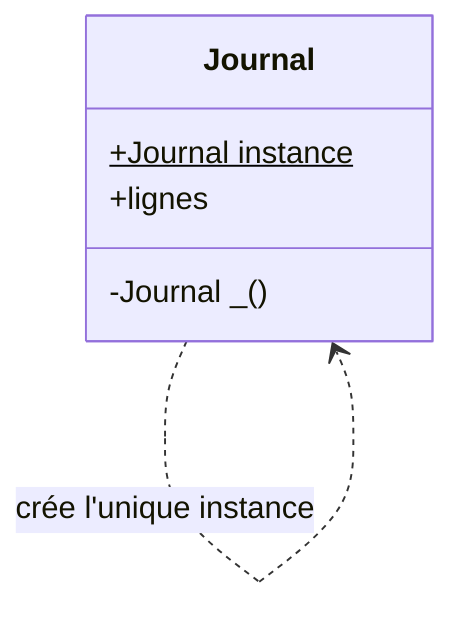

**Le piège.** C'est le patron le plus connu et le plus critiqué. L'accès global crée des **dépendances cachées** (le code utilise `Journal.instance` sans que cela se voie dans sa signature) et rend les tests difficiles : on ne peut pas remplacer le journal par une version factice. La documentation officielle de Flutter recommande l'**injection de dépendances** (section 6.2) pour éviter les objets accessibles globalement. On peut garder le bénéfice « une seule instance » en demandant au conteneur d'injection d'en créer une seule et de la distribuer : l'unicité est conservée, l'accès global disparaît.

### 2.2 Factory Method : laisser la sous-classe choisir

**Problème.** Une classe sait *quand* créer un objet, mais pas *lequel*.
**Solution.** Elle délègue la création à une méthode que les sous-classes redéfinissent.

```dart
abstract class Quete {
  Ennemi creerEnnemi();                          // méthode de fabrication
  void lancer() => creerEnnemi().attaquer();
}

class Donjon extends Quete {
  @override
  Ennemi creerEnnemi() => Squelette();
}

class Foret extends Quete {
  @override
  Ennemi creerEnnemi() => Loup();
}
```

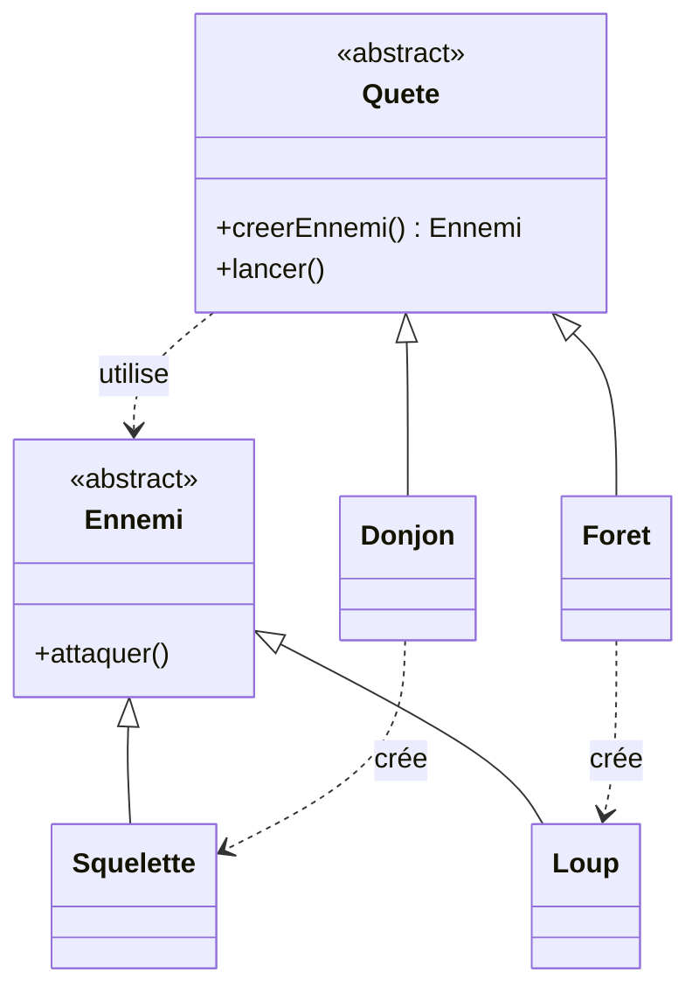

`Quete.lancer()` fonctionne pour toutes les quêtes sans connaître les classes concrètes. Pour ajouter une quête dans le marais, on écrit une nouvelle sous-classe et on ne touche à rien d'autre. Le patron voisin, **Abstract Factory**, étend l'idée à une **famille d'objets qui vont ensemble** (par exemple un bouton, une case à cocher et une fenêtre, tous au style d'un même système d'exploitation).

*Remarque sur Dart.* Le mot-clé `factory` de Dart (constructeur qui peut renvoyer une instance existante ou d'un sous-type) est proche de l'esprit, mais n'est pas la forme du livre, où la fabrication est redéfinie dans une sous-classe.

### 2.3 Builder : construire pas à pas

**Problème.** Un objet a beaucoup de paramètres, dont beaucoup de facultatifs.
**Solution.** Un objet intermédiaire reçoit les valeurs une à une, puis produit l'objet final.

```dart
final perso = PersonnageBuilder()
    .nom('Aria')
    .classe('Mage')
    .niveau(3)
    .sort('Boule de feu')
    .build();            // objet prêt, validé
```

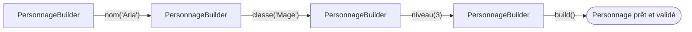

Dart réduit le besoin : les **paramètres nommés** et les valeurs par défaut (`Personnage(nom: 'Aria', niveau: 3)`) couvrent la plupart des cas sans builder. Ne pas confondre avec les widgets « builder » de Flutter (`ListView.builder`, `Builder`) : ils reçoivent une fonction qui construit les éléments à la demande, une idée différente qui ne partage que le nom.

### 2.4 Autres patrons de création

**Prototype** : créer un objet en clonant un exemplaire existant, sans connaître sa classe concrète (méthode `clone()`). En Dart, la méthode `copyWith`, très répandue pour les objets immuables, y ressemble par analogie, mais n'est pas le patron du livre.

---

## 3. Patrons de structure : assembler des objets

### 3.1 Adapter : brancher deux interfaces incompatibles

**Problème.** Le code attend une interface, le service ou la bibliothèque externe en fournit une autre.
**Solution.** Une classe intermédiaire traduit l'une vers l'autre.

```dart
abstract class De {
  int lancer();                                  // ce que mon code attend
}

class DeAdaptateur implements De {
  DeAdaptateur(this._service);
  final ServiceExterne _service;

  @override
  int lancer() => _service.tirage(faces: 20);   // ce que le service offre
}
```

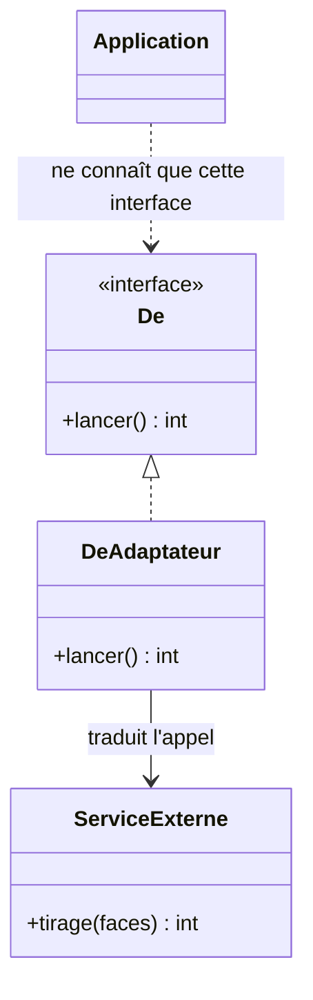

Le reste de l'application ne connaît que `De`. Changer de fournisseur, ou remplacer le service par un faux dé pour les tests, revient à écrire un autre adaptateur. C'est le geste de base des **ports et adaptateurs** (section 6.4).

### 3.2 Decorator : ajouter un comportement en enrobant

**Problème.** On veut combiner des options (arme enflammée, empoisonnée, bénie) sans créer une classe par combinaison. Avec trois options combinables, il y aurait huit classes.
**Solution.** Chaque option est un décorateur qui a **la même interface** que l'objet enrobé, délègue à lui, et ajoute son effet.

```dart
abstract class Arme {
  int degats();
}

class Epee implements Arme {
  @override
  int degats() => 6;
}

class Enflammee implements Arme {
  Enflammee(this._arme);
  final Arme _arme;
  @override
  int degats() => _arme.degats() + 2;
}

Enflammee(Epee()).degats();   // 8
```

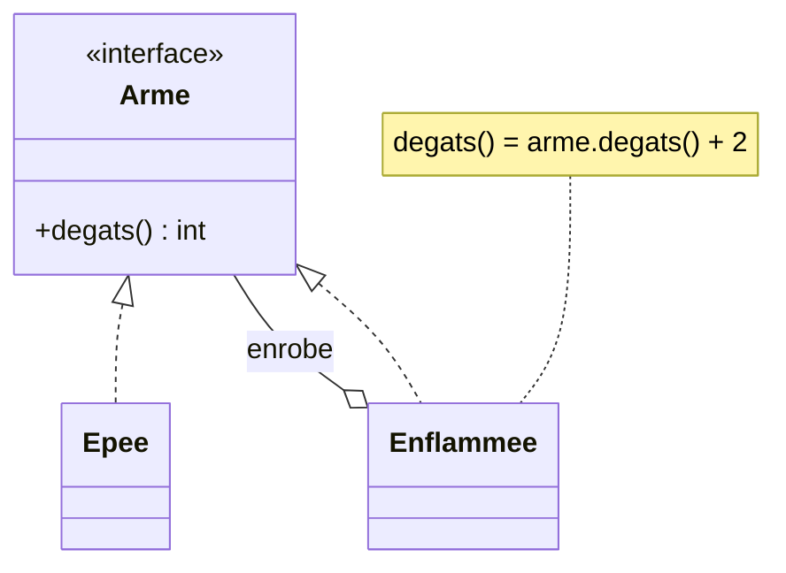

Les décorateurs s'empilent : `Enflammee(Empoisonnee(Epee()))`. Dans Flutter, les widgets d'enrobage (`Padding`, `Opacity`, `Center`) fonctionnent par imbrication d'un widget enfant : c'est une **analogie pédagogique**, la documentation officielle ne les désigne pas comme des Decorator.

### 3.3 Composite : un élément seul ou un groupe, même interface

**Problème.** Une structure en arbre (un sac contient des objets, et d'autres sacs).
**Solution.** Les feuilles et les nœuds partagent la même interface.

```dart
abstract class Item {
  int poids();
}

class Objet implements Item {
  Objet(this._poids);
  final int _poids;
  @override
  int poids() => _poids;
}

class Sac implements Item {
  Sac(this.contenu);
  final List<Item> contenu;
  @override
  int poids() => contenu.fold(0, (s, i) => s + i.poids());
}
```

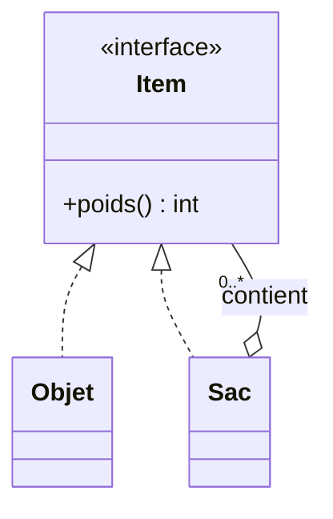

On demande `poids()` à n'importe quel `Item` sans distinguer le cas simple du cas groupé. Les dossiers et fichiers d'un disque en sont l'exemple classique ; l'**arbre de widgets** de Flutter a la même forme (un widget peut en contenir d'autres), toujours par analogie.

### 3.4 Facade et Proxy

- **Facade** : une classe qui offre une **interface simple devant un ensemble de composants complexes**. Exemple : une classe `Partie` qui expose `demarrer()` et cache l'initialisation du moteur de jeu, du son et de la sauvegarde.
- **Proxy** : un **substitut** qui contrôle l'accès à un autre objet (chargement différé, contrôle des droits, mise en cache). Exemple : un objet « image » qui ne charge le fichier qu'au premier affichage.

**Bridge** (séparer une abstraction de son implémentation) et **Flyweight** (partager des objets identiques pour économiser la mémoire) complètent la famille, avec des usages plus rares pour un projet comme le vôtre.

---

## 4. Patrons de comportement : faire collaborer les objets

### 4.1 Observer : prévenir ceux qui s'intéressent

**Problème.** Plusieurs parties du programme doivent réagir quand une donnée change (barre de vie, son, journal), sans que la donnée les connaisse.
**Solution.** La donnée (le *sujet*) tient une liste d'abonnés et les prévient à chaque changement.

```dart
class Pv extends ChangeNotifier {
  int _valeur = 20;
  int get valeur => _valeur;

  void subir(int degats) {
    _valeur -= degats;
    notifyListeners();                           // tous les abonnés sont prévenus
  }
}

// l'écran écoute et se redessine seul :
ListenableBuilder(
  listenable: pv,
  builder: (context, _) => Text('${pv.valeur}'),
)
```

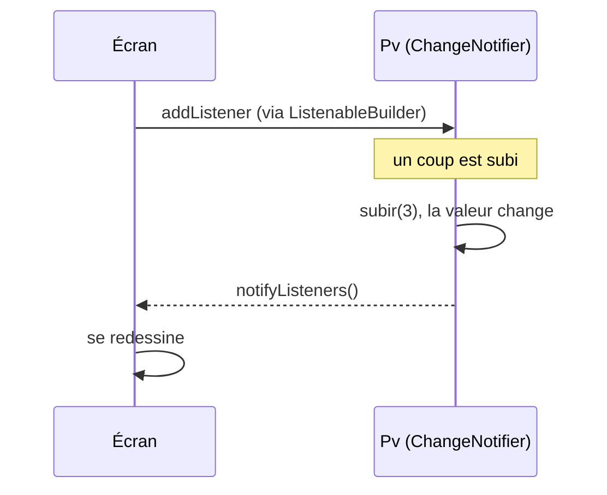

C'est le patron le plus visible dans Flutter : la documentation officielle présente `ChangeNotifier` (inclus dans le SDK) comme un moyen pratique pour que les widgets **observent** un view model (recommandation conditionnelle : le choix du gestionnaire d'état reste une préférence, et le projet utilise BLoC), puis `ListenableBuilder` pour reconstruire l'interface quand `notifyListeners()` est appelé. La documentation ne parle pas d'« Observer » : c'est la lecture classique du mécanisme (`addListener`, `removeListener`, `notifyListeners`). Les **flux** (*streams*) de Dart et le patron BLoC reposent sur la même idée.

### 4.2 Strategy : changer d'algorithme

**Problème.** Plusieurs façons de faire la même chose (calculer des dégâts, trier, tarifer), et un `if` qui grossit à chaque ajout.
**Solution.** Chaque variante est une classe qui respecte la même interface ; l'objet utilisateur reçoit celle qu'il veut.

```dart
abstract class Attaque {
  int degats(int jet);
}

class Prudente implements Attaque {
  @override
  int degats(int jet) => jet ~/ 2;
}

class Brutale implements Attaque {
  @override
  int degats(int jet) => jet * 2;
}

heros.attaque = Brutale();   // on change de stratégie
```

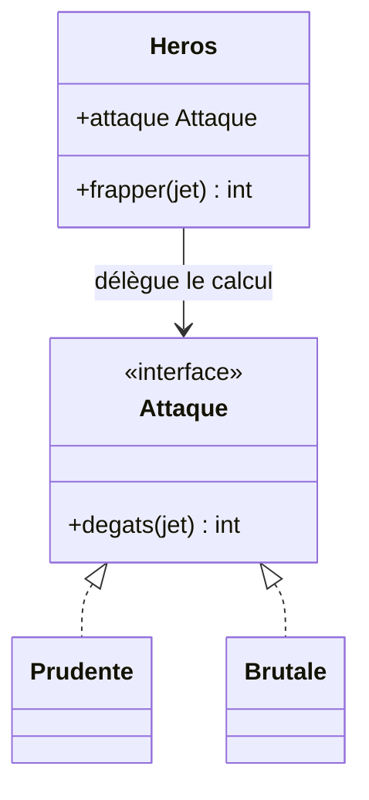

En Dart, on peut faire plus simple : les fonctions sont des valeurs. `int Function(int) attaque = (jet) => jet * 2;` remplace les trois classes. C'est exactement l'argument de la section 7 : **le langage a absorbé le patron**.

### 4.3 Command : une action devient un objet

**Problème.** On veut mémoriser des actions pour les annuler (Ctrl+Z), les rejouer ou les mettre en file d'attente.
**Solution.** Chaque action est un objet avec `executer()` et `annuler()`.

```dart
abstract class Commande {
  void executer();
  void annuler();
}

class Avancer implements Commande {
  Avancer(this._joueur);
  final Joueur _joueur;

  @override
  void executer() => _joueur.x++;
  @override
  void annuler() => _joueur.x--;
}
```

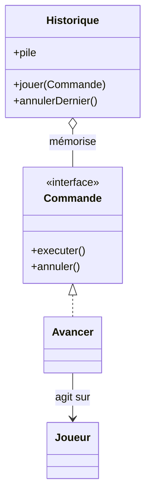

Une pile de commandes donne l'historique : annuler, c'est dépiler et appeler `annuler()`.

**Attention à l'homonymie.** Le guide d'architecture de Flutter recommande aussi un « pattern Command », qui est **autre chose** : un enrobage d'une action déclenchée par l'interface (envoyer un formulaire, par exemple), avec ses états (en cours, terminée, en erreur), pour éviter les erreurs d'affichage. Il est défini dans l'application d'exemple *Compass* de la documentation (le paquet `command_it` propose une alternative) ; ce n'est ni une fonction du SDK, ni le Command du livre avec annulation.

### 4.4 State, Template Method, Iterator

- **State** : un objet change de comportement selon son état interne. Exemple : un monstre qui se comporte différemment endormi, en alerte ou en fuite ; chaque état est une classe (ou, en Dart moderne, une classe scellée `sealed`) qui décide de la réaction. Un écran qui affiche « chargement », « données » ou « erreur » ressemble à une machine à états, et c'est ce que publient les *états* de BLoC (ce sont des données lues par l'écran, pas des objets qui portent le comportement comme dans le patron State).
- **Template Method** : une classe parente fixe le **squelette** d'un algorithme et laisse les sous-classes définir certaines étapes. Exemple : `jouerTour()` appelle dans l'ordre `lancerDe()`, `choisirAction()`, `appliquerEffet()`, que chaque type de personnage redéfinit.
- **Iterator** : parcourir une collection sans connaître sa structure interne. Vous l'utilisez sans le voir : la boucle `for (final quete in quetes)` de Dart s'appuie sur ce patron.

Les autres patrons de comportement du livre (Chain of Responsibility, Interpreter, Mediator, Memento, Visitor) sont d'usage plus spécialisé.

---

## 5. Un coup d'œil d'ensemble

| Patron | En une phrase | Un signal qu'il pourrait servir |
|---|---|---|
| Singleton | Une seule instance accessible partout | « Il ne doit y en avoir qu'un » (puis réfléchir à l'injection) |
| Factory Method | La sous-classe choisit la classe à créer | Un `if` sur un type à chaque création |
| Builder | Construire un objet complexe pas à pas | Un constructeur à dix paramètres |
| Adapter | Traduire une interface vers une autre | Un service externe qui ne parle pas votre langage |
| Decorator | Ajouter un comportement en enrobant | Des classes pour chaque combinaison d'options |
| Composite | Un élément et un groupe se traitent pareil | Une arborescence |
| Facade | Une porte d'entrée simple devant un sous-système | Trop de classes à connaître pour une action |
| Observer | Prévenir les abonnés d'un changement | Plusieurs écrans à tenir à jour |
| Strategy | Choisir un algorithme à l'exécution | Un `if` qui grossit à chaque variante |
| Command | Une action devient un objet | Annuler, rejouer, mettre en file |
| State | Le comportement suit l'état | Des `if` sur un état partout dans le code |

---

## 6. Patrons d'architecture : ceux du projet Flutter

Les patrons du livre portent sur quelques classes. D'autres, plus récents, organisent **tout un projet**. Le projet du cours est construit en couches : la **présentation** (pages, widgets, BLoC), le **domaine** (entités, cas d'usage, interfaces) et les **données** (accès à l'API, base de données). La règle centrale : **le domaine ne dépend de rien** ; la présentation et les données dépendent de lui.

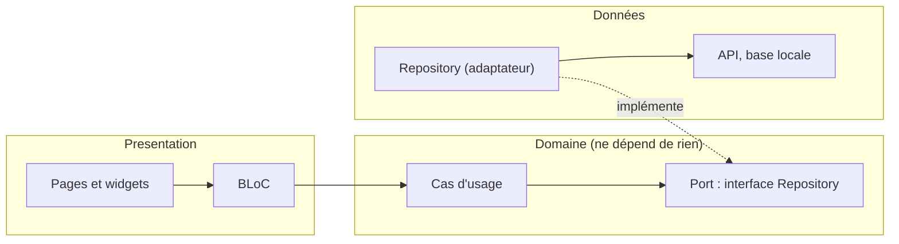

### 6.1 Repository

Un **Repository** est un objet qui **cache d'où viennent les données** (API, base locale, cache) derrière une interface semblable à une collection. Martin Fowler le décrit comme un médiateur entre le domaine et les couches d'accès aux données (catalogue *Patterns of Enterprise Application Architecture*, 2002). La documentation d'architecture de Flutter le recommande **fortement** pour la couche de données, avec des classes abstraites et des implémentations différentes selon l'environnement (développement, production). Le reste de l'application demande « donne-moi les signalements » sans savoir si la réponse vient du réseau ou du disque.

### 6.2 Injection de dépendances

Plutôt que de laisser un objet **créer** ses collaborateurs ou aller les **chercher globalement** (le Singleton), on les lui **donne** à la construction. Dans Flutter, la documentation officielle recommande fortement l'injection de dépendances pour éviter les objets globalement accessibles, ce qui rend le code moins sujet aux erreurs. La documentation cite le paquet `provider` ; dans notre projet, c'est le paquet **`get_it`** (avec `injectable`) qui joue le rôle de conteneur : il sait quelle implémentation fournir à qui. En test, on remplace l'implémentation réelle par une doublure.

### 6.3 BLoC

**BLoC** (*Business Logic Component*) sépare la logique de l'écran : l'écran **envoie des événements** (« l'utilisateur appuie sur Valider »), un composant de logique les traite et **publie des états** (« chargement », « succès », « erreur »), et l'écran se redessine en fonction du dernier état. On peut le lire comme un Observer organisé autour de flux (une lecture, pas une définition officielle). Dans le projet, il est fourni par le paquet `flutter_bloc` (voir aussi le chapitre 4).

### 6.4 Ports et adaptateurs, architecture hexagonale, Clean Architecture

Deux familles de styles d'architecture reposent sur la même règle de dépendance : **l'architecture hexagonale** (ports et adaptateurs, Alistair Cockburn, 2005) et la **Clean Architecture** (Robert C. Martin, 2012). Principe : le **domaine** (les règles du métier) définit des **interfaces** (les *ports*) ; la couche données ou l'infrastructure fournit des **adaptateurs** qui les implémentent. On retrouve le patron Adapter (section 3.1) à l'échelle du projet. Un **cas d'usage** (*use case*) est une classe qui réalise une action du métier (« envoyer un signalement ») en s'appuyant sur ces ports. Le guide d'architecture de Flutter, lui, propose une couche domaine **facultative** (utile seulement si la logique est complexe), placée entre l'interface et les données, sans l'inversion de dépendance de la Clean Architecture : la règle « le domaine ne dépend de rien » est celle de **notre projet**, pas celle du guide.

### 6.5 Les patrons dans Flutter lui-même

| Patron | Ce que l'on observe dans Flutter | Statut |
|---|---|---|
| Observer | `ChangeNotifier` et `ListenableBuilder` | Proposé par la documentation (recommandation conditionnelle ; le nom « Observer » est une lecture) |
| Command | Enrobage d'action de l'interface (exemple *Compass*) | Recommandé (niveau « recommend », pas « strongly ») ; sens différent du Command du livre, que la documentation ne rattache pas au GoF |
| Repository, injection de dépendances | Couche de données et conteneur | Recommandés par la documentation |
| Composite | L'arbre de widgets | Analogie |
| Decorator | `Padding`, `Opacity`, `Center` enrobant un enfant | Analogie |
| Builder | `ListView.builder`, `Builder` | Même nom, rôle différent |

---

## 7. Les critiques à connaître

- **Des compensations aux limites du langage.** En 1996, Peter Norvig a observé que **16 des 23 patrons** du livre ont, dans des langages comme Lisp ou Dylan, une réalisation plus simple, voire invisible : ils sont absorbés par les fonctions de première classe, les types ou les macros du langage. C'est le cas de Strategy en Dart : une simple fonction suffit.
- **Le Singleton** est souvent présenté comme un anti-patron à cause de l'état global caché qu'il introduit (section 2.1).
- **La sur-ingénierie.** Un patron ajoute des classes, de l'indirection, de la configuration. Utilisé sans problème réel à résoudre, il rend le code plus difficile à lire, pas plus facile. La question juste n'est pas « quel patron mettre ? » mais « quel problème ai-je ? ». Pour un petit outil temporaire, trois fonctions simples valent souvent mieux qu'une architecture complète.
- **Le nom ne remplace pas la compréhension.** Savoir dire « Strategy » ne dispense pas de comprendre pourquoi on le choisit ici plutôt qu'un `if`.

---

## 8. Patrons et agents de code

Les noms de patrons sont partout dans la documentation et le code publics : un agent les reconnaît, et vous aussi pouvez les utiliser pour **cadrer** son travail.

1. **Nommer le patron dans le prompt.** « Ajoute un Repository pour l'accès aux signalements, avec une interface dans le domaine » est plus précis et plus court qu'une description libre.
2. **Écrire les règles dans le contexte du projet.** Le dépôt de démonstration `devoxx-2026` met dans son `AGENTS.md` des règles du type « le domaine ne dépend de rien », « aucune logique métier dans un widget ou un gestionnaire de requêtes », « la dépendance va de la présentation vers le domaine, et des données vers le domaine ». Ce sont des patrons d'architecture transformés en interdits vérifiables (voir le chapitre 6).
3. **Demander pourquoi.** Face à un code proposé, demandez : « Quel patron as-tu utilisé, et quel problème résout-il ici ? » Si la réponse est vague, le patron est probablement de trop.
4. **Relire plus vite.** Reconnaître un Adapter, un Observer ou un Repository permet de relire une proposition en regardant la **structure** avant le détail. C'est l'objet de la règle du projet : « je sais l'expliquer ».
5. **Garder les tests comme juge.** Un patron change la forme du code, pas son comportement : les scénarios BDD et les tests unitaires (chapitre 5) doivent rester verts.

*Mise en garde.* Un agent peut produire plus de couches ou de classes que nécessaire pour un petit besoin. Demandez la solution **la plus simple qui passe les tests**, puis ajoutez un patron seulement quand un problème concret l'exige.

---

## Glossaire

| Terme | Sens |
|---|---|
| **Design pattern** (patron de conception) | Solution connue à un problème de conception récurrent, avec un nom |
| **GoF** (*Gang of Four*) | Les quatre auteurs du livre de 1994, et par extension ses 23 patrons |
| **Interface** | Ce qu'un objet sait faire, sans dire comment (en Dart : une classe abstraite) |
| **Instance** | Un exemplaire d'une classe |
| **Dépendance** | Un objet dont un autre a besoin pour fonctionner |
| **Injection de dépendances** | Fournir à un objet ses dépendances plutôt que de les lui faire créer |
| **Couche** | Un étage du projet (présentation, domaine, données) |
| **Port / adaptateur** | Interface définie par le domaine / classe qui l'implémente côté technique |
| **Cas d'usage** (*use case*) | Une action du métier, portée par une classe |
| **Anti-patron** | Solution répandue qui cause plus de problèmes qu'elle n'en résout |

---

## Points non vérifiés (à signaler honnêtement)

- **Confirmés à la source le 7 octobre 2026** : le livre GoF (quatre auteurs, 1994, 23 patrons, exemples en C++ et Smalltalk, par plusieurs fiches bibliographiques ; certaines impressions portent 1995) ; la liste des cinq patrons de création, et la répartition 5, 7 et 11 avec ses listes (recoupée avec le catalogue de refactoring.guru, qui présente les mêmes patrons à l'exception d'Interpreter) ; l'étude de Norvig (1996, 16 patrons sur 23 plus simples en Lisp ou Dylan) ; les recommandations de la documentation Flutter (Repository, injection de dépendances, `ChangeNotifier` avec `ListenableBuilder`, pattern Command de l'application *Compass*, couches UI, données et domaine facultatif).
- **De mémoire, non revérifiés** : toutes les définitions et tous les exemples de patrons ci-dessus, rédigés pour le cours (ils suivent l'usage courant, mais n'ont pas été comparés au texte du livre) ; l'année et le titre du livre d'Alexander (1977) ; l'article de Beck et Cunningham (1987) ; l'attribution du Repository à Fowler (2002) et à Evans (*Domain-Driven Design*, 2003) ; les dates de l'architecture hexagonale (2005) et de la Clean Architecture (2012) ; la description de BLoC (documentation officielle `bloclibrary.dev` non consultée).
- **Analogies, pas des affirmations de Flutter** : Composite pour l'arbre de widgets, Decorator pour les widgets d'enrobage, Observer comme nom de `ChangeNotifier` et lecture de BLoC, State pour les états de BLoC, `copyWith` pour Prototype.
- **Hypothèses de travail** : que les agents de code connaissent bien ces noms, et qu'ils ont tendance à ajouter des couches inutiles ; à constater dans vos propres essais. Le gain de lecture (reconnaître un patron aide à relire) est un argument pédagogique, pas un résultat mesuré.
- Les extraits de code Dart sont des **extraits** (certaines classes comme `Ennemi`, `ServiceExterne`, `Joueur` ou `PersonnageBuilder` ne sont pas définies) et n'ont pas été compilés.

---

## Sources

- E. Gamma, R. Helm, R. Johnson, J. Vlissides, *Design Patterns: Elements of Reusable Object-Oriented Software*, Addison-Wesley, 1994 (fiches : https://books.google.com/books/about/Design_Patterns.html?id=6oHuKQe3TjQC, https://openlibrary.org/books/OL22173620M/Design_patterns)
- Catalogue des patrons : https://refactoring.guru/design-patterns/catalog (source secondaire ; il présente 22 patrons, sans Interpreter, donc 10 patrons de comportement ; le livre GoF en compte 11, soit 23 au total)
- P. Norvig, « Design Patterns in Dynamic Languages », 1996 : https://norvig.com/design-patterns/design-patterns.pdf
- Flutter, « Architecture » : https://docs.flutter.dev/app-architecture, https://docs.flutter.dev/app-architecture/recommendations, https://docs.flutter.dev/app-architecture/case-study
- Flutter, « State management » : https://docs.flutter.dev/get-started/fwe/state-management
- M. Fowler, « Repository » (catalogue PoEAA) : https://www.martinfowler.com/eaaCatalog/repository.html
- C. Alexander et al., *A Pattern Language*, Oxford University Press, 1977 (non consulté)
- A. Cockburn, « Hexagonal architecture », 2005 ; R. C. Martin, « The Clean Architecture », 2012 (non consultés)
- Dépôt de démonstration `b-fontaine/devoxx-2026` : `AGENTS.md`, `frontend/CLAUDE.md`
- Locales : `cours/presentations/day-1/notes.html` (partie 05), chapitres 4, 5 et 6 de ce dossier
